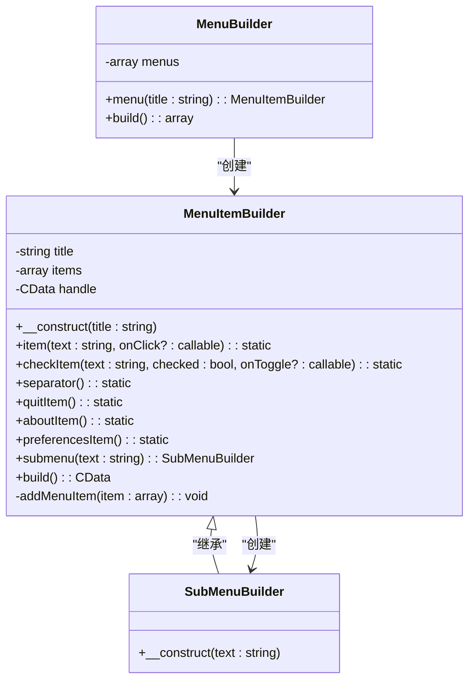
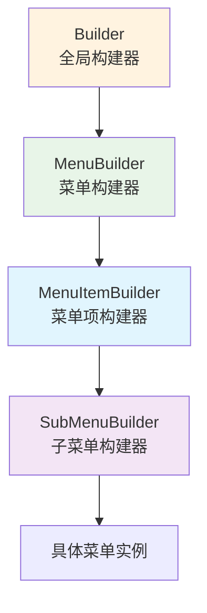
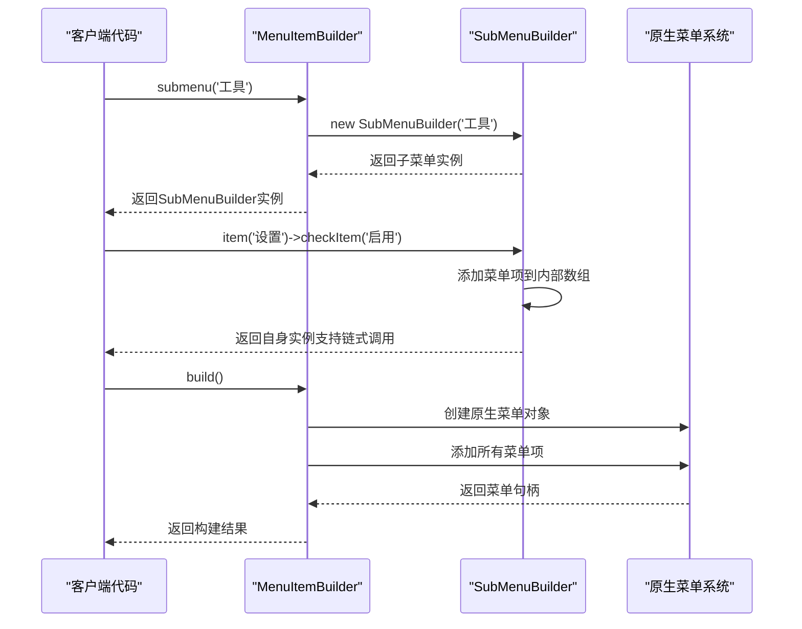
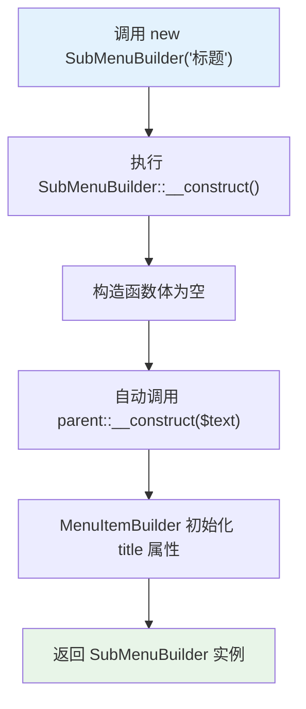
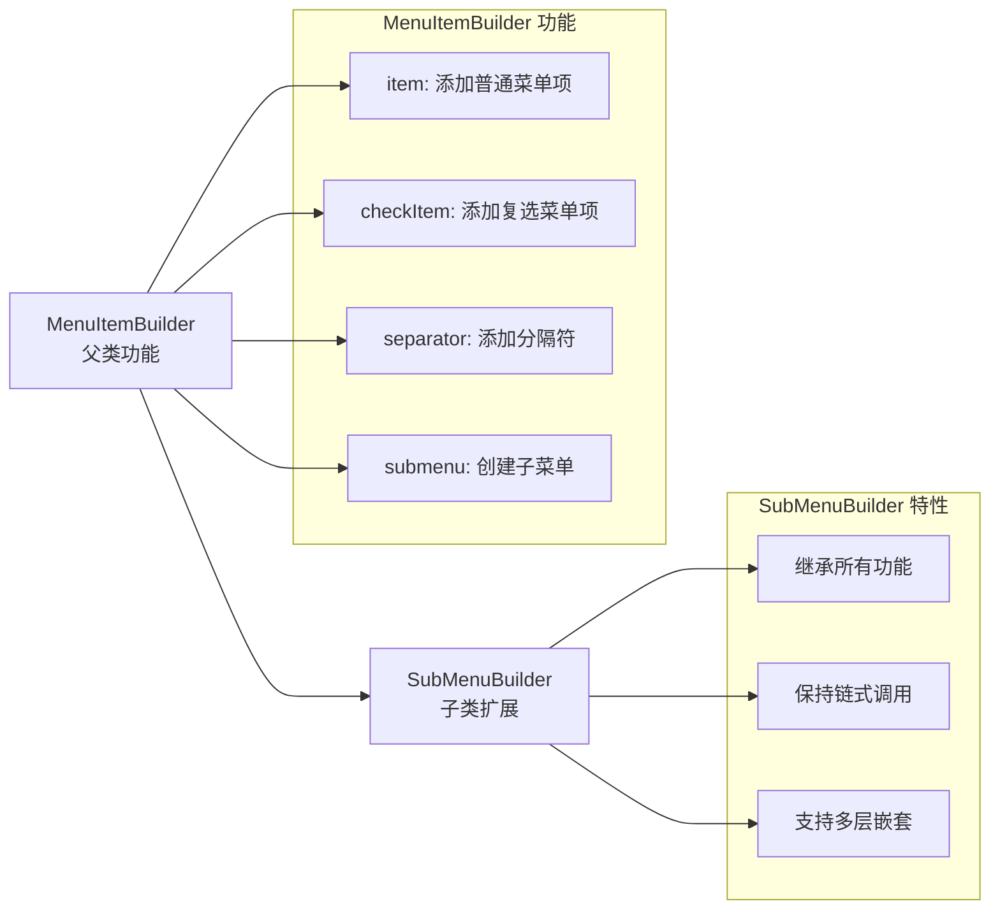
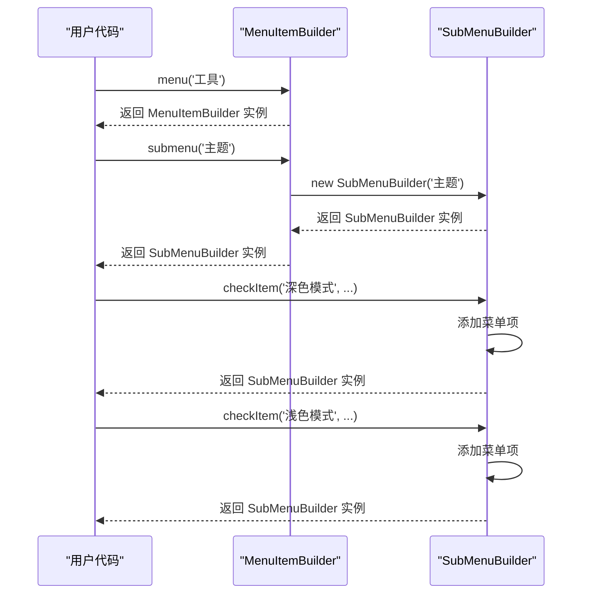
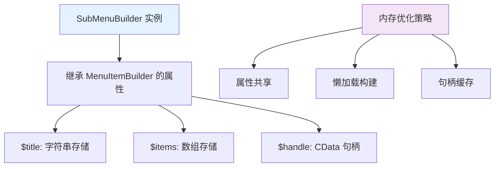

# SubMenuBuilder（子菜单）

<cite>
**本文档中引用的文件**
- [SubMenuBuilder.php](file://src/Components/SubMenuBuilder.php)
- [MenuItemBuilder.php](file://src/Components/MenuItemBuilder.php)
- [MenuBuilder.php](file://src/Components/MenuBuilder.php)
- [Builder.php](file://src/Builder.php)
- [full.php](file://example/full.php)
</cite>

## 目录
1. [简介](#简介)
2. [类结构概览](#类结构概览)
3. [继承关系与架构](#继承关系与架构)
4. [核心功能分析](#核心功能分析)
5. [构造函数详解](#构造函数详解)
6. [与父类的关系](#与父类的关系)
7. [实际使用示例](#实际使用示例)
8. [最佳实践指南](#最佳实践指南)
9. [性能考虑](#性能考虑)
10. [总结](#总结)

## 简介

SubMenuBuilder是libuiBuilder框架中用于构建嵌套菜单结构的核心组件。它作为MenuItemBuilder的扩展类，专门负责处理子菜单的创建和管理，为应用程序提供了灵活而强大的菜单层次结构支持。

该类的设计遵循了面向对象编程的最佳实践，通过继承机制复用了MenuItemBuilder的所有功能，同时专注于子菜单特有的行为和属性。这种设计使得开发者能够轻松构建复杂的多级菜单系统，满足现代应用程序对用户界面组织的需求。

## 类结构概览



**图表来源**
- [MenuItemBuilder.php](file://src/Components/MenuItemBuilder.php#L10-L126)
- [SubMenuBuilder.php](file://src/Components/SubMenuBuilder.php#L5-L14)
- [MenuBuilder.php](file://src/Components/MenuBuilder.php#L10-L29)

**章节来源**
- [SubMenuBuilder.php](file://src/Components/SubMenuBuilder.php#L1-L14)
- [MenuItemBuilder.php](file://src/Components/MenuItemBuilder.php#L1-L126)

## 继承关系与架构

SubMenuBuilder采用单一继承的方式，直接扩展自MenuItemBuilder基类。这种设计体现了以下架构原则：

### 继承层次结构



**图表来源**
- [MenuItemBuilder.php](file://src/Components/MenuItemBuilder.php#L10-L126)
- [SubMenuBuilder.php](file://src/Components/SubMenuBuilder.php#L5-L14)
- [MenuBuilder.php](file://src/Components/MenuBuilder.php#L10-L29)

### 设计模式应用

SubMenuBuilder的实现体现了以下设计模式：

1. **模板方法模式**：继承了MenuItemBuilder的构建流程
2. **组合模式**：可以包含多个菜单项和子菜单
3. **建造者模式**：提供流畅的链式调用接口

**章节来源**
- [MenuItemBuilder.php](file://src/Components/MenuItemBuilder.php#L10-L126)
- [SubMenuBuilder.php](file://src/Components/SubMenuBuilder.php#L5-L14)

## 核心功能分析

虽然SubMenuBuilder的实现相对简洁，但它在菜单系统中扮演着关键角色。让我们深入分析其核心功能：

### 功能特性矩阵

| 功能类别 | SubMenuBuilder | MenuItemBuilder | 备注 |
|---------|---------------|-----------------|------|
| 构造函数 | ✅ 接收子菜单标题 | ✅ 接收主菜单标题 | 子菜单需要特定的初始化参数 |
| 菜单项添加 | ✅ 继承所有功能 | ✅ 支持item/checkItem等 | 完全复用父类功能 |
| 子菜单创建 | ✅ 特殊处理 | ✅ 创建SubMenuBuilder实例 | 链式调用的核心 |
| 构建过程 | ✅ 调用父类构建方法 | ✅ 创建原生菜单对象 | 自动处理层级关系 |
| 事件处理 | ✅ 继承事件机制 | ✅ 支持点击和切换事件 | 完整的交互支持 |

### 方法调用流程



**图表来源**
- [MenuItemBuilder.php](file://src/Components/MenuItemBuilder.php#L66-L75)
- [SubMenuBuilder.php](file://src/Components/SubMenuBuilder.php#L11-L13)

**章节来源**
- [MenuItemBuilder.php](file://src/Components/MenuItemBuilder.php#L66-L75)
- [SubMenuBuilder.php](file://src/Components/SubMenuBuilder.php#L11-L13)

## 构造函数详解

SubMenuBuilder的构造函数设计极其简洁，只接受一个字符串参数：

### 构造函数签名分析

```php
public function __construct(string $text)
{
    // 当前实现为空，但会自动调用父类构造函数
}
```

### 参数说明

- **$text** (`string`): 子菜单的显示标题，这是唯一必需的参数
- **类型**: 必须是字符串类型
- **用途**: 用于在菜单栏中显示子菜单的名称

### 继承机制

虽然构造函数体为空，但PHP的继承机制确保了以下行为：

1. **自动调用父类构造函数**: PHP会自动调用MenuItemBuilder的构造函数
2. **参数传递**: `$text`参数会被传递给父类的`__construct()`方法
3. **状态初始化**: 父类会正确初始化`$title`属性

### 实现细节



**图表来源**
- [SubMenuBuilder.php](file://src/Components/SubMenuBuilder.php#L11-L13)
- [MenuItemBuilder.php](file://src/Components/MenuItemBuilder.php#L17-L20)

**章节来源**
- [SubMenuBuilder.php](file://src/Components/SubMenuBuilder.php#L11-L13)

## 与父类的关系

SubMenuBuilder与MenuItemBuilder之间的关系是理解其功能的关键。让我们详细分析这种继承关系：

### 功能复用机制



**图表来源**
- [MenuItemBuilder.php](file://src/Components/MenuItemBuilder.php#L22-L65)
- [SubMenuBuilder.php](file://src/Components/SubMenuBuilder.php#L5-L14)

### 关键差异点

| 方面 | MenuItemBuilder | SubMenuBuilder | 影响 |
|------|----------------|---------------|------|
| 构造函数 | 接收主菜单标题 | 接收子菜单标题 | 决定菜单在UI中的位置 |
| 主要用途 | 创建顶级菜单 | 创建嵌套菜单 | 影响菜单层次结构 |
| 功能完整性 | 完整的功能集 | 功能完全复用 | 提供一致的API体验 |
| 链式调用 | 支持 | 支持 | 保持开发体验一致性 |

### 继承优势

1. **代码复用**: 不需要重复实现菜单项添加功能
2. **一致性**: 两种类型的菜单使用相同的API
3. **维护性**: 修改父类功能自动惠及子类
4. **扩展性**: 可以在子类中添加特殊功能而不影响父类

**章节来源**
- [MenuItemBuilder.php](file://src/Components/MenuItemBuilder.php#L22-L65)
- [SubMenuBuilder.php](file://src/Components/SubMenuBuilder.php#L5-L14)

## 实际使用示例

为了更好地理解SubMenuBuilder的实际应用，我们来看一个构建复杂嵌套菜单的完整示例：

### 多级嵌套菜单构建

以下是一个构建"工具"→"主题"→"深色/浅色模式"菜单结构的示例：

```php
// 使用Builder创建菜单系统
$menuBuilder = Builder::menu();

// 创建主菜单"工具"
$toolsMenu = $menuBuilder->menu('工具');

// 在工具菜单中创建子菜单"主题"
$themeSubmenu = $toolsMenu->submenu('主题');

// 在主题子菜单中添加深色模式选项
$darkModeItem = $themeSubmenu->checkItem('深色模式', false, function($checked) {
    // 深色模式切换逻辑
    echo "深色模式: " . ($checked ? '启用' : '禁用');
});

// 在主题子菜单中添加浅色模式选项
$lightModeItem = $themeSubmenu->checkItem('浅色模式', true, function($checked) {
    // 浅色模式切换逻辑
    echo "浅色模式: " . ($checked ? '启用' : '禁用');
});

// 构建并应用菜单
$nativeMenus = $menuBuilder->build();
```

### 链式调用解析

这个示例展示了SubMenuBuilder的链式调用能力：



**图表来源**
- [Builder.php](file://src/Builder.php#L97-L100)
- [MenuBuilder.php](file://src/Components/MenuBuilder.php#L14-L18)
- [MenuItemBuilder.php](file://src/Components/MenuItemBuilder.php#L66-L75)

### 复杂菜单结构示例

```php
// 构建更复杂的菜单结构
$menuBuilder = Builder::menu();

// 文件菜单
$fileMenu = $menuBuilder->menu('文件');
$fileMenu->item('新建', function() { /* 新建逻辑 */ });
$fileMenu->item('打开', function() { /* 打开逻辑 */ });
$fileMenu->separator();
$fileMenu->item('退出', function() { /* 退出逻辑 */ });

// 编辑菜单
$editMenu = $menuBuilder->menu('编辑');
$editMenu->item('撤销', function() { /* 撤销逻辑 */ });
$editMenu->item('重做', function() { /* 重做逻辑 */ });
$editMenu->separator();
$editMenu->submenu('查找')->item('查找...', function() { /* 查找逻辑 */ })
                         ->item('替换...', function() { /* 替换逻辑 */ });

// 工具菜单（包含多级嵌套）
$toolsMenu = $menuBuilder->menu('工具');
$toolsMenu->submenu('主题')->checkItem('深色模式', false, function($checked) {
    // 主题切换逻辑
})
->checkItem('浅色模式', true, function($checked) {
    // 主题切换逻辑
});

// 帮助菜单
$helpMenu = $menuBuilder->menu('帮助');
$helpMenu->item('关于', function() { /* 关于信息 */ });

// 构建最终菜单
$finalMenus = $menuBuilder->build();
```

**章节来源**
- [Builder.php](file://src/Builder.php#L97-L100)
- [MenuBuilder.php](file://src/Components/MenuBuilder.php#L14-L28)

## 最佳实践指南

基于对SubMenuBuilder的深入分析，以下是构建复杂菜单系统的最佳实践：

### 设计原则

1. **单一职责原则**: 每个菜单类只负责一种类型的菜单
2. **开闭原则**: 通过继承扩展功能，而不是修改现有代码
3. **里氏替换原则**: SubMenuBuilder可以完全替代MenuItemBuilder使用

### 命名约定

```php
// 推荐的命名方式
$menuBuilder = Builder::menu();
$toolsMenu = $menuBuilder->menu('工具');           // 主菜单
$themeSubmenu = $toolsMenu->submenu('主题');      // 子菜单
$colorSubmenu = $themeSubmenu->submenu('颜色');   // 更深层次的子菜单

// 避免过深的嵌套（建议不超过3-4层）
```

### 性能优化建议

1. **延迟构建**: 只在需要时才调用`build()`方法
2. **避免重复创建**: 复用菜单构建器实例
3. **合理使用事件**: 避免在事件处理器中执行耗时操作

### 错误处理

```php
try {
    $menuBuilder = Builder::menu();
    $toolsMenu = $menuBuilder->menu('工具');
    
    // 安全地添加子菜单
    if ($toolsMenu instanceof MenuItemBuilder) {
        $themeSubmenu = $toolsMenu->submenu('主题');
        // 继续添加菜单项...
    }
} catch (Exception $e) {
    // 处理菜单创建错误
    error_log("菜单创建失败: " . $e->getMessage());
}
```

### 用户体验考虑

1. **清晰的层次结构**: 使用适当的子菜单组织功能
2. **一致的命名**: 保持菜单项命名的一致性
3. **合理的分组**: 将相关的功能放在同一个子菜单中

**章节来源**
- [MenuItemBuilder.php](file://src/Components/MenuItemBuilder.php#L77-L86)
- [MenuBuilder.php](file://src/Components/MenuBuilder.php#L21-L28)

## 性能考虑

SubMenuBuilder的设计在性能方面表现出色，主要体现在以下几个方面：

### 内存使用优化



### 性能特征

| 特征 | 性能表现 | 说明 |
|------|----------|------|
| 构造时间 | O(1) | 简单的对象创建 |
| 内存占用 | O(n) | n为菜单项数量 |
| 构建时间 | O(m) | m为最终菜单项总数 |
| 事件处理 | O(1) | 直接回调处理 |

### 优化建议

1. **避免过度嵌套**: 保持菜单结构的扁平化
2. **合理使用检查项**: 避免过多的状态菜单项
3. **及时释放资源**: 在不需要时清理菜单引用

## 总结

SubMenuBuilder作为libuiBuilder框架中的关键组件，通过简洁而优雅的设计实现了复杂菜单系统的构建。其主要特点包括：

### 核心优势

1. **简洁的设计**: 极简的实现却具备强大的功能
2. **完美的继承**: 充分利用面向对象的继承特性
3. **流畅的API**: 支持链式调用，提升开发体验
4. **完整的功能**: 复用父类的所有菜单功能

### 应用价值

- **提高开发效率**: 通过继承减少重复代码
- **保证一致性**: 统一的API设计
- **支持复杂场景**: 多级嵌套菜单的完美支持
- **易于维护**: 清晰的代码结构和职责分离

### 发展方向

SubMenuBuilder的设计为未来的扩展提供了良好的基础，可以考虑：
- 添加动画效果支持
- 增加键盘快捷键绑定
- 支持动态菜单更新
- 提供更多的样式定制选项

通过深入理解和正确使用SubMenuBuilder，开发者可以构建出既美观又实用的桌面应用程序菜单系统，为用户提供优秀的交互体验。