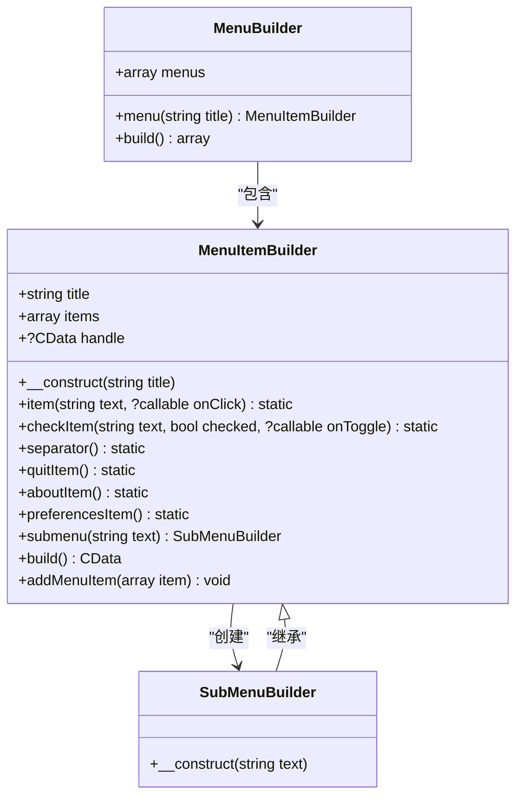
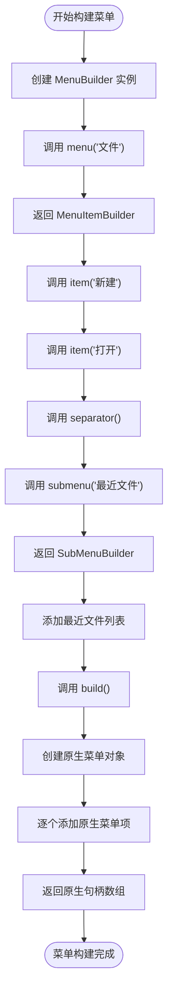
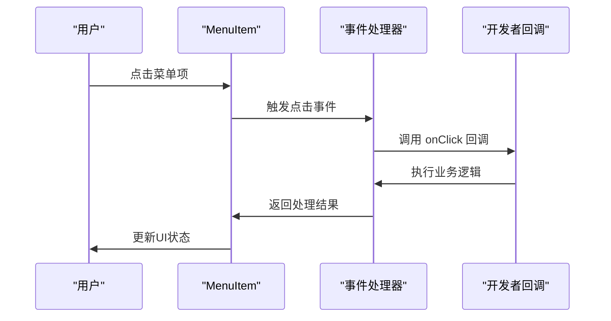
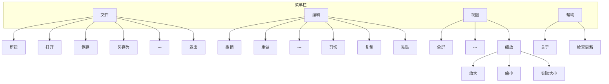
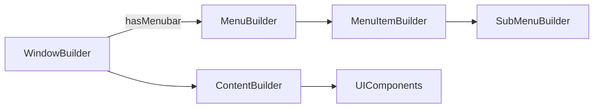

# 菜单系统

<cite>
**本文档中引用的文件**  
- [MenuBuilder.php](file://src/Components/MenuBuilder.php)
- [MenuItemBuilder.php](file://src/Components/MenuItemBuilder.php)
- [SubMenuBuilder.php](file://src/Components/SubMenuBuilder.php)
- [WindowBuilder.php](file://src/Components/WindowBuilder.php)
- [Builder.php](file://src/Builder.php)
- [full.php](file://example/full.php)
</cite>

## 目录
1. [简介](#简介)
2. [菜单系统架构](#菜单系统架构)
3. [核心组件分析](#核心组件分析)
4. [菜单构建流程](#菜单构建流程)
5. [菜单项类型与配置](#菜单项类型与配置)
6. [事件处理机制](#事件处理机制)
7. [完整菜单示例](#完整菜单示例)
8. [与主窗口集成](#与主窗口集成)
9. [最佳实践](#最佳实践)

## 简介
libuiBuilder的菜单系统提供了一套完整的桌面应用程序菜单构建解决方案，支持创建包含文件、编辑、视图等标准菜单的复杂菜单结构。该系统由三个核心组件构成：MenuBuilder用于管理顶层菜单栏，MenuItemBuilder表示可点击的菜单项，SubMenuBuilder实现嵌套子菜单功能。通过链式调用语法，开发者可以直观地构建复杂的菜单层级结构，同时支持快捷键、复选标记和分隔符等常见UI元素。

## 菜单系统架构

**图示来源**  
- [MenuBuilder.php](file://src/Components/MenuBuilder.php#L10-L29)
- [MenuItemBuilder.php](file://src/Components/MenuItemBuilder.php#L10-L126)
- [SubMenuBuilder.php](file://src/Components/SubMenuBuilder.php#L5-L14)

## 核心组件分析

### MenuBuilder（菜单栏构建器）
MenuBuilder是菜单系统的顶层管理器，负责创建和组织应用程序的菜单栏。它维护一个菜单项数组，每个菜单项对应菜单栏上的一个顶级菜单（如"文件"、"编辑"等）。通过`menu()`方法创建新的顶级菜单，并将其添加到内部数组中。`build()`方法遍历所有菜单项并调用它们的`build()`方法，最终返回原生菜单句柄数组。

**组件来源**  
- [MenuBuilder.php](file://src/Components/MenuBuilder.php#L10-L29)

### MenuItemBuilder（菜单项构建器）
MenuItemBuilder是菜单系统的核心组件，代表一个菜单项或子菜单。它包含菜单标题、子项数组和原生句柄。通过多种方法可以添加不同类型的菜单项：普通项、复选项、分隔符以及特殊系统项（如退出、关于）。`build()`方法在首次调用时创建原生菜单对象，并通过`addMenuItem()`方法处理所有子项的添加逻辑。

**组件来源**  
- [MenuItemBuilder.php](file://src/Components/MenuItemBuilder.php#L10-L126)

### SubMenuBuilder（子菜单构建器）
SubMenuBuilder继承自MenuItemBuilder，专门用于创建嵌套子菜单。虽然当前实现中构造函数为空，但它通过继承获得了MenuItemBuilder的所有功能，可以像普通菜单项一样添加各种子项。这种设计模式实现了代码复用，同时保持了API的一致性。

**组件来源**  
- [SubMenuBuilder.php](file://src/Components/SubMenuBuilder.php#L5-L14)

## 菜单构建流程

**流程来源**  
- [MenuBuilder.php](file://src/Components/MenuBuilder.php#L14-L28)
- [MenuItemBuilder.php](file://src/Components/MenuItemBuilder.php#L77-L87)

## 菜单项类型与配置

### 菜单项类型
| 类型 | 方法 | 描述 | 配置项 |
|------|------|------|--------|
| 普通项 | `item()` | 可点击的操作项 | text, onClick |
| 复选项 | `checkItem()` | 带复选标记的菜单项 | text, checked, onToggle |
| 分隔符 | `separator()` | 菜单项之间的分隔线 | 无 |
| 退出项 | `quitItem()` | 应用程序退出项 | 无 |
| 关于项 | `aboutItem()` | 关于对话框项 | 无 |
| 首选项项 | `preferencesItem()` | 首选项设置项 | 无 |
| 子菜单 | `submenu()` | 包含子项的菜单 | text |

**配置来源**  
- [MenuItemBuilder.php](file://src/Components/MenuItemBuilder.php#L22-L67)

### 关键配置属性
- **text**: 菜单项显示文本，支持Unicode字符
- **checked**: 布尔值，控制复选项的选中状态
- **enabled**: 通过原生API控制菜单项的启用/禁用状态
- **onClick**: 点击事件回调函数
- **onToggle**: 复选项状态切换回调函数

## 事件处理机制

当用户点击菜单项时，系统会触发相应的事件处理流程。对于普通菜单项，`onClick`回调函数会被调用；对于复选项，`onToggle`回调函数会在状态切换时执行。这些回调函数在主线程中同步执行，确保UI更新的及时性。

**事件来源**  
- [MenuItemBuilder.php](file://src/Components/MenuItemBuilder.php#L93-L96)
- [MenuItemBuilder.php](file://src/Components/MenuItemBuilder.php#L100-L106)

## 完整菜单示例

**示例来源**  
- [full.php](file://example/full.php#L11-L180)

## 与主窗口集成

菜单系统通过WindowBuilder的`hasMenubar`配置项与主窗口集成。当创建窗口时，如果`hasMenubar`设置为true，系统会自动创建菜单栏区域。菜单构建完成后，通过链式调用将菜单添加到窗口配置中，最终在`show()`方法中完成原生控件的创建和显示。

**集成来源**  
- [WindowBuilder.php](file://src/Components/WindowBuilder.php#L19-L33)
- [Builder.php](file://src/Builder.php#L30-L33)

## 最佳实践
1. **层次化设计**: 将相关功能组织在同一个顶级菜单下，如文件操作放在"文件"菜单
2. **标准命名**: 使用"文件"、"编辑"、"视图"等标准菜单名称，符合用户预期
3. **合理分组**: 使用分隔符将功能相关的菜单项分组，提高可读性
4. **状态同步**: 对于复选项，确保`checked`状态与应用程序实际状态保持同步
5. **错误处理**: 在事件回调中添加适当的错误处理机制，避免程序崩溃
6. **性能优化**: 对于动态生成的菜单项（如最近文件列表），考虑缓存机制

**实践建议来源**  
- [WindowBuilder.php](file://src/Components/WindowBuilder.php#L73-L78)
- [MenuItemBuilder.php](file://src/Components/MenuItemBuilder.php#L77-L87)