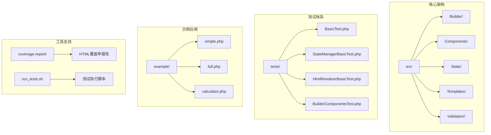
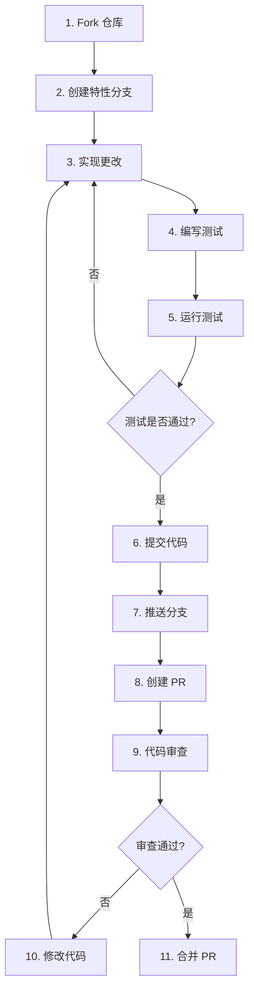
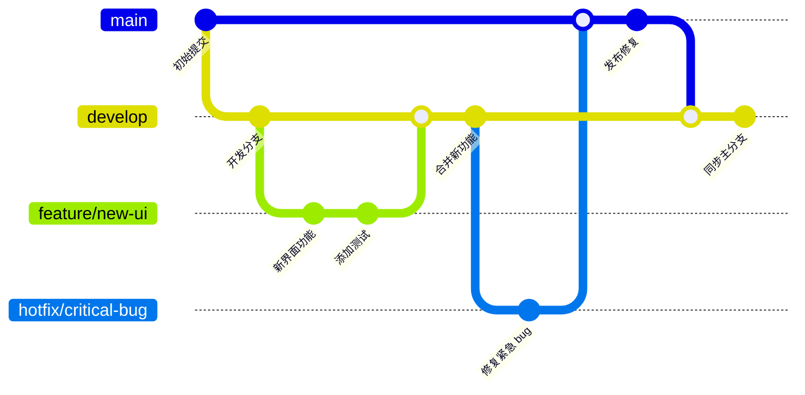
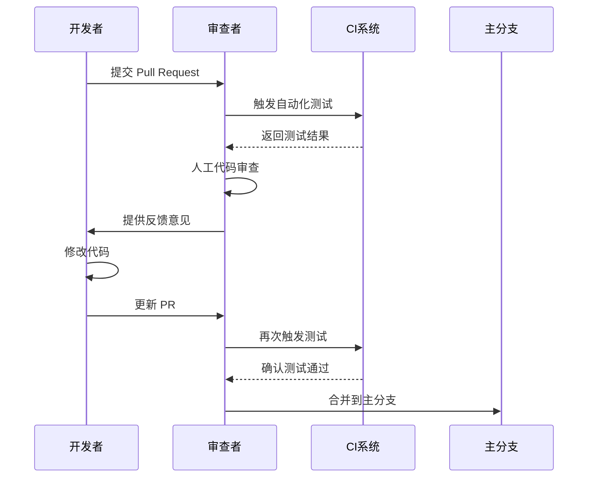

# 贡献指南

<cite>
**本文档中引用的文件**
- [README.md](file://README.md)
- [composer.json](file://composer.json)
- [run_tests.sh](file://run_tests.sh)
- [tests/README.md](file://tests/README.md)
- [pest.php](file://pest.php)
- [ComponentBuilder.php](file://src/ComponentBuilder.php)
- [ButtonBuilder.php](file://src/Components/ButtonBuilder.php)
- [tests/BasicTest.php](file://tests/BasicTest.php)
- [src/helper.php](file://src/helper.php)
- [example/simple.php](file://example/simple.php)
- [example/full.php](file://example/full.php)
</cite>

## 目录
1. [简介](#简介)
2. [项目结构概览](#项目结构概览)
3. [如何提交问题报告](#如何提交问题报告)
4. [如何提交拉取请求](#如何提交拉取请求)
5. [代码风格要求](#代码风格要求)
6. [测试要求](#测试要求)
7. [分支模型](#分支模型)
8. [代码审查标准](#代码审查标准)
9. [新贡献者指南](#新贡献者指南)
10. [常见问题解答](#常见问题解答)

## 简介

欢迎来到 libuiBuilder 项目的贡献者社区！libuiBuilder 是一个基于 PHP 的 GUI 应用程序开发框架，它提供了直观、灵活的方式来构建桌面应用程序。我们致力于建立一个开放、包容的开发环境，欢迎所有开发者参与项目的改进和扩展。

无论您是经验丰富的开发者还是刚刚入门的新手，您的贡献都将帮助我们打造更好的工具。让我们一起让 libuiBuilder 成为 PHP 桌面应用开发的最佳选择！

## 项目结构概览

libuiBuilder 项目采用模块化架构设计，主要包含以下核心组件：



**图表来源**
- [README.md](file://README.md#L1-L50)
- [composer.json](file://composer.json#L1-L37)

**章节来源**
- [README.md](file://README.md#L1-L100)
- [composer.json](file://composer.json#L1-L37)

## 如何提交问题报告

我们非常重视用户反馈，如果您在使用 libuiBuilder 时遇到任何问题，请按照以下格式提交问题报告：

### 问题报告模板

当提交问题报告时，请包含以下必要信息：

#### 基本信息
- **PHP 版本**: 您使用的 PHP 版本号（例如：8.1.12）
- **操作系统**: 您的操作系统及版本（例如：Windows 11, Ubuntu 22.04, macOS 13.0）
- **libuiBuilder 版本**: 您使用的 libuiBuilder 版本号
- **安装方式**: Composer 安装或其他方式

#### 问题描述
- **重现步骤**: 详细描述导致问题的操作步骤
- **预期行为**: 描述您期望看到的结果
- **实际行为**: 描述实际发生的情况
- **错误日志**: 提供相关的错误信息和堆栈跟踪

#### 环境配置
- **相关配置**: 列出可能影响问题的配置项
- **依赖版本**: 相关依赖库的版本信息
- **硬件信息**: 如有硬件相关问题，请提供相关信息

### 示例问题报告

```markdown
## Bug 报告

### 基本信息
- PHP 版本: 8.2.0
- 操作系统: Ubuntu 22.04 LTS
- libuiBuilder 版本: v1.2.3
- 安装方式: Composer

### 问题描述
在使用 Grid 布局时，当设置 `colspan` 属性时，组件无法正确跨越多列。

### 重现步骤
1. 创建一个 Grid 容器
2. 添加一个组件并设置 `colspan="2"`
3. 观察组件的显示效果

### 预期行为
组件应该跨越两列空间

### 实际行为
组件仍然只占据一列宽度

### 错误日志
```
Warning: Undefined property: stdClass::$colspan in /path/to/GridBuilder.php on line 45
```

### 环境配置
- libui 版本: 0.10.0
- 相关扩展: ext-ffi enabled
```

### 提交渠道
- **GitHub Issues**: 在项目的 GitHub 仓库中提交问题
- **详细描述**: 使用清晰、简洁的语言描述问题
- **标签分类**: 为问题添加适当的标签（bug、enhancement、question等）

**章节来源**
- [README.md](file://README.md#L388-L407)

## 如何提交拉取请求

我们欢迎各种形式的贡献，包括但不限于 bug 修复、功能增强、文档改进等。以下是提交拉取请求的完整流程：

### 提交流程



### 详细步骤

#### 1. 准备工作
- **Fork 仓库**: 在 GitHub 上 fork libuiBuilder 主仓库
- **克隆代码**: 将 fork 后的仓库克隆到本地
- **设置上游**: 添加主仓库为 upstream 远程

```bash
git clone https://github.com/your-username/libuiBuilder.git
cd libuiBuilder
git remote add upstream https://github.com/kingbes/libuiBuilder.git
```

#### 2. 创建特性分支
- **分支命名**: 使用描述性的分支名称
- **分支类型**: 
  - `feature/` - 新功能
  - `fix/` - bug 修复
  - `docs/` - 文档改进
  - `test/` - 测试相关
  - `refactor/` - 代码重构

```bash
git checkout -b feature/new-component
```

#### 3. 实现更改
- **遵循现有模式**: 新代码应与现有代码风格一致
- **保持单一职责**: 每个 PR 应该专注于一个特定目标
- **添加注释**: 重要的逻辑应该有清晰的注释

#### 4. 编写测试
- **测试覆盖率**: 新功能应有相应的测试
- **测试完整性**: 包括正常流程和边界情况
- **测试可读性**: 测试代码应该清晰易懂

#### 5. 运行测试
```bash
# 运行完整测试套件
./vendor/bin/pest

# 或使用交互式测试脚本
./run_tests.sh
```

#### 6. 提交代码
```bash
git add .
git commit -m "feat: 添加新的 Grid 组件支持"
```

#### 7. 推送分支
```bash
git push origin feature/new-component
```

#### 8. 创建 Pull Request
- **标题格式**: 使用清晰、描述性的标题
- **描述内容**: 详细说明更改的内容和原因
- **关联问题**: 如果有相关 issue，记得关联

### Pull Request 模板

```markdown
## 变更类型
- [ ] Bug 修复
- [ ] 新功能
- [ ] 文档改进
- [ ] 性能优化
- [ ] 代码重构

## 变更描述
简要描述本次变更的内容。

## 测试
- [ ] 添加了新的测试
- [ ] 所有现有测试通过
- [ ] 手动测试通过

## 相关问题
关闭 #123

## 截图
如果适用，添加截图以帮助解释您的变更。

## 检查清单
- [ ] 代码遵循 PSR 标准
- [ ] 自测通过
- [ ] 添加了必要的文档
- [ ] 更新了相关文档
```

**章节来源**
- [run_tests.sh](file://run_tests.sh#L1-L106)
- [tests/README.md](file://tests/README.md#L1-L50)

## 代码风格要求

libuiBuilder 严格遵循 PSR 编码标准，确保代码的一致性和可维护性。

### PSR 标准遵循

#### PSR-1: 基础编码标准
- 文件必须使用 `<?php` 或 `<?=` 标签
- 文件应该只使用 `<?php ?>` 或 `<?php ?>` 标签
- 文件应该只使用 UTF-8 无 BOM 编码
- 类名必须使用 StudlyCaps（帕斯卡命名法）
- 方法名必须使用 camelCase（驼峰命名法）

#### PSR-4: 自动加载标准
项目已经配置了 PSR-4 自动加载：
```json
{
    "autoload": {
        "psr-4": {
            "Kingbes\\Libui\\View\\": "src/"
        }
    }
}
```

#### PSR-12: 代码样式标准
- **缩进**: 使用 4 个空格，不使用制表符
- **行长度**: 每行不超过 120 个字符
- **命名空间**: 命名空间声明后有一个空行
- **use 声明**: use 声明后有一个空行

### 代码风格示例

#### 正确的代码风格
```php
<?php

namespace Kingbes\Libui\View\Components;

use Kingbes\Libui\View\ComponentBuilder;
use Kingbes\Libui\Button;

class ButtonBuilder extends ComponentBuilder
{
    protected function getDefaultConfig(): array
    {
        return [
            'text' => 'Button',
            'onClick' => null,
            'stretchy' => false,
        ];
    }

    public function text(string $text): static
    {
        return $this->setConfig('text', $text);
    }

    public function onClick(callable $callback): static
    {
        return $this->setConfig('onClick', $callback);
    }
}
```

#### 错误的代码风格
```php
<?php

namespace Kingbes\Libui\View\Components;
use Kingbes\Libui\View\ComponentBuilder;
use Kingbes\Libui\Button;

class ButtonBuilder extends ComponentBuilder
{
    protected function getDefaultConfig():array
    {
        return ['text'=>'Button','onClick'=>null,'stretchy'=>false];
    }
    public function text($text){return $this->setConfig('text',$text);}
    public function onClick($callback){return $this->setConfig('onClick',$callback);}
}
```

### 代码质量检查

#### 使用 PHPStan 进行静态分析
```bash
# 安装 PHPStan
composer require --dev phpstan/phpstan

# 运行静态分析
./vendor/bin/phpstan analyse src/
```

#### 使用 PHP CS Fixer 自动格式化
```bash
# 安装 PHP CS Fixer
composer require --dev friendsofphp/php-cs-fixer

# 运行代码格式化
./vendor/bin/php-cs-fixer fix src/
```

**章节来源**
- [composer.json](file://composer.json#L10-L17)
- [ButtonBuilder.php](file://src/Components/ButtonBuilder.php#L1-L48)
- [ComponentBuilder.php](file://src/ComponentBuilder.php#L1-L234)

## 测试要求

libuiBuilder 项目拥有完善的测试体系，我们要求所有贡献都必须包含相应的测试。

### 测试框架

项目使用 Pest 作为主要的测试框架，这是一个基于 PHPUnit 的现代测试工具。

#### 测试目录结构
```
tests/
├── BasicTest.php              # 基础功能测试
├── StateManagerBasicTest.php  # 状态管理测试
├── HtmlRendererBasicTest.php  # HTML 渲染器测试
├── BuilderComponentsTest.php  # Builder 组件测试
└── HelperFunctionsTest.php    # 辅助函数测试
```

### 测试覆盖率要求

根据覆盖率报告，我们设定了以下覆盖率目标：

| 组件/模块 | 当前覆盖率 | 目标覆盖率 | 状态 |
|-----------|------------|------------|------|
| **StateManager** | 88.24% | 95%+ | 需要改进 |
| **HtmlRenderer** | 87.8% | 90%+ | 需要改进 |
| **Builder** | 95.8% | 95%+ | 良好 |
| **ComponentRef** | 80% | 90%+ | 需要改进 |
| **Helper Functions** | 100% | 100%+ | 优秀 |

### 测试编写指南

#### 基础测试示例
```php
<?php

test('基本断言测试', function () {
    expect(true)->toBeTrue();
    expect(false)->toBeFalse();
});

test('数组测试', function () {
    $array = [1, 2, 3];
    expect($array)->toHaveCount(3);
    expect($array)->toContain(2);
});

test('字符串测试', function () {
    $string = 'Hello World';
    expect($string)->toBe('Hello World');
    expect($string)->toContain('World');
});
```

#### 组件测试示例
```php
<?php

test('ButtonBuilder 基本功能', function () {
    $button = Builder::button()
        ->text('测试按钮')
        ->onClick(function($btn, $state) {
            return 'clicked';
        });
        
    expect($button)->toBeInstanceOf(ButtonBuilder::class);
    expect($button->getConfig('text'))->toBe('测试按钮');
});
```

#### 状态管理测试
```php
<?php

test('StateManager 基本操作', function () {
    $state = StateManager::instance();
    
    // 设置状态
    $state->set('username', 'testuser');
    expect($state->get('username'))->toBe('testuser');
    
    // 批量更新
    $state->update(['count' => 10, 'active' => true]);
    expect($state->get('count'))->toBe(10);
    expect($state->get('active'))->toBe(true);
});
```

### 测试执行

#### 运行所有测试
```bash
# 使用 Pest CLI
./vendor/bin/pest

# 使用测试脚本
./run_tests.sh
```

#### 运行特定测试
```bash
# 运行单个测试文件
./vendor/bin/pest tests/BasicTest.php

# 运行特定测试类
./vendor/bin/pest tests/StateManagerBasicTest.php
```

#### 生成测试覆盖率报告
```bash
# 控制台覆盖率报告
./vendor/bin/pest --coverage

# HTML 覆盖率报告
./vendor/bin/pest --coverage --coverage-html=coverage-report
```

### 测试最佳实践

#### 1. 测试隔离性
每个测试都应该独立运行，不依赖其他测试的状态。

```php
test('独立测试', function () {
    // 每次测试都初始化新的状态
    $state = StateManager::instance();
    $state->set('test', 'initial');
    
    // 测试逻辑
    expect($state->get('test'))->toBe('initial');
});
```

#### 2. 清晰的测试命名
```php
// ❌ 不好的命名
test('test', function () {});

// ✅ 好的命名
test('StateManager should set and get values correctly', function () {});
```

#### 3. 充分的边界测试
```php
test('边界条件测试', function () {
    $builder = Builder::entry();
    
    // 测试空值
    expect($builder->getValue())->toBeNull();
    
    // 测试最大长度限制
    $builder->maxLength(10);
    $builder->setValue('这是一个很长的字符串');
    expect(strlen($builder->getValue()))->toBeLessThanOrEqual(10);
});
```

**章节来源**
- [tests/README.md](file://tests/README.md#L1-L174)
- [run_tests.sh](file://run_tests.sh#L1-L106)
- [tests/BasicTest.php](file://tests/BasicTest.php#L1-L17)
- [pest.php](file://pest.php#L1-L8)

## 分支模型

libuiBuilder 采用 Git Flow 分支模型，这是一种广泛使用的版本控制策略。

### 分支结构



### 主要分支说明

#### 1. main 分支（稳定分支）
- **用途**: 代表最新的稳定版本
- **特点**: 
  - 代码经过充分测试
  - 包含已发布的版本
  - 保持高度稳定性
- **访问权限**: 只有核心维护者可以推送

#### 2. develop 分支（开发分支）
- **用途**: 日常开发工作分支
- **特点**:
  - 包含即将发布的功能
  - 可能包含实验性功能
  - 定期与 main 分支同步
- **访问权限**: 所有贡献者都可以推送

#### 3. feature 分支（特性分支）
- **命名规则**: `feature/description`
- **用途**: 开发新功能
- **生命周期**: 从创建到合并到 develop

#### 4. hotfix 分支（热修复分支）
- **命名规则**: `hotfix/description`
- **用途**: 紧急修复生产环境问题
- **流程**: 
  1. 从 main 分支创建
  2. 修复后合并到 main 和 develop

#### 5. release 分支（发布分支）
- **命名规则**: `release/vX.Y.Z`
- **用途**: 准备新版本发布
- **活动**: 最终测试、版本标记、文档更新

### 分支操作指南

#### 创建特性分支
```bash
# 从 develop 分支创建新特性
git checkout develop
git pull upstream develop
git checkout -b feature/new-feature-name
```

#### 合并特性分支
```bash
# 在合并前确保代码是最新的
git checkout develop
git pull upstream develop

# 合并特性分支
git checkout feature/new-feature-name
git pull upstream develop
git checkout develop
git merge feature/new-feature-name

# 删除特性分支
git branch -d feature/new-feature-name
git push origin --delete feature/new-feature-name
```

#### 处理冲突
```bash
# 解决冲突后继续合并
git add .
git commit -m "解决合并冲突"
git push origin develop
```

**章节来源**
- [README.md](file://README.md#L388-L407)

## 代码审查标准

代码审查是保证代码质量和项目健康的重要环节。我们制定了以下审查标准：

### 审查清单

#### 1. 功能正确性
- [ ] 代码实现了预期功能
- [ ] 处理了所有边界情况
- [ ] 错误处理得当
- [ ] 性能考虑充分

#### 2. 代码质量
- [ ] 遵循 PSR 编码标准
- [ ] 代码结构清晰合理
- [ ] 变量和函数命名恰当
- [ ] 注释充分且准确

#### 3. 测试覆盖
- [ ] 添加了相应的测试
- [ ] 测试覆盖率达标
- [ ] 测试包含了边界情况
- [ ] 测试可重复执行

#### 4. 文档
- [ ] 更新了相关文档
- [ ] 添加了必要的注释
- [ ] 示例代码清晰

### 审查流程



### 审查要点

#### 1. 代码逻辑审查
- **业务逻辑**: 确保实现符合需求规格
- **算法效率**: 评估算法的时间和空间复杂度
- **数据流**: 检查数据在系统中的流向

#### 2. 安全性审查
- **输入验证**: 确保所有输入都经过验证
- **权限检查**: 验证适当的权限控制
- **敏感信息**: 检查是否有敏感信息泄露

#### 3. 可维护性审查
- **模块化**: 代码是否具有良好的模块化
- **依赖管理**: 检查依赖关系是否合理
- **扩展性**: 代码是否易于扩展

#### 4. 性能审查
- **资源使用**: 检查内存和 CPU 使用情况
- **并发处理**: 验证并发场景下的正确性
- **缓存策略**: 检查缓存使用的合理性

### 审查反馈示例

#### 积极的反馈
```markdown
👍 代码结构清晰，很好地分离了关注点。测试覆盖全面，包含了边界情况。

💡 建议：可以考虑添加更多的错误处理逻辑，特别是对于外部依赖的调用。

📝 文档：新增的函数有很好的注释，但可以在 README 中添加使用示例。
```

#### 建设性的反馈
```markdown
⚠️ 这段代码存在潜在的竞态条件，特别是在高并发场景下。

🔍 建议：需要添加更多的单元测试来覆盖这个场景。

📖 文档：缺少相关的使用示例，建议添加到文档中。
```

### 审查工具

#### 自动化检查工具
- **PHPStan**: 静态代码分析
- **PHP CS Fixer**: 代码格式化
- **PHPUnit**: 单元测试
- **Pest**: 测试框架

#### 代码审查平台
- **GitHub Pull Requests**: 主要的审查平台
- **Code Review Comments**: 结构化的反馈
- **Automated Checks**: CI/CD 集成

**章节来源**
- [tests/README.md](file://tests/README.md#L159-L174)

## 新贡献者指南

我们欢迎所有新贡献者的加入！为了让您更快地融入项目，我们准备了这份专门的指南。

### 第一次贡献

#### 1. 环境准备
```bash
# 1. Fork 项目仓库
# 2. 克隆到本地
git clone https://github.com/your-username/libuiBuilder.git
cd libuiBuilder

# 3. 安装依赖
composer install

# 4. 运行测试确保环境正常
./vendor/bin/pest
```

#### 2. 选择合适的任务
- **Good First Issue**: 标记为 "good first issue" 的问题适合新手
- **Documentation**: 文档改进通常比较容易上手
- **Bug Fixes**: 简单的 bug 修复是很好的起点

#### 3. 开始贡献
```bash
# 1. 创建特性分支
git checkout -b feature/your-feature-name

# 2. 实现功能
# 3. 编写测试
# 4. 运行测试
./vendor/bin/pest

# 5. 提交代码
git add .
git commit -m "feat: 添加新功能描述"
git push origin feature/your-feature-name
```

### 社区互动

#### 1. 加入讨论
- **GitHub Discussions**: 参与项目讨论
- **Issues**: 回答其他贡献者的问题
- **Pull Requests**: 为其他人的 PR 提供反馈

#### 2. 寻求帮助
- **文档阅读**: 仔细阅读项目文档
- **提问技巧**: 提出具体、可搜索的问题
- **耐心等待**: 维护者可能需要时间回复

#### 3. 分享知识
- **博客文章**: 分享您的学习心得
- **教程制作**: 制作使用教程
- **演讲分享**: 在技术会议上分享经验

### 成长路径

#### 初级贡献者
- 熟悉项目结构
- 学习编码规范
- 参与简单问题修复

#### 中级贡献者
- 独立开发新功能
- 编写高质量测试
- 优化现有代码

#### 高级贡献者
- 设计新架构
- 指导新贡献者
- 参与项目决策

### 我们的承诺

我们承诺为新贡献者提供：
- **友好和支持的环境**
- **清晰的指导和反馈**
- **学习和成长的机会**
- **认可和奖励**

**章节来源**
- [README.md](file://README.md#L388-L407)

## 常见问题解答

### 关于问题报告

#### Q: 我应该如何报告安全漏洞？
A: 请不要在公开的 GitHub Issues 中报告安全漏洞。请直接联系项目维护者，或者使用 GitHub 的私密报告功能。

#### Q: 我提交的问题没有得到及时回复怎么办？
A: 项目维护者通常是志愿者，可能无法立即回复。您可以：
- 检查是否提供了足够的信息
- 等待一段时间再跟进
- 在其他渠道寻求帮助

### 关于拉取请求

#### Q: 我的 PR 被拒绝了，应该怎么办？
A: 不要气馁！请：
- 仔细阅读审查反馈
- 根据建议修改代码
- 重新提交 PR
- 如果有疑问，主动询问

#### Q: 我的 PR 太大了，应该拆分成多个小的吗？
A: 是的，尽量保持 PR 的小而专注。大的 PR 很难审查，也容易引入问题。

### 关于测试

#### Q: 我的测试总是失败，怎么办？
A: 首先检查：
- 测试环境是否正确配置
- 测试代码是否正确
- 依赖是否正确安装

#### Q: 我不知道如何为某些功能编写测试，怎么办？
A: 可以：
- 查看现有的测试示例
- 在 PR 中询问帮助
- 先提交功能，后续再补充测试

### 关于代码风格

#### Q: 我的代码风格和项目不一致，会被拒绝吗？
A: 不会！我们会帮助您调整代码风格。重要的是功能正确和代码质量。

#### Q: 我不确定某个代码风格是否正确，怎么办？
A: 参考项目的现有代码风格，或者在 PR 中询问。

### 关于分支和合并

#### Q: 我的分支和主分支有冲突，怎么解决？
A: 通常可以通过：
- 从主分支更新最新代码
- 解决冲突
- 重新测试

#### Q: 我的 PR 被合并后，我的本地分支怎么办？
A: 可以删除本地分支：
```bash
git branch -d feature/your-feature-name
git push origin --delete feature/your-feature-name
```

### 关于项目发展

#### Q: 我有一个很好的想法，但不确定是否会被接受，怎么办？
A: 可以：
- 在 GitHub Discussions 中提出
- 创建一个原型展示
- 与其他贡献者讨论

#### Q: 我想为项目做更多贡献，有什么建议？
A: 可以：
- 从小的改进开始
- 帮助回答其他人的问题是很好的开始
- 参与文档改进
- 帮助维护现有功能

**章节来源**
- [README.md](file://README.md#L388-L407)
- [tests/README.md](file://tests/README.md#L1-L50)

## 结语

感谢您花时间阅读这份贡献指南！libuiBuilder 项目的发展离不开每一位贡献者的努力。无论您是提交 bug 报告、修复问题、添加新功能，还是改进文档，您的每一份贡献都将帮助我们打造更好的工具。

记住，开源不仅仅是写代码，更是建立社区、分享知识和互相学习的过程。我们在这里欢迎您的到来，期待与您一起创造美好的未来！

如果您还有任何问题，随时可以通过 GitHub Issues 或 Discussions 与我们联系。让我们一起让 libuiBuilder 成为 PHP 桌面应用开发的最佳选择！

---

**最后更新**: 2024年1月
**版本**: 1.0.0