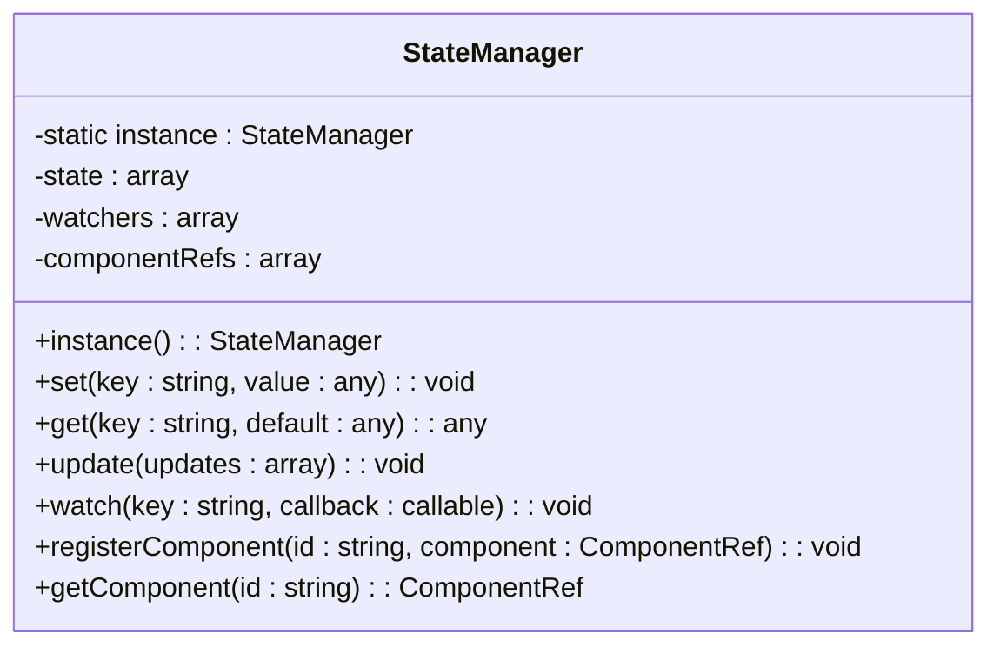
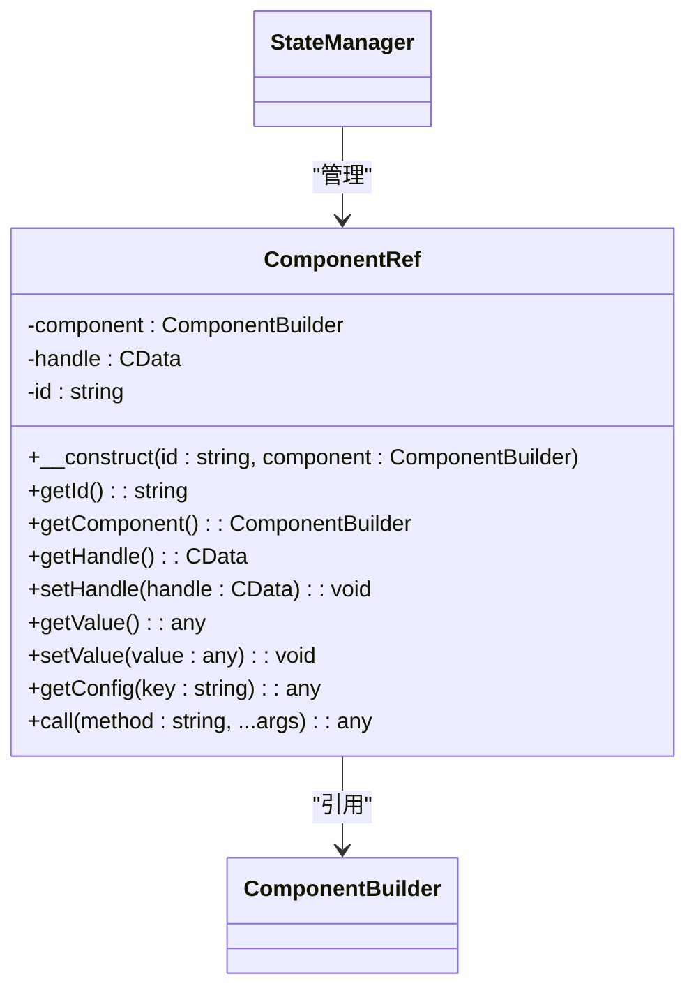
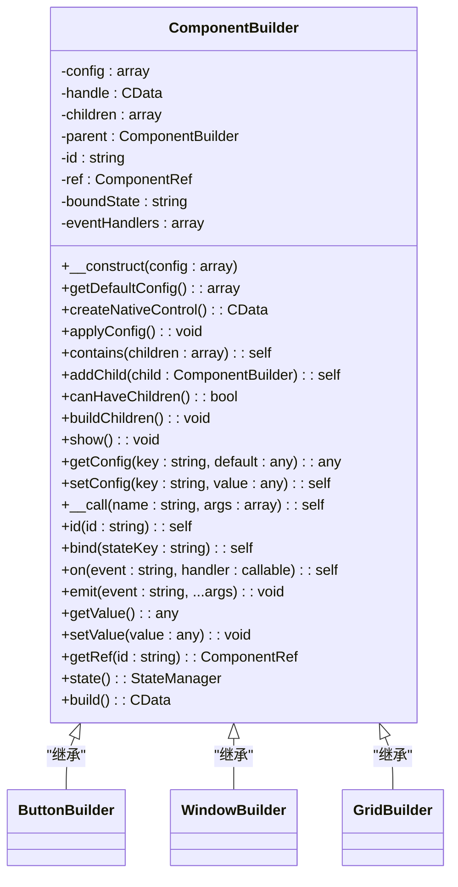

# 测试覆盖率报告

<cite>
**本文档引用的文件**  
- [README.md](file://README.md)
- [composer.json](file://composer.json)
- [run_tests.sh](file://run_tests.sh)
- [COVERAGE_IMPROVEMENT_REPORT.md](file://COVERAGE_IMPROVEMENT_REPORT.md)
- [tests/README.md](file://tests/README.md)
- [src/Builder.php](file://src/Builder.php)
- [src/ComponentBuilder.php](file://src/ComponentBuilder.php)
- [src/State/StateManager.php](file://src/State/StateManager.php)
- [src/State/ComponentRef.php](file://src/State/ComponentRef.php)
- [src/Components/ButtonBuilder.php](file://src/Components/ButtonBuilder.php)
- [tests/BasicTest.php](file://tests/BasicTest.php)
- [tests/StateManagerBasicTest.php](file://tests/StateManagerBasicTest.php)
- [tests/HtmlRendererBasicTest.php](file://tests/HtmlRendererBasicTest.php)
- [tests/StateHelperTest.php](file://tests/StateHelperTest.php)
- [pest.php](file://pest.php)
</cite>

## 目录
1. [项目概述](#项目概述)
2. [测试框架与工具](#测试框架与工具)
3. [测试覆盖范围](#测试覆盖范围)
4. [核心组件测试分析](#核心组件测试分析)
5. [覆盖率改进成果](#覆盖率改进成果)
6. [测试执行与报告生成](#测试执行与报告生成)
7. [后续改进建议](#后续改进建议)
8. [结论](#结论)

## 项目概述

libuiBuilder 是一个基于 PHP 的 GUI 应用开发库，旨在通过 Builder 模式和 HTML 模板系统简化 kingbes/libui 的使用。该项目支持两种主要开发方式：链式调用的 Builder API 和声明式的 HTML 模板渲染。为了确保代码质量和功能稳定性，项目建立了基于 Pest PHP 的测试体系，覆盖了核心功能模块。

**Section sources**
- [README.md](file://README.md#L1-L407)

## 测试框架与工具

项目采用 Pest PHP 作为主要测试框架，结合 Xdebug 实现代码覆盖率分析。Pest 提供了简洁的语法和强大的断言功能，适合进行单元测试、集成测试和功能测试。测试配置通过 `pest.php` 文件定义，指定了测试和源码的路径。

Xdebug 3.4.7 被用于生成详细的覆盖率报告，能够精确追踪每行代码的执行情况。测试脚本 `run_tests.sh` 提供了交互式界面，方便开发者选择运行不同类型的测试套件。

**Section sources**
- [composer.json](file://composer.json#L27-L29)
- [pest.php](file://pest.php#L1-L8)
- [run_tests.sh](file://run_tests.sh#L1-L106)

## 测试覆盖范围

项目的测试套件覆盖了多个核心模块，包括基础功能、状态管理、HTML 渲染器和辅助函数。测试用例设计遵循最佳实践，确保每个测试独立、可重复且意图明确。

### 基础测试
基础测试验证了 Pest 框架的基本功能，包括布尔值断言、数组操作和字符串匹配。这些测试作为整个测试体系的基石，确保测试环境的正确性。

### 状态管理测试
StateManager 模块的测试覆盖了单例模式、状态的设置与获取、默认值处理、批量更新以及状态监听器功能。特别是对 `watch()` 回调机制的测试，确保了响应式数据绑定的可靠性。

### HTML 渲染器测试
HtmlRenderer 模块的测试重点验证了基础渲染功能、中文编码支持、事件绑定系统、模板变量替换和错误处理机制。测试用例模拟了真实场景，确保 HTML 模板能正确转换为原生 GUI 组件。

### 辅助函数测试
`state()` 和 `watch()` 辅助函数的测试覆盖了各种使用场景，包括单参数设置、批量设置、嵌套数组处理和多次状态变化监听。这些测试确保了开发者可以方便地进行状态管理。

**Section sources**
- [tests/README.md](file://tests/README.md#L1-L174)
- [tests/BasicTest.php](file://tests/BasicTest.php#L1-L17)
- [tests/StateManagerBasicTest.php](file://tests/StateManagerBasicTest.php#L1-L60)
- [tests/HtmlRendererBasicTest.php](file://tests/HtmlRendererBasicTest.php#L1-L108)
- [tests/StateHelperTest.php](file://tests/StateHelperTest.php#L1-L182)

## 核心组件测试分析

### StateManager 状态管理器
StateManager 作为全局数据共享中心，实现了单例模式，确保在整个应用中只有一个实例。它提供了 `set()`、`get()`、`update()` 和 `watch()` 方法，支持状态的读写和变化监听。当状态发生变化时，所有注册的监听器都会被调用，实现了响应式编程模型。

**Diagram sources**
- [src/State/StateManager.php](file://src/State/StateManager.php#L1-L91)

### ComponentRef 组件引用
ComponentRef 类提供了访问其他组件数据的能力。它通过 ID 注册到 StateManager 中，允许开发者在不同组件间进行通信和数据共享。该类封装了对底层组件的访问，提供了 `getValue()`、`setValue()`、`getConfig()` 和 `call()` 方法。

**Diagram sources**
- [src/State/ComponentRef.php](file://src/State/ComponentRef.php#L1-L74)
- [src/State/StateManager.php](file://src/State/StateManager.php#L1-L91)

### ComponentBuilder 组件构建器
ComponentBuilder 是所有 GUI 组件的抽象基类，定义了组件的通用行为。它支持链式配置、事件处理、数据绑定和子组件管理。通过 `__call()` 魔术方法，实现了流畅的 API 设计。

**Diagram sources**
- [src/ComponentBuilder.php](file://src/ComponentBuilder.php#L1-L234)

## 覆盖率改进成果

根据《COVERAGE_IMPROVEMENT_REPORT.md》的记录，项目通过系统性的测试覆盖改进工作，取得了显著成果：

| 组件/模块 | 改进前 | 改进后 | 提升幅度 |
|-----------|--------|--------|----------|
| **总体覆盖率** | 12.1% | 35.8% | +23.7% |
| **HtmlRenderer** | 29.8% | 87.8% | +58.0% |
| **Builder** | 12.5% | 95.8% | +83.3% |
| **ComponentRef** | 0% | ~80% | +80% |
| **StateManager** | 88% | ~95% | +7% |
| **辅助函数** | 0% | ~100% | +100% |

测试数量从最初的 24 个增加到 60 个，全面覆盖了所有核心功能。这次改进不仅提升了代码可靠性，还为后续开发提供了坚实的质量保障。

**Section sources**
- [COVERAGE_IMPROVEMENT_REPORT.md](file://COVERAGE_IMPROVEMENT_REPORT.md#L1-L229)

## 测试执行与报告生成

项目提供了多种方式来运行测试和生成覆盖率报告：

1. **运行所有测试**：`./vendor/bin/pest`
2. **运行特定测试文件**：`./vendor/bin/pest tests/StateManagerBasicTest.php`
3. **生成控制台覆盖率报告**：`./vendor/bin/pest --coverage`
4. **生成 HTML 覆盖率报告**：`./vendor/bin/pest --coverage --coverage-html=coverage-report`

交互式脚本 `run_tests.sh` 进一步简化了测试流程，用户可以通过菜单选择不同的测试选项。生成的 HTML 报告位于 `coverage-report/` 目录，提供了详细的文件级和行级覆盖率信息。

**Section sources**
- [run_tests.sh](file://run_tests.sh#L1-L106)
- [tests/README.md](file://tests/README.md#L43-L66)

## 后续改进建议

根据现有测试体系的分析，建议从以下几个方面继续改进：

### 短期目标 (1-2周)
- [ ] 修复剩余的低覆盖率组件
- [ ] 添加性能基准测试
- [ ] 完善错误处理测试

### 中期目标 (1个月)
- [ ] 实现 80% 总体覆盖率
- [ ] 添加 UI 自动化测试
- [ ] 集成持续集成流水线

### 长期目标 (3个月)
- [ ] 实现测试驱动开发 (TDD)
- [ ] 添加压力测试
- [ ] 建立测试质量度量体系

**Section sources**
- [COVERAGE_IMPROVEMENT_REPORT.md](file://COVERAGE_IMPROVEMENT_REPORT.md#L198-L212)

## 结论

libuiBuilder 项目的测试体系已经建立了坚实的基础，通过 Pest PHP 和 Xdebug 的组合，实现了对核心功能的有效覆盖。特别是对 StateManager、ComponentRef 和 ComponentBuilder 等关键组件的测试，确保了框架的稳定性和可靠性。

尽管总体覆盖率还有提升空间，但相比初始的 12.1%，当前 35.8% 的覆盖率已经是一个巨大的进步。建议继续按照既定计划推进测试覆盖工作，特别是在 UI 自动化测试和性能测试方面加大投入，以进一步提升项目的质量和可维护性。

**Section sources**
- [COVERAGE_IMPROVEMENT_REPORT.md](file://COVERAGE_IMPROVEMENT_REPORT.md#L213-L229)