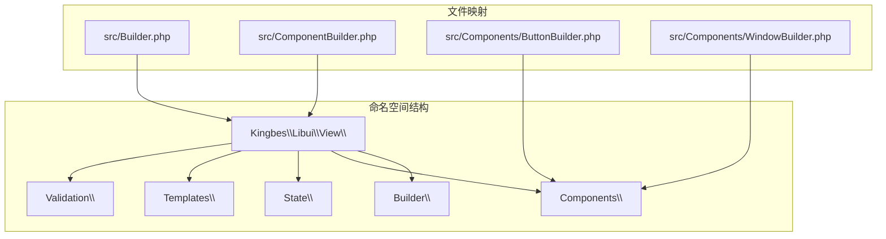
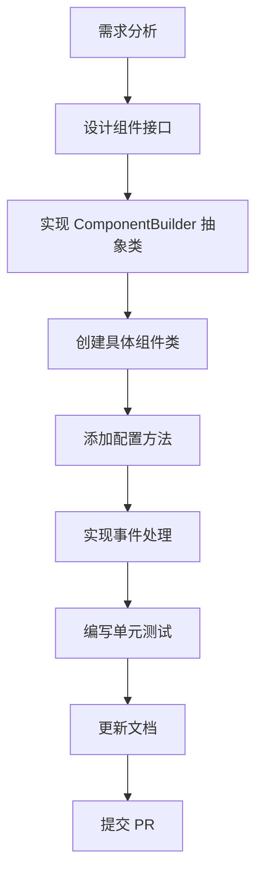
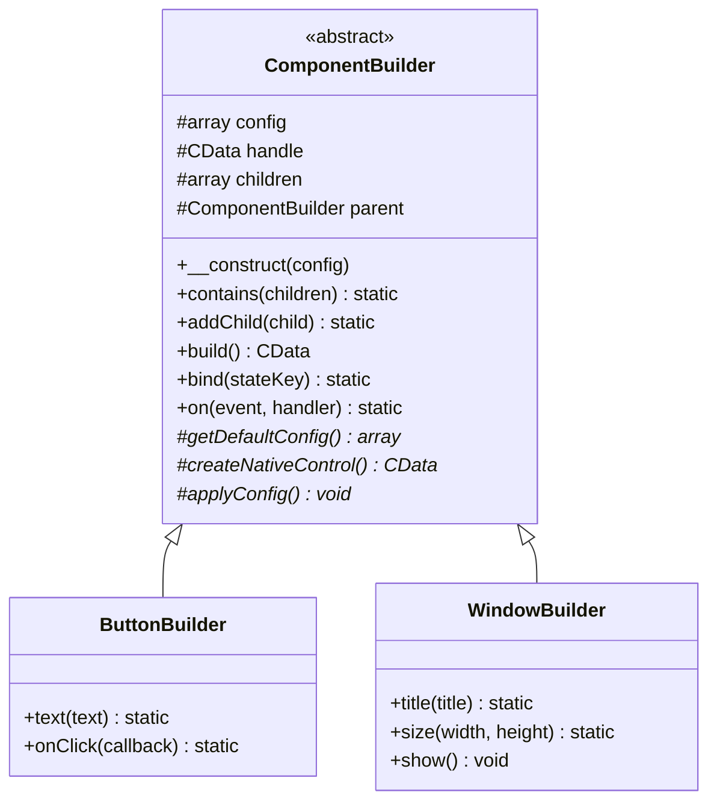
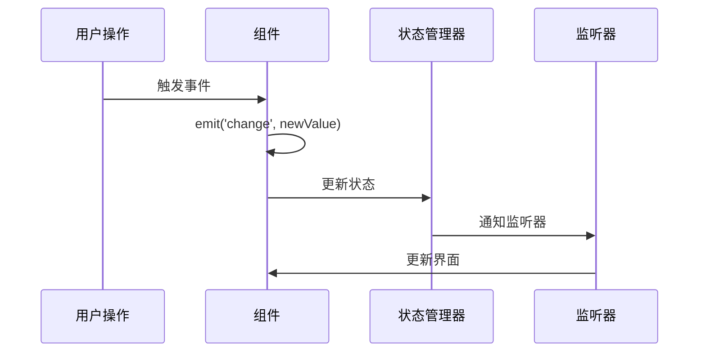

# 贡献指南

<cite>
**本文档中引用的文件**
- [composer.json](file://composer.json)
- [src/Builder.php](file://src/Builder.php)
- [src/ComponentBuilder.php](file://src/ComponentBuilder.php)
- [src/Components/ButtonBuilder.php](file://src/Components/ButtonBuilder.php)
- [src/Components/WindowBuilder.php](file://src/Components/WindowBuilder.php)
- [src/Templates/FormTemplate.php](file://src/Templates/FormTemplate.php)
- [src/helper.php](file://src/helper.php)
- [tests/Html5RendererTest.php](file://tests/Html5RendererTest.php)
- [tests/StateHelperTest.php](file://tests/StateHelperTest.php)
- [example/simple.php](file://example/simple.php)
- [example/full.php](file://example/full.php)
- [example/responseGrid.php](file://example/responseGrid.php)
</cite>

## 目录
1. [项目简介](#项目简介)
2. [开发环境设置](#开发环境设置)
3. [代码风格规范](#代码风格规范)
4. [测试要求](#测试要求)
5. [提交规范](#提交规范)
6. [运行测试套件](#运行测试套件)
7. [贡献类型指南](#贡献类型指南)
8. [架构设计原则](#架构设计原则)
9. [最佳实践](#最佳实践)
10. [常见问题解答](#常见问题解答)

## 项目简介

libuiBuilder 是一个基于 PHP 的 GUI 应用程序构建库，采用 Builder 设计模式，提供了直观的链式调用接口来创建跨平台的桌面应用程序。该项目使用 PSR-4 自动加载规范，所有核心类都位于 `Kingbes\Libui\View\` 命名空间下。

### 核心特性
- **Builder 设计模式**：提供流畅的链式 API
- **跨平台支持**：基于 libui 库，支持 Windows、macOS 和 Linux
- **响应式状态管理**：内置状态管理系统，支持数据绑定
- **丰富的组件库**：包含按钮、输入框、表格等多种 UI 组件
- **模板系统**：支持 HTML5 渲染和表单模板

## 开发环境设置

### 系统要求
- PHP 8.0 或更高版本
- ext/ffi 扩展（必需）
- libui 库（通过 composer 自动安装）

### 环境配置步骤

1. **克隆项目**
```bash
git clone https://github.com/yangweijie/libui-builder.git
cd libui-builder
```

2. **安装依赖**
```bash
composer install
```

3. **验证安装**
```bash
composer test
```

**章节来源**
- [composer.json](file://composer.json#L1-L35)

## 代码风格规范

### PSR-4 自动加载规范

项目严格遵循 PSR-4 自动加载标准，所有代码文件必须按照以下规则组织：



**图表来源**
- [composer.json](file://composer.json#L10-L17)
- [src/Builder.php](file://src/Builder.php#L3-L4)

### 命名约定

#### 类名与文件名匹配
每个类必须与其所在文件名完全一致：

| 文件路径 | 类名 | 命名空间 |
|---------|------|----------|
| `src/Builder.php` | `Builder` | `Kingbes\Libui\View` |
| `src/ComponentBuilder.php` | `ComponentBuilder` | `Kingbes\Libui\View` |
| `src/Components/ButtonBuilder.php` | `ButtonBuilder` | `Kingbes\Libui\View\Components` |
| `src/Components/WindowBuilder.php` | `WindowBuilder` | `Kingbes\Libui\View\Components` |

#### 方法命名规范
- **公共方法**：使用驼峰命名法（camelCase）
- **私有方法**：使用下划线命名法（snake_case）作为辅助方法
- **静态方法**：使用驼峰命名法

#### 命名空间使用
所有新组件必须使用 `Kingbes\Libui\View\` 命名空间：
- 组件类：`Kingbes\Libui\View\Components\{ComponentName}Builder`
- 模板类：`Kingbes\Libui\View\Templates\{TemplateName}`
- 状态管理：`Kingbes\Libui\View\State\{ClassName}`

**章节来源**
- [src/Builder.php](file://src/Builder.php#L1-L153)
- [src/ComponentBuilder.php](file://src/ComponentBuilder.php#L1-L234)

## 测试要求

### 测试框架选择
项目支持两种测试框架：
- **PHPUnit**：传统 PHPUnit 框架
- **Pest**：现代 Pest 框架（推荐）

### 测试文件结构
所有测试文件必须位于 `tests/` 目录下，遵循以下命名规范：
- `{ComponentName}Test.php`：针对具体组件的测试
- `{FeatureName}Test.php`：功能测试
- `*HelperTest.php`：辅助功能测试

### 测试覆盖率要求
- **新功能**：必须包含单元测试
- **Bug修复**：必须包含回归测试
- **性能优化**：必须包含性能测试
- **最小覆盖率**：80%

### 测试编写规范

#### 基本测试结构
```php
<?php

use Kingbes\Libui\View\{Component};
use Kingbes\Libui\View\ComponentBuilder;

describe('{Component} 基础功能', function () {
    
    it('可以正确初始化', function () {
        $component = new {Component}Builder();
        expect($component)->toBeInstanceOf(ComponentBuilder::class);
    });
    
    it('支持链式调用', function () {
        $component = (new {Component}Builder())
            ->property1('value1')
            ->property2('value2');
            
        expect($component)->toBeInstanceOf({Component}Builder::class);
    });
});
```

#### 状态管理测试
```php
it('可以正确绑定状态', function () {
    $component = new {Component}Builder();
    $component->bind('testState');
    
    expect($component->boundState)->toBe('testState');
});
```

**章节来源**
- [composer.json](file://composer.json#L26-L29)
- [tests/Html5RendererTest.php](file://tests/Html5RendererTest.php#L1-L221)
- [tests/StateHelperTest.php](file://tests/StateHelperTest.php#L1-L184)

## 提交规范

### Git 提交消息格式

使用清晰、描述性的提交消息，遵循以下格式：

```
{类型}(范围): {简短描述}

{详细描述}

{相关 issue 编号}
```

#### 提交类型
- `feat`：新功能
- `fix`：Bug 修复
- `docs`：文档更新
- `style`：代码格式调整
- `refactor`：重构
- `test`：测试相关
- `chore`：构建过程或辅助工具变动

#### 示例提交消息
```
feat(components): 添加新的 CanvasBuilder 组件

新增 CanvasBuilder 类，支持自定义绘图功能
- 实现基本绘图 API
- 支持事件处理
- 添加单元测试

Closes #123
```

### 关联 Issue 编号
在提交消息中明确关联相关的 Issue 编号，便于跟踪和管理。

### 代码审查流程

1. **本地测试**：确保所有测试通过
2. **代码审查**：提交 Pull Request 并邀请团队成员审查
3. **反馈处理**：根据审查意见修改代码
4. **合并批准**：获得至少一位维护者的批准后合并

## 运行测试套件

### 安装测试依赖
```bash
composer install --dev
```

### 运行所有测试
```bash
# 使用 PHPUnit
vendor/bin/phpunit

# 使用 Pest
vendor/bin/pest
```

### 运行特定测试
```bash
# 运行单个测试文件
vendor/bin/phpunit tests/Html5RendererTest.php

# 运行特定测试类
vendor/bin/pest tests/Html5RendererTest.php

# 运行特定测试方法
vendor/bin/pest --filter "可以解析简单的HTML5模板"
```

### 测试覆盖率报告
```bash
# 生成 HTML 覆盖率报告
vendor/bin/phpunit --coverage-html coverage/

# 生成文本覆盖率报告
vendor/bin/phpunit --coverage-text
```

### 测试环境配置
确保测试环境包含必要的扩展：
- `ext/ffi`：FFI 扩展
- `ext/json`：JSON 扩展
- `ext/mbstring`：多字节字符串扩展

**章节来源**
- [composer.json](file://composer.json#L26-L29)

## 贡献类型指南

### 新组件开发

#### 组件开发流程


**图表来源**
- [src/ComponentBuilder.php](file://src/ComponentBuilder.php#L11-L234)
- [src/Components/ButtonBuilder.php](file://src/Components/ButtonBuilder.php#L1-L48)

#### 组件开发模板
```php
<?php

namespace Kingbes\Libui\View\Components;

use Kingbes\Libui\View\ComponentBuilder;
use Kingbes\Libui\{NativeClass};
use FFI\CData;

class NewComponentBuilder extends ComponentBuilder
{
    protected function getDefaultConfig(): array
    {
        return [
            'property1' => 'defaultValue',
            'property2' => false,
            'property3' => 0,
        ];
    }

    protected function createNativeControl(): CData
    {
        return NativeClass::create(/* 参数 */);
    }

    protected function applyConfig(): void
    {
        // 应用配置到原生控件
    }

    public function property1(string $value): static
    {
        return $this->setConfig('property1', $value);
    }

    // 其他配置方法...
}
```

### 文档改进

#### 文档类型
- **API 文档**：组件方法和属性说明
- **使用指南**：实际应用场景示例
- **最佳实践**：开发建议和注意事项
- **故障排除**：常见问题解决方案

#### 文档贡献方式
- 改进现有文档的清晰度和准确性
- 添加缺失的功能说明
- 提供更详细的使用示例
- 翻译现有文档到其他语言

### 示例补充

#### 示例开发要求
- **功能性**：展示新功能的实际应用
- **简洁性**：代码简洁易懂
- **完整性**：包含完整的使用场景
- **可运行性**：示例代码必须可以正常运行

#### 示例文件结构
```
example/
├── {feature}.php          # 功能演示
├── {component}_demo.php   # 组件演示
└── {use_case}.php         # 应用场景示例
```

**章节来源**
- [example/simple.php](file://example/simple.php#L1-L142)
- [example/full.php](file://example/full.php#L1-L180)
- [example/responseGrid.php](file://example/responseGrid.php#L1-L25)

## 架构设计原则

### Builder 设计模式
项目采用 Builder 设计模式，提供流畅的链式 API：



**图表来源**
- [src/ComponentBuilder.php](file://src/ComponentBuilder.php#L11-L234)
- [src/Components/ButtonBuilder.php](file://src/Components/ButtonBuilder.php#L9-L48)
- [src/Components/WindowBuilder.php](file://src/Components/WindowBuilder.php#L11-L96)

### 状态管理架构


**图表来源**
- [src/ComponentBuilder.php](file://src/ComponentBuilder.php#L160-L175)

### 组件继承层次
- **ComponentBuilder**：所有组件的基类
- **ContainerBuilder**：容器组件（如 VBox、HBox、Grid）
- **ControlBuilder**：控件组件（如 Button、Entry、Label）
- **SpecializedBuilder**：特殊组件（如 Window、Canvas）

**章节来源**
- [src/Builder.php](file://src/Builder.php#L27-L153)

## 最佳实践

### 性能优化
- **延迟初始化**：组件在需要时才创建原生控件
- **状态缓存**：合理使用状态管理减少重复计算
- **事件节流**：对高频事件进行节流处理

### 错误处理
- **异常捕获**：妥善处理 FFI 调用可能抛出的异常
- **输入验证**：对用户输入进行充分验证
- **资源清理**：确保正确释放原生资源

### 兼容性考虑
- **向后兼容**：新版本应保持 API 向后兼容
- **跨平台**：确保在不同操作系统上的一致性
- **PHP 版本**：支持最低 PHP 8.0 版本

### 代码质量
- **单一职责**：每个类只负责一个明确的功能
- **松耦合**：组件之间通过接口通信
- **高内聚**：相关功能集中在同一类中

## 常见问题解答

### Q: 如何添加新的 UI 组件？
A: 遵循以下步骤：
1. 继承 `ComponentBuilder` 抽象类
2. 实现必需的抽象方法
3. 添加配置方法和事件处理
4. 编写完整的单元测试
5. 更新 Builder 类的工厂方法

### Q: 测试失败怎么办？
A: 检查以下方面：
- PHP 版本是否符合要求
- FFI 扩展是否已启用
- libui 库是否正确安装
- 测试环境配置是否正确

### Q: 如何贡献文档？
A: 文档贡献可以通过：
- 改进现有文档的清晰度
- 添加缺失的功能说明
- 提供更详细的使用示例
- 翻译现有文档到其他语言

### Q: 项目支持哪些操作系统？
A: 项目支持：
- Windows（Windows 10/11）
- macOS（macOS 10.14+）
- Linux（Ubuntu 18.04+）

### Q: 如何调试 FFI 相关的问题？
A: 使用以下方法：
- 检查 FFI 扩展是否启用
- 验证 libui 库的版本兼容性
- 使用错误日志定位问题
- 在测试环境中隔离 FFI 调用

**章节来源**
- [src/helper.php](file://src/helper.php#L1-L59)