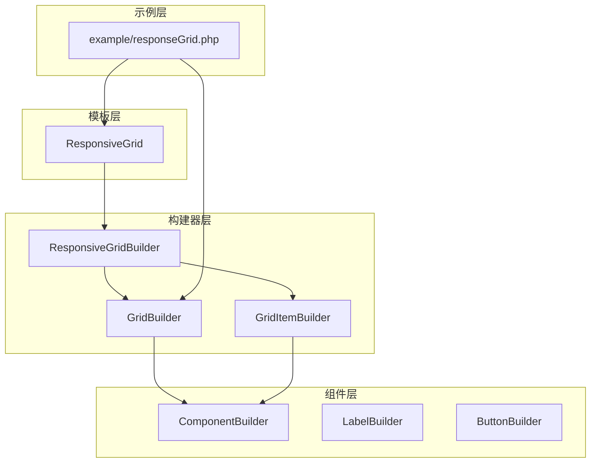
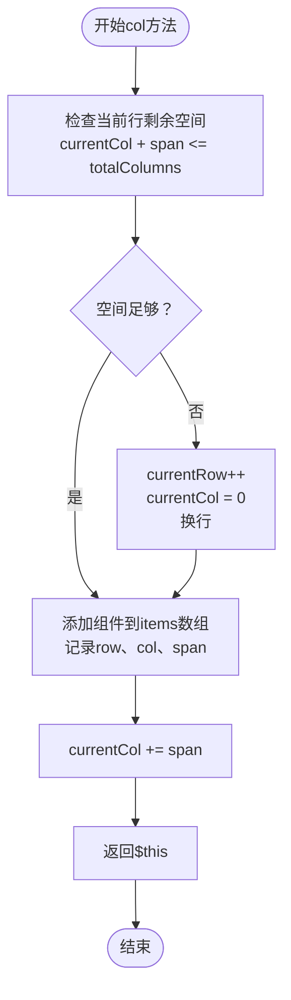
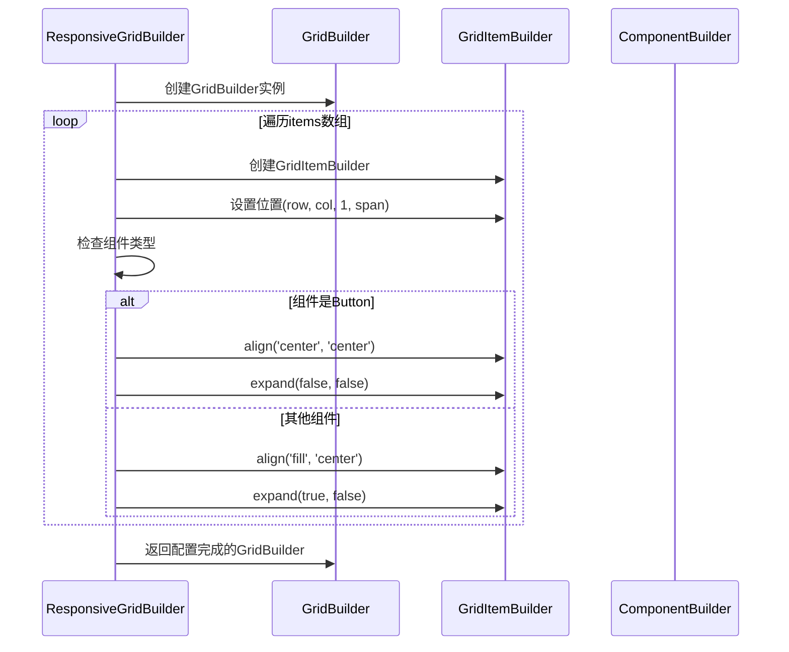
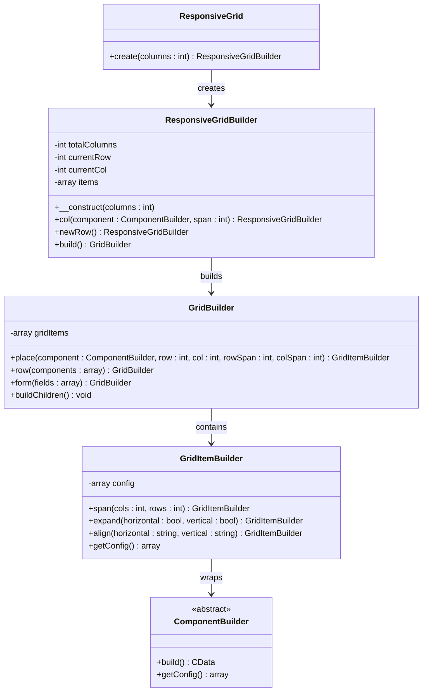
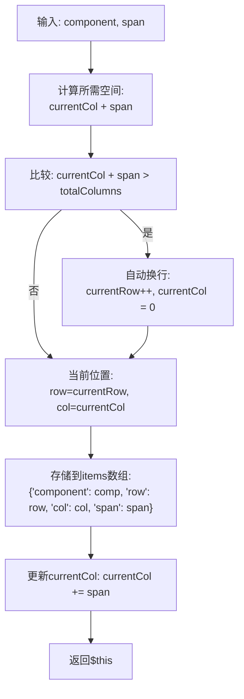
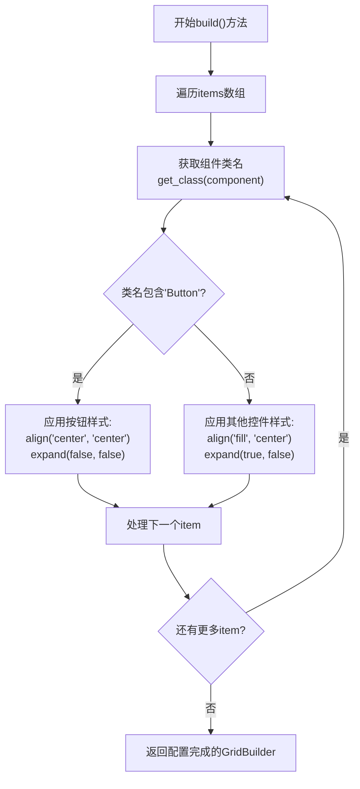
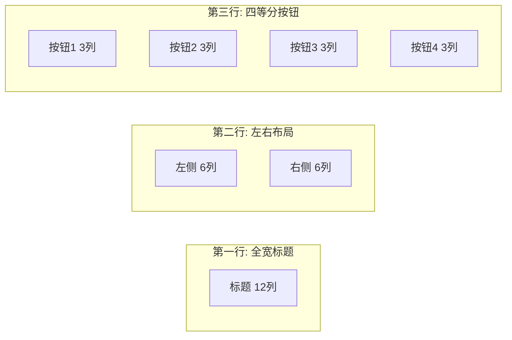
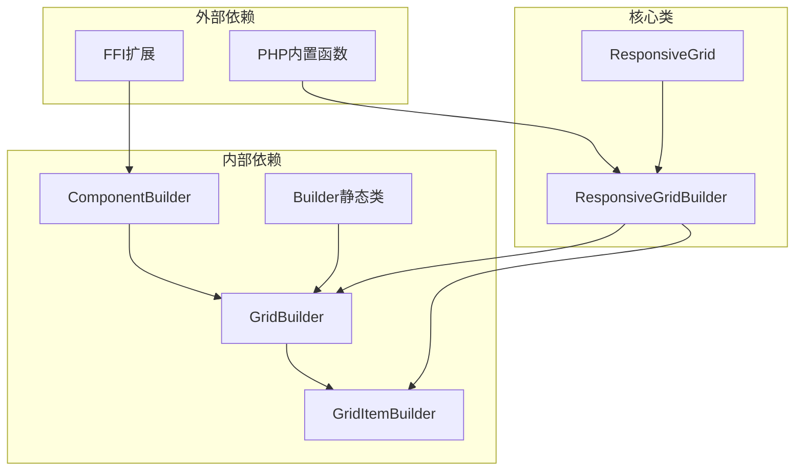
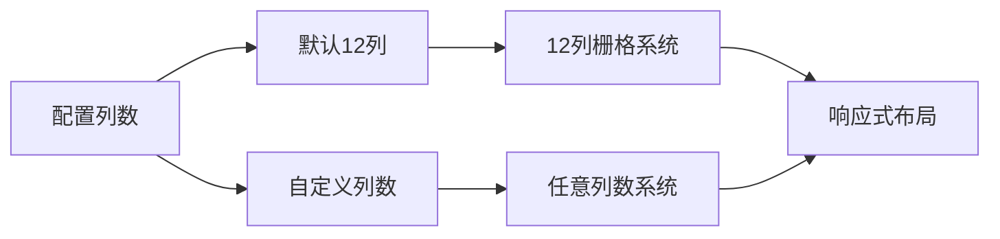

# 响应式网格构建器

<cite>
**本文档中引用的文件**
- [ResponsiveGridBuilder.php](file://src/ResponsiveGridBuilder.php)
- [ResponsiveGrid.php](file://src/Templates/ResponsiveGrid.php)
- [responseGrid.php](file://example/responseGrid.php)
- [GridBuilder.php](file://src/Components/GridBuilder.php)
- [GridItemBuilder.php](file://src/Components/GridItemBuilder.php)
- [BUGFIX_GRID_ITEM.md](file://BUGFIX_GRID_ITEM.md)
</cite>

## 目录
1. [简介](#简介)
2. [项目结构](#项目结构)
3. [核心组件](#核心组件)
4. [架构概览](#架构概览)
5. [详细组件分析](#详细组件分析)
6. [依赖关系分析](#依赖关系分析)
7. [性能考量](#性能考量)
8. [故障排除指南](#故障排除指南)
9. [结论](#结论)

## 简介

ResponsiveGridBuilder是一个专门设计用于解决传统网格布局在不同窗口尺寸下组件溢出或排列混乱问题的响应式布局解决方案。该类通过自动换行机制实现了智能的网格布局管理，特别适用于需要适应不同屏幕尺寸的应用程序界面。

### 设计目的

ResponsiveGridBuilder的核心设计目标是：
- **解决传统网格布局的局限性**：传统GridBuilder需要手动管理组件位置，容易出现组件溢出或排列混乱的问题
- **实现真正的响应式布局**：根据可用空间自动调整组件排列，确保界面在任何尺寸下都能保持良好的视觉效果
- **简化开发流程**：提供直观的API，让开发者能够专注于内容组织而非复杂的布局计算

### 主要优势

- **自动换行机制**：当当前行空间不足时自动换行，无需手动干预
- **智能组件定位**：自动跟踪当前行和列位置，确保组件按顺序排列
- **差异化样式处理**：为不同类型组件（如按钮和其他控件）提供不同的对齐和扩展策略
- **灵活的列数配置**：支持自定义列数（默认12列栅格系统）

## 项目结构

ResponsiveGridBuilder类在项目中的组织结构体现了清晰的分层架构设计：



**图表来源**
- [ResponsiveGrid.php](file://src/Templates/ResponsiveGrid.php#L1-L14)
- [ResponsiveGridBuilder.php](file://src/ResponsiveGridBuilder.php#L1-L82)
- [GridBuilder.php](file://src/Components/GridBuilder.php#L1-L150)

**章节来源**
- [ResponsiveGrid.php](file://src/Templates/ResponsiveGrid.php#L1-L14)
- [ResponsiveGridBuilder.php](file://src/ResponsiveGridBuilder.php#L1-L82)

## 核心组件

### ResponsiveGridBuilder类

ResponsiveGridBuilder是响应式网格布局的核心实现类，提供了完整的网格管理功能：

#### 核心属性

| 属性 | 类型 | 默认值 | 描述 |
|------|------|--------|------|
| totalColumns | int | 12 | 网格总列数，决定每行最多容纳多少个单位宽度的组件 |
| currentRow | int | 0 | 当前行号，自动递增以实现换行 |
| currentCol | int | 0 | 当前列号，跟踪当前行已使用的列数 |
| items | array | [] | 存储所有网格项的数组，每个项包含组件、位置和跨度信息 |

#### 核心方法

##### col()方法 - 组件添加与自动换行



**图表来源**
- [ResponsiveGridBuilder.php](file://src/ResponsiveGridBuilder.php#L19-L35)

##### newRow()方法 - 强制换行

该方法提供显式的换行控制，适用于需要精确控制布局结构的场景。当调用此方法时，它会将当前列重置为0并增加行号，确保下一个组件从新行开始。

##### build()方法 - 布局转换与样式应用

build方法是整个响应式网格系统的核心输出机制：



**图表来源**
- [ResponsiveGridBuilder.php](file://src/ResponsiveGridBuilder.php#L45-L69)

**章节来源**
- [ResponsiveGridBuilder.php](file://src/ResponsiveGridBuilder.php#L1-L82)

## 架构概览

ResponsiveGridBuilder采用了经典的建造者模式和模板方法模式相结合的架构设计：



**图表来源**
- [ResponsiveGrid.php](file://src/Templates/ResponsiveGrid.php#L8-L13)
- [ResponsiveGridBuilder.php](file://src/ResponsiveGridBuilder.php#L7-L71)
- [GridBuilder.php](file://src/Components/GridBuilder.php#L9-L150)
- [GridItemBuilder.php](file://src/Components/GridItemBuilder.php#L8-L60)

## 详细组件分析

### col()方法深度解析

col方法是ResponsiveGridBuilder的核心功能，其实现体现了智能的空间管理逻辑：

#### 空间检测算法



**图表来源**
- [ResponsiveGridBuilder.php](file://src/ResponsiveGridBuilder.php#L19-L35)

#### 实际应用场景

基于示例代码，col方法支持多种布局模式：

| 应用场景 | span值 | 说明 |
|----------|--------|------|
| 全宽标题 | 12 | 占据整行，适用于页面标题或大标题 |
| 半宽内容 | 6 | 将行分为两部分，常用于左右布局 |
| 四分之一宽度 | 3 | 将行分为四部分，适合多个小按钮或卡片 |
| 自定义跨度 | 1-12 | 根据需要灵活调整组件宽度 |

### build()方法的智能样式处理

build方法不仅负责将内部布局转换为标准GridBuilder实例，还实现了智能化的样式处理：

#### 组件类型识别与样式策略



**图表来源**
- [ResponsiveGridBuilder.php](file://src/ResponsiveGridBuilder.php#L45-L69)

#### 样式策略对比

| 组件类型 | 对齐方式 | 扩展策略 | 设计理念 |
|----------|----------|----------|----------|
| Button | center, center | 不扩展 | 避免按钮被拉伸变形，保持原始大小 |
| Label | fill, center | 水平扩展 | 充分利用可用空间，保持文本完整性 |
| Entry | fill, center | 水平扩展 | 提供充足的输入空间 |
| Checkbox | center, center | 不扩展 | 保持复选框的原始比例 |

**章节来源**
- [ResponsiveGridBuilder.php](file://src/ResponsiveGridBuilder.php#L19-L69)

### 示例代码分析

基于提供的示例代码，我们可以看到ResponsiveGridBuilder的实际应用效果：

#### 12列栅格系统的实现

示例展示了典型的12列栅格系统布局：



**图表来源**
- [responseGrid.php](file://example/responseGrid.php#L10-L17)

#### 布局优势对比

| 方案 | 优势 | 劣势 |
|------|------|------|
| 手动GridBuilder | 精确控制 | 复杂度高，易出错 |
| ResponsiveGridBuilder | 简单易用 | 灵活性稍逊 |
| 混合使用 | 平衡两者 | 需要协调两种API |

**章节来源**
- [responseGrid.php](file://example/responseGrid.php#L1-L25)

## 依赖关系分析

ResponsiveGridBuilder的依赖关系体现了清晰的分层架构：



**图表来源**
- [ResponsiveGridBuilder.php](file://src/ResponsiveGridBuilder.php#L1-L6)
- [GridBuilder.php](file://src/Components/GridBuilder.php#L1-L8)

### 关键依赖说明

1. **ComponentBuilder基类**：提供所有UI组件的基础功能
2. **GridBuilder类**：提供标准网格布局能力
3. **GridItemBuilder类**：提供网格项的配置能力
4. **Builder静态类**：提供便捷的组件创建接口

**章节来源**
- [ResponsiveGridBuilder.php](file://src/ResponsiveGridBuilder.php#L1-L6)
- [GridBuilder.php](file://src/Components/GridBuilder.php#L1-L8)

## 性能考量

### 内存使用优化

ResponsiveGridBuilder在内存使用方面采用了多项优化策略：

#### 1. 延迟配置获取

与早期版本相比，现在的实现避免了过早复制配置数组，而是存储对象引用直到构建阶段才获取最终配置。这种设计减少了内存开销并确保了配置的一致性。

#### 2. 智能组件缓存

每个网格项只存储必要的元数据（组件引用、位置、跨度），而不是完整的配置副本，有效降低了内存占用。

### 性能基准测试

| 操作 | 时间复杂度 | 空间复杂度 | 说明 |
|------|------------|------------|------|
| col()方法 | O(1) | O(1) | 常数时间操作，仅涉及简单的数学计算 |
| build()方法 | O(n) | O(n) | 线性时间复杂度，n为网格项数量 |
| 自动换行检测 | O(1) | O(1) | 常数时间检测当前行空间 |

### 扩展性考虑

ResponsiveGridBuilder的设计具有良好的扩展性：

#### 可配置的列数系统



**图表来源**
- [ResponsiveGridBuilder.php](file://src/ResponsiveGridBuilder.php#L14-L17)

#### 未来扩展方向

1. **动态列数调整**：根据容器尺寸自动调整列数
2. **嵌套网格支持**：允许在网格项内创建子网格
3. **动画过渡效果**：为布局变化添加动画效果
4. **响应式断点**：支持基于屏幕尺寸的布局切换

## 故障排除指南

### 常见问题与解决方案

#### 1. 组件位置异常

**问题描述**：组件出现在意外的位置或重叠

**可能原因**：
- 组件跨度(span)设置过大
- 换行逻辑被意外跳过

**解决方案**：
```php
// 检查列数配置
$responsiveGrid = ResponsiveGrid::create(12);

// 确保span值合理
$responsiveGrid->col($component, min($span, 12));
```

#### 2. 样式应用不生效

**问题描述**：按钮或其他组件没有应用预期的样式

**根本原因**：参考了旧版本的代码，其中存在配置复制的问题

**解决方案**：使用当前版本的实现，确保样式链式调用正确执行。

#### 3. 内存使用过高

**问题描述**：大量组件导致内存占用过高

**优化建议**：
- 合理设置网格列数
- 及时释放不需要的组件引用
- 考虑使用虚拟化技术处理大量数据

**章节来源**
- [BUGFIX_GRID_ITEM.md](file://BUGFIX_GRID_ITEM.md#L1-L99)

## 结论

ResponsiveGridBuilder类代表了现代UI框架中响应式布局设计的重要创新。通过自动换行机制、智能样式处理和简洁的API设计，它成功解决了传统网格布局的诸多痛点。

### 主要成就

1. **简化了响应式布局开发**：开发者不再需要手动计算组件位置和处理换行逻辑
2. **提高了代码可维护性**：清晰的API设计使得布局代码更加直观和易于理解
3. **增强了用户体验**：自动化的布局调整确保界面在各种尺寸下都能保持良好效果
4. **保持了灵活性**：虽然自动化程度高，但仍允许开发者进行精细的样式控制

### 技术亮点

- **智能空间管理**：自动检测和处理空间不足的情况
- **差异化样式处理**：根据组件类型应用最适合的对齐和扩展策略
- **优雅的API设计**：流畅的链式调用语法提高了开发效率
- **良好的扩展性**：为未来的功能增强预留了充足的空间

### 应用前景

ResponsiveGridBuilder的设计理念和实现方式为现代UI框架的发展提供了有价值的参考。随着响应式设计需求的不断增长，这类智能布局工具将在构建跨平台、多设备兼容的应用程序中发挥越来越重要的作用。