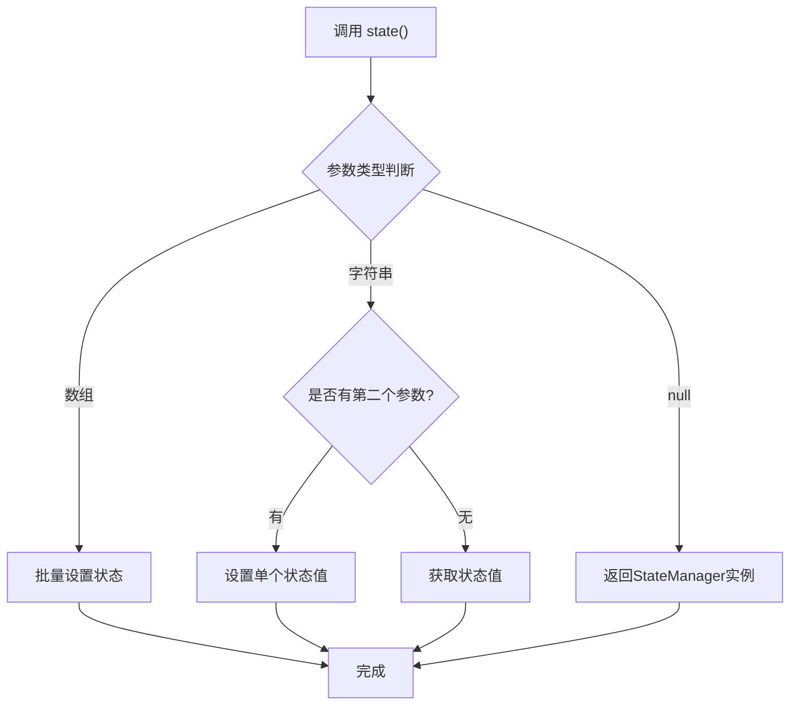
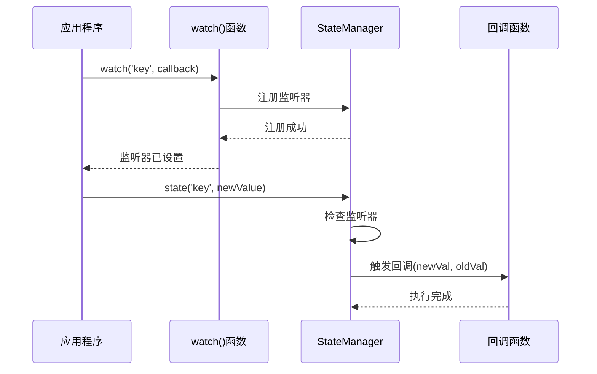
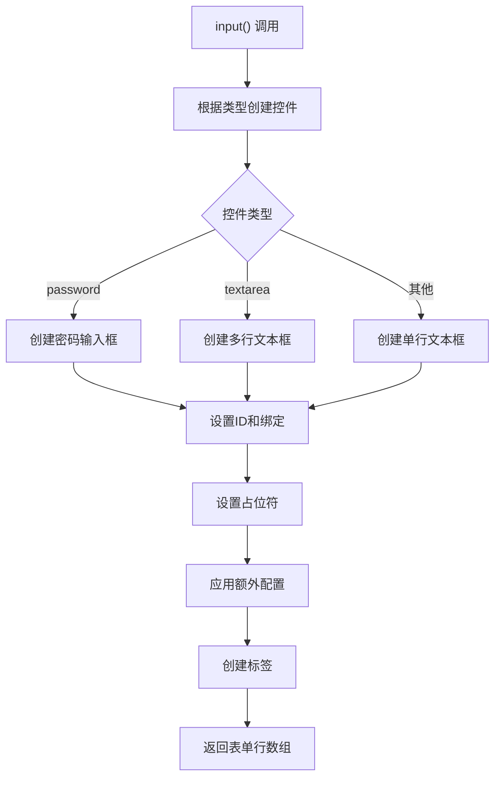
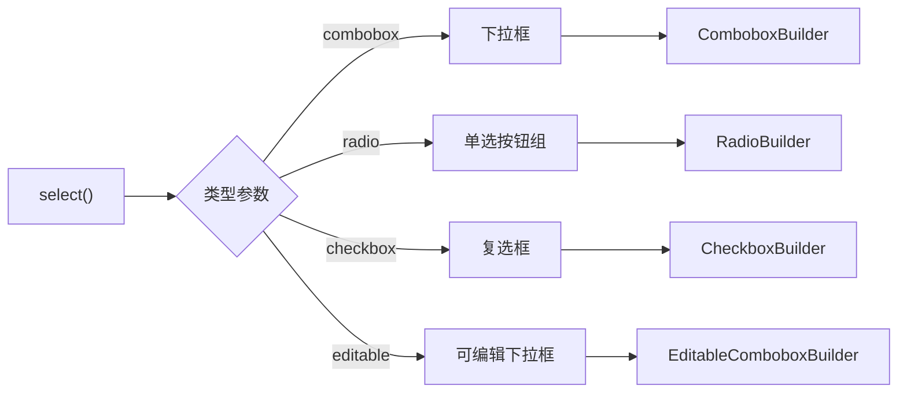
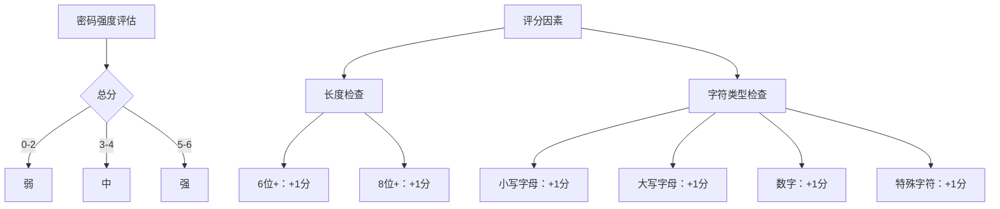
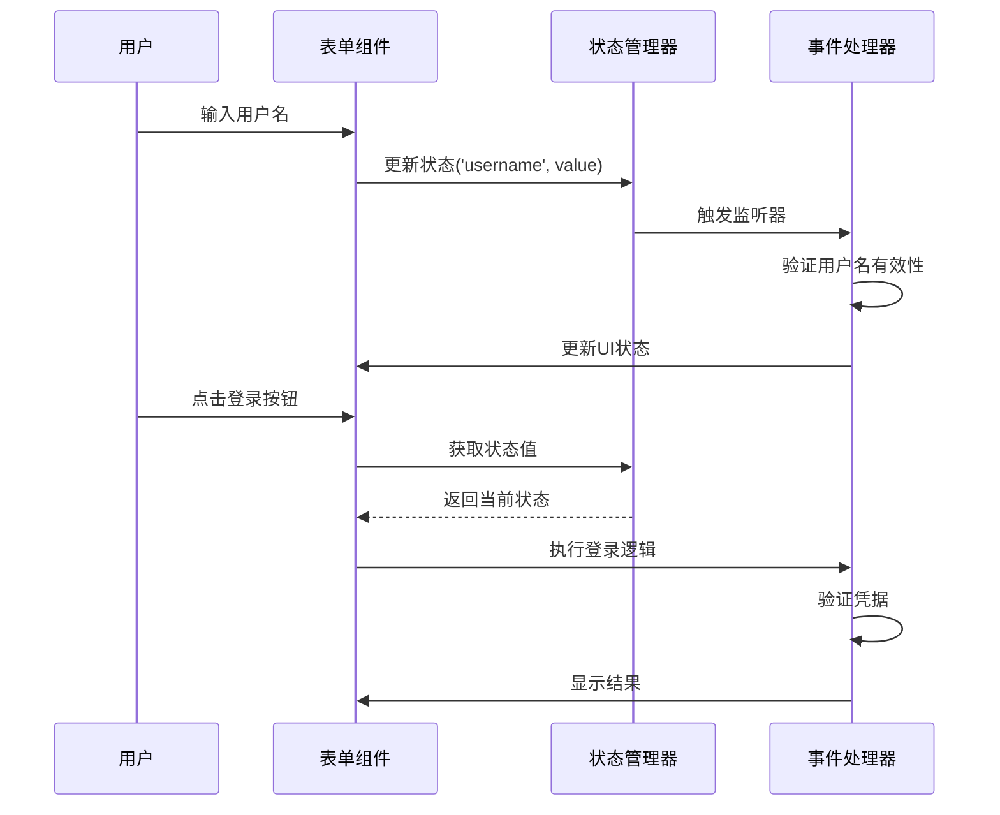

# 辅助函数详细文档

<cite>
**本文档中引用的文件**
- [helper.php](file://src/helper.php)
- [StateManager.php](file://src/State/StateManager.php)
- [HelperFunctionsTest.php](file://tests/HelperFunctionsTest.php)
- [StateHelperTest.php](file://tests/StateHelperTest.php)
- [HelperBuilderFunctionsTest.php](file://tests/HelperBuilderFunctionsTest.php)
- [builder_helpers_demo.php](file://example/builder_helpers_demo.php)
- [helper_shortcuts_demo.php](file://example/helper_shortcuts_demo.php)
- [htmlLogin.php](file://example/htmlLogin.php)
</cite>

## 目录
1. [概述](#概述)
2. [状态管理辅助函数](#状态管理辅助函数)
3. [Builder快捷函数](#builder快捷函数)
4. [表单构建辅助函数](#表单构建辅助函数)
5. [密码强度计算函数](#密码强度计算函数)
6. [实际应用示例](#实际应用示例)
7. [最佳实践与常见误用](#最佳实践与常见误用)
8. [总结](#总结)

## 概述

src/helper.php文件提供了丰富的全局辅助函数，旨在简化libuiBuilder的开发流程。这些函数分为四个主要类别：状态管理、Builder快捷函数、表单构建辅助函数和密码强度计算。它们通过消除样板代码、提供链式调用支持和自动状态绑定，显著提升了开发效率。

## 状态管理辅助函数

### state() 函数

`state()` 函数是状态管理系统的核心入口点，提供了灵活的状态访问和管理功能。

#### 功能特性
- **无参数调用**：返回StateManager实例
- **获取状态值**：`state('key')`
- **设置单个值**：`state('key', 'value')`
- **批量设置**：`state(['key1' => 'value1', 'key2' => 'value2'])`
- **支持复杂数据类型**：数组、对象、嵌套结构等

#### 使用场景

**图表来源**
- [helper.php](file://src/helper.php#L72-L96)

#### 代码示例路径
- [HelperFunctionsTest.php](file://tests/HelperFunctionsTest.php#L21-L92)
- [StateHelperTest.php](file://tests/StateHelperTest.php#L55-L181)

**节来源**
- [helper.php](file://src/helper.php#L63-L96)

### watch() 函数

`watch()` 函数提供了状态变化监听功能，实现了响应式编程模式。

#### 功能特性
- **状态变化监听**：当指定键的状态发生变化时触发回调
- **回调参数**：接收新值和旧值作为参数
- **多监听器支持**：同一状态可注册多个监听器
- **即时触发**：首次设置时会立即触发回调

#### 监听器工作流程

**图表来源**
- [helper.php](file://src/helper.php#L107-L109)
- [StateManager.php](file://src/State/StateManager.php#L49-L56)

#### 代码示例路径
- [HelperFunctionsTest.php](file://tests/HelperFunctionsTest.php#L95-L166)
- [StateHelperTest.php](file://tests/StateHelperTest.php#L78-L181)

**节来源**
- [helper.php](file://src/helper.php#L100-L109)

## Builder快捷函数

Builder快捷函数为各种UI组件提供了简化的创建接口，消除了冗长的Builder::前缀。

### 容器组件快捷函数

| 函数名 | 对应Builder方法 | 返回类型 | 主要用途 |
|--------|----------------|----------|----------|
| `window()` | `Builder::window()` | WindowBuilder | 创建主窗口 |
| `vbox()` | `Builder::vbox()` | BoxBuilder | 垂直布局容器 |
| `hbox()` | `Builder::hbox()` | BoxBuilder | 水平布局容器 |
| `grid()` | `Builder::grid()` | GridBuilder | 网格布局容器 |
| `tab()` | `Builder::tab()` | TabBuilder | 标签页容器 |

### 基础控件快捷函数

| 函数名 | 对应Builder方法 | 返回类型 | 特殊功能 |
|--------|----------------|----------|----------|
| `button()` | `Builder::button()` | ButtonBuilder | 可添加点击事件 |
| `label()` | `Builder::label()` | LabelBuilder | 文本显示 |
| `entry()` | `Builder::entry()` | EntryBuilder | 单行文本输入 |
| `checkbox()` | `Builder::checkbox()` | CheckboxBuilder | 复选框 |
| `combobox()` | `Builder::combobox()` | ComboboxBuilder | 下拉选择 |

### 输入控件快捷函数

| 函数名 | 对应Builder方法 | 返回类型 | 适用场景 |
|--------|----------------|----------|----------|
| `textarea()` | `Builder::textarea()` | MultilineEntryBuilder | 多行文本输入 |
| `spinbox()` | `Builder::spinbox()` | SpinboxBuilder | 数值输入框 |
| `slider()` | `Builder::slider()` | SliderBuilder | 滑块控件 |
| `radio()` | `Builder::radio()` | RadioBuilder | 单选按钮组 |

### 其他控件快捷函数

| 函数名 | 对应Builder方法 | 返回类型 | 特殊功能 |
|--------|----------------|----------|----------|
| `progressBar()` | `Builder::progressBar()` | ProgressBarBuilder | 进度显示 |
| `table()` | `Builder::table()` | TableBuilder | 数据表格 |
| `canvas()` | `Builder::canvas()` | CanvasBuilder | 自定义绘图 |
| `separator()` | `Builder::separator()` | SeparatorBuilder | 分隔线 |

### 便捷方法

| 函数名 | 对应Builder方法 | 返回类型 | 用途 |
|--------|----------------|----------|------|
| `passwordEntry()` | `Builder::passwordEntry()` | EntryBuilder | 密码输入 |
| `editableCombobox()` | `Builder::editableCombobox()` | ComboboxBuilder | 可编辑下拉框 |
| `hSeparator()` | `Builder::hSeparator()` | SeparatorBuilder | 水平分隔线 |
| `vSeparator()` | `Builder::vSeparator()` | SeparatorBuilder | 垂直分隔线 |

**节来源**
- [helper.php](file://src/helper.php#L116-L147)

## 表单构建辅助函数

### input() 函数

`input()` 函数专门用于创建带标签的输入字段，自动处理状态绑定和组件配置。

#### 参数说明
- `$label`：标签文本，自动添加冒号后缀
- `$id`：组件ID，同时用于状态绑定
- `$type`：输入类型（'text', 'password', 'textarea'）
- `$placeholder`：占位符文本
- `$extra`：额外配置数组

#### 工作流程

**图表来源**
- [helper.php](file://src/helper.php#L159-L185)

#### 使用示例
- 文本输入：`input('用户名', 'username', placeholder: '请输入用户名')`
- 密码输入：`input('密码', 'password', type: 'password')`
- 多行文本：`input('描述', 'description', type: 'textarea')`

**节来源**
- [helper.php](file://src/helper.php#L149-L185)

### select() 函数

`select()` 函数用于创建带标签的选择字段，支持多种选择控件类型。

#### 参数说明
- `$label`：标签文本
- `$id`：组件ID
- `$items`：选项列表数组
- `$type`：选择类型（'combobox', 'radio', 'checkbox', 'editable'）
- `$extra`：额外配置

#### 控件类型映射

**图表来源**
- [helper.php](file://src/helper.php#L198-L221)

#### 使用示例
- 下拉选择：`select('性别', 'gender', ['男', '女'])`
- 单选按钮：`select('选项', 'option', ['A', 'B', 'C'], type: 'radio')`
- 多选复选框：`select('兴趣', 'interests', ['编程', '音乐', '运动'])`

**节来源**
- [helper.php](file://src/helper.php#L188-L221)

## 密码强度计算函数

### calculateStrength() 函数

`calculateStrength()` 函数提供了密码强度评估功能，基于多个安全因素进行评分。

#### 评分标准
- **长度要求**：
  - ≥6位：+1分
  - ≥8位：+1分（额外加分）
- **字符类型**：
  - 包含小写字母：+1分
  - 包含大写字母：+1分
  - 包含数字：+1分
  - 包含特殊字符：+1分

#### 强度等级

**图表来源**
- [helper.php](file://src/helper.php#L6-L60)

#### 反馈机制
函数不仅返回强度等级，还维护一个反馈数组，记录不符合要求的安全因素，便于向用户提供具体的改进建议。

**节来源**
- [helper.php](file://src/helper.php#L5-L60)

## 实际应用示例

### 状态管理与组件绑定

以下示例展示了如何在实际应用中结合使用状态管理和表单构建函数：

**图表来源**
- [helper_shortcuts_demo.php](file://example/helper_shortcuts_demo.php#L70-L103)
- [htmlLogin.php](file://example/htmlLogin.php#L16-L95)

### Builder快捷函数的实际应用

通过对比传统方式和快捷函数方式，可以明显看出代码量的减少和可读性的提升：

| 方面 | 传统方式 | 快捷函数方式 | 代码行数减少 |
|------|----------|--------------|-------------|
| 窗口创建 | 20行 | 9行 | 55% |
| 表单构建 | 大量Builder::前缀 | 简洁函数调用 | 显著减少 |
| 状态绑定 | 手动设置ID和绑定 | 自动绑定 | 无需手动配置 |
| 事件处理 | 详细事件注册 | 简洁回调定义 | 更加直观 |

**节来源**
- [helper_shortcuts_demo.php](file://example/helper_shortcuts_demo.php#L16-L61)

## 最佳实践与常见误用

### 最佳实践

1. **状态命名规范**
   - 使用有意义的键名：`username`, `password`, `userRole`
   - 避免使用特殊字符和空格
   - 采用驼峰命名法

2. **组件ID管理**
   - 确保每个组件ID唯一
   - 使用描述性名称便于调试
   - 避免重复绑定相同ID

3. **事件处理优化**
   - 在监听器中避免长时间运行的操作
   - 使用闭包捕获必要的上下文
   - 及时清理不需要的监听器

4. **表单验证策略**
   - 结合`calculateStrength()`函数提供实时反馈
   - 使用watch()函数实现实时验证
   - 提供清晰的错误提示信息

### 常见误用

1. **过度依赖全局状态**
   - 避免在大型应用中滥用全局状态
   - 考虑使用局部状态管理
   - 合理划分状态作用域

2. **忘记清理监听器**
   - 在组件销毁时移除监听器
   - 避免内存泄漏
   - 使用弱引用避免循环引用

3. **忽略类型检查**
   - 在使用状态值前进行类型验证
   - 处理可能的null值情况
   - 提供默认值保护

4. **性能考虑不足**
   - 避免在高频事件中进行复杂计算
   - 使用防抖(debounce)技术优化频繁触发的监听器
   - 合理使用批量更新机制

**节来源**
- [HelperFunctionsTest.php](file://tests/HelperFunctionsTest.php#L1-L177)
- [StateHelperTest.php](file://tests/StateHelperTest.php#L1-L181)

## 总结

src/helper.php中的全局辅助函数为libuiBuilder提供了强大而灵活的开发工具集。通过合理使用这些函数，开发者可以：

1. **显著提升开发效率**：通过Builder快捷函数减少样板代码
2. **简化状态管理**：通过state()和watch()函数实现响应式编程
3. **改善用户体验**：通过表单构建函数和密码强度计算提供更好的交互体验
4. **保持代码整洁**：通过自动绑定和链式调用提高代码可读性

这些辅助函数的设计理念体现了现代PHP开发的最佳实践，既保持了向后兼容性，又提供了现代化的开发体验。在实际项目中，建议根据具体需求选择合适的函数组合，并遵循相应的最佳实践，以构建高质量的桌面应用程序。