# 辅助功能

<cite>
**本文档中引用的文件**
- [helper.php](file://src/helper.php)
- [ResponsiveGridBuilder.php](file://src/ResponsiveGridBuilder.php)
- [builder_helpers_demo.php](file://example/builder_helpers_demo.php)
- [helper_shortcuts_demo.php](file://example/helper_shortcuts_demo.php)
- [ComponentBuilder.php](file://src/ComponentBuilder.php)
- [TabBuilder.php](file://src/Builder/TabBuilder.php)
- [BuilderHelperTest.php](file://tests/BuilderHelperTest.php)
- [HelperFunctionsTest.php](file://tests/HelperFunctionsTest.php)
</cite>

## 目录
1. [简介](#简介)
2. [全局辅助函数](#全局辅助函数)
3. [ResponsiveGridBuilder 类](#responsivegridbuilder-类)
4. [Builder 链式辅助函数](#builder-链式辅助函数)
5. [状态管理辅助函数](#状态管理辅助函数)
6. [表单快捷函数](#表单快捷函数)
7. [使用示例](#使用示例)
8. [与核心API的集成](#与核心api的集成)
9. [性能考虑](#性能考虑)
10. [故障排除](#故障排除)

## 简介

libuiBuilder项目提供了一套完整的辅助功能和工具，旨在简化GUI应用程序的开发过程。这些辅助功能包括全局辅助函数、响应式网格构建器、链式调用API以及状态管理系统，为开发者提供了更加便捷和高效的开发体验。

## 全局辅助函数

### 密码强度计算函数

项目提供了专门的密码强度计算函数，用于评估用户密码的安全性。

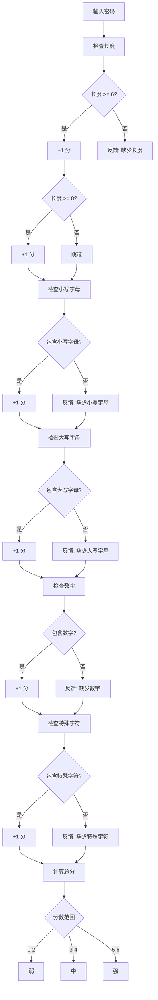

**图表来源**
- [helper.php](file://src/helper.php#L6-L59)

**节来源**
- [helper.php](file://src/helper.php#L6-L59)

### Builder 快捷函数

项目提供了丰富的全局快捷函数，消除了Builder::前缀的冗余，显著提高了代码的可读性和编写效率。

#### 窗口和容器函数

| 函数名 | 功能描述 | 参数 |
|--------|----------|------|
| `window()` | 创建窗口组件 | `array $config = []` |
| `vbox()` | 创建垂直布局容器 | `array $config = []` |
| `hbox()` | 创建水平布局容器 | `array $config = []` |
| `grid()` | 创建网格布局 | `array $config = []` |
| `tab()` | 创建标签页容器 | `array $config = []` |

#### 基础控件函数

| 函数名 | 功能描述 | 参数 |
|--------|----------|------|
| `button()` | 创建按钮控件 | `array $config = []` |
| `label()` | 创建标签控件 | `array $config = []` |
| `entry()` | 创建单行输入框 | `array $config = []` |
| `checkbox()` | 创建复选框 | `array $config = []` |
| `combobox()` | 创建下拉选择框 | `array $config = []` |

#### 输入控件函数

| 函数名 | 功能描述 | 参数 |
|--------|----------|------|
| `textarea()` | 创建多行文本输入框 | `array $config = []` |
| `spinbox()` | 创建数值输入框 | `array $config = []` |
| `slider()` | 创建滑块控件 | `array $config = []` |
| `radio()` | 创建单选按钮组 | `array $config = []` |

#### 其他控件函数

| 函数名 | 功能描述 | 参数 |
|--------|----------|------|
| `progressBar()` | 创建进度条 | `array $config = []` |
| `table()` | 创建表格控件 | `array $config = []` |
| `canvas()` | 创建画布控件 | `array $config = []` |
| `separator()` | 创建分隔符 | `void` |
| `menu()` | 创建菜单控件 | `void` |

**节来源**
- [helper.php](file://src/helper.php#L116-L147)

## ResponsiveGridBuilder 类

ResponsiveGridBuilder是一个专门用于创建响应式网格布局的类，它能够根据窗口大小动态调整组件排列，提供更加灵活和适应性强的布局解决方案。

### 核心特性

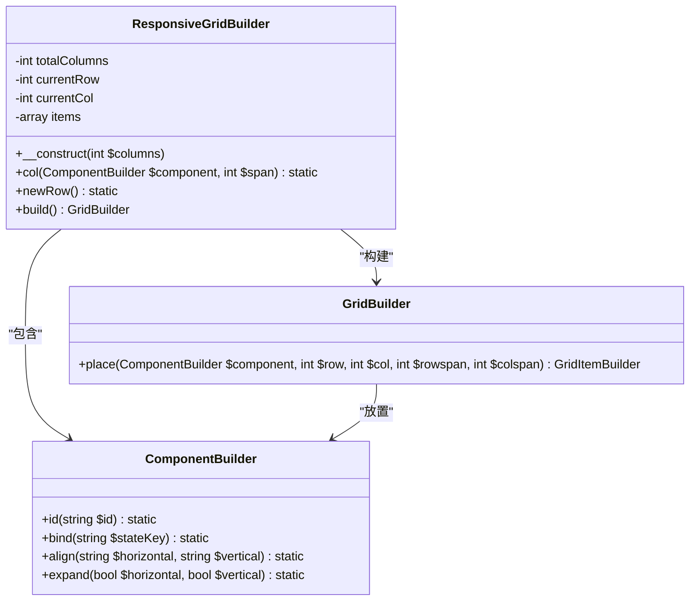

**图表来源**
- [ResponsiveGridBuilder.php](file://src/ResponsiveGridBuilder.php#L7-L70)

### 工作原理

ResponsiveGridBuilder采用智能的列布局算法，当当前行空间不足时自动换行，确保组件按照预期的网格结构排列。

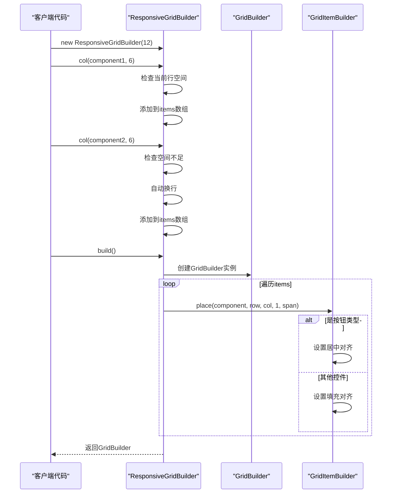

**图表来源**
- [ResponsiveGridBuilder.php](file://src/ResponsiveGridBuilder.php#L19-L69)

### 使用示例

ResponsiveGridBuilder支持灵活的列跨度配置，允许开发者创建复杂的网格布局：

- **全宽组件**: `col($component, 12)`
- **半宽组件**: `col($component, 6)`
- **四分之一宽组件**: `col($component, 3)`

**节来源**
- [ResponsiveGridBuilder.php](file://src/ResponsiveGridBuilder.php#L7-L82)

## Builder 链式辅助函数

Builder类提供了全新的链式调用API，支持流畅的界面构建方式，大大提升了开发效率和代码可读性。

### 核心链式方法

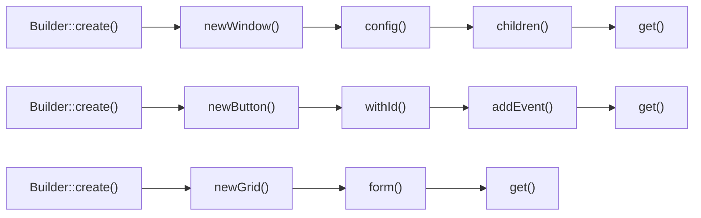

**图表来源**
- [builder_helpers_demo.php](file://example/builder_helpers_demo.php#L24-L80)

### 方法功能对照表

| 方法名 | 功能描述 | 返回类型 | 使用场景 |
|--------|----------|----------|----------|
| `create()` | 创建Builder实例 | `Builder` | 开始链式调用 |
| `newWindow()` | 创建新窗口 | `Builder` | 构建主界面 |
| `newButton()` | 创建按钮 | `Builder` | 添加交互控件 |
| `newLabel()` | 创建标签 | `Builder` | 显示文本信息 |
| `newEntry()` | 创建输入框 | `Builder` | 用户输入 |
| `newGrid()` | 创建网格布局 | `Builder` | 复杂布局 |
| `withId()` | 设置组件ID | `Builder` | 状态绑定 |
| `config()` | 配置属性 | `Builder` | 动态设置 |
| `addEvent()` | 添加事件处理器 | `Builder` | 事件绑定 |
| `children()` | 添加子组件 | `Builder` | 组件组合 |
| `get()` | 获取最终组件 | `ComponentBuilder` | 完成构建 |

**节来源**
- [builder_helpers_demo.php](file://example/builder_helpers_demo.php#L12-L140)
- [BuilderHelperTest.php](file://tests/BuilderHelperTest.php#L8-L157)

## 状态管理辅助函数

项目提供了两个核心的状态管理辅助函数，实现了响应式的数据绑定和状态监听机制。

### state() 函数

state()函数是状态管理的核心入口，提供了灵活的状态操作接口。

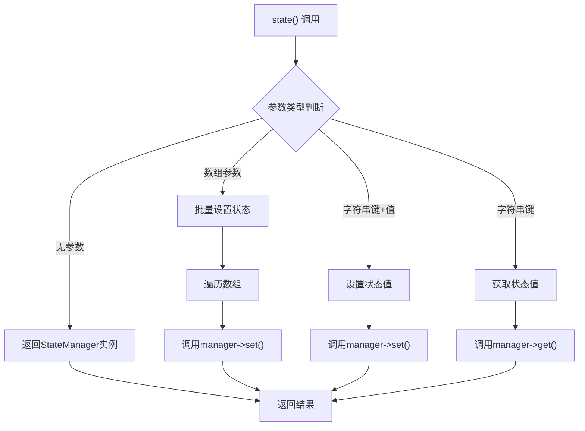

**图表来源**
- [helper.php](file://src/helper.php#L72-L96)

### watch() 函数

watch()函数提供了状态变化监听功能，支持响应式编程模式。

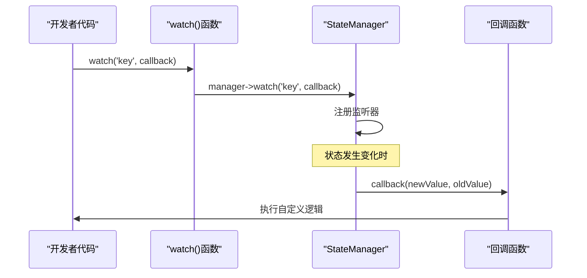

**图表来源**
- [helper.php](file://src/helper.php#L107-L109)

### 状态管理功能特性

| 功能 | 描述 | 使用场景 |
|------|------|----------|
| 状态获取 | `state('key')` | 读取当前状态值 |
| 状态设置 | `state('key', 'value')` | 更新状态值 |
| 批量设置 | `state(['key1' => 'val1', 'key2' => 'val2'])` | 同时更新多个状态 |
| 状态监听 | `watch('key', callback)` | 监听状态变化 |
| 状态实例 | `state()` | 获取StateManager实例 |

**节来源**
- [helper.php](file://src/helper.php#L62-L110)
- [HelperFunctionsTest.php](file://tests/HelperFunctionsTest.php#L13-L197)

## 表单快捷函数

项目提供了两个专门的表单快捷函数，用于快速创建常见的表单元素，大大简化了表单构建过程。

### input() 函数

input()函数用于创建各种类型的输入字段，支持自动绑定和配置。

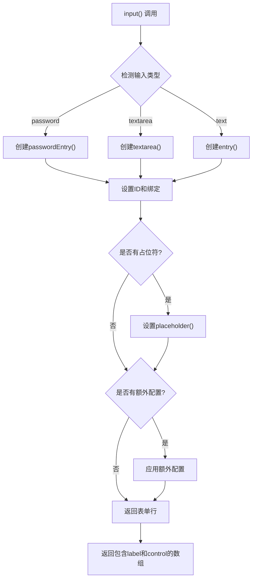

**图表来源**
- [helper.php](file://src/helper.php#L159-L185)

### select() 函数

select()函数用于创建各种类型的下拉选择控件。

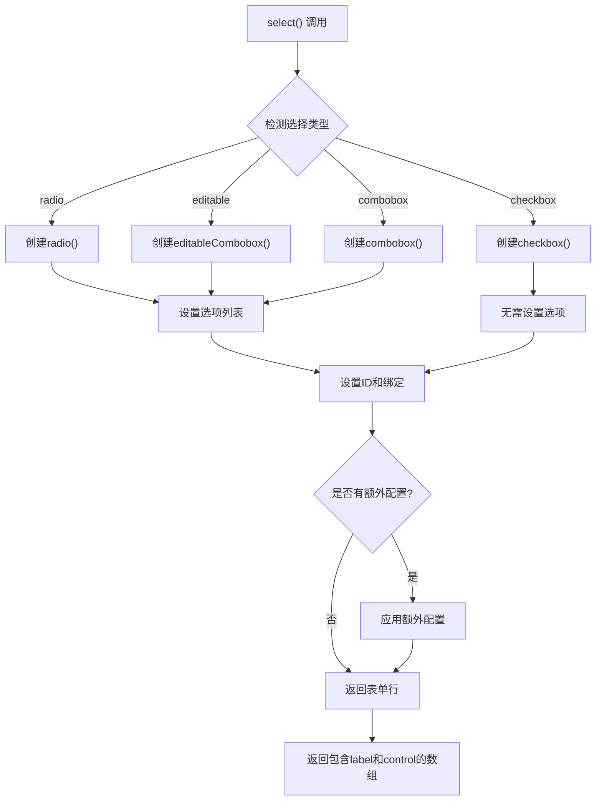

**图表来源**
- [helper.php](file://src/helper.php#L198-L221)

### 表单快捷函数功能对比

| 函数 | 支持的输入类型 | 主要特点 | 使用场景 |
|------|----------------|----------|----------|
| `input()` | text, password, textarea | 自动绑定ID，支持占位符 | 表单字段创建 |
| `select()` | combobox, radio, checkbox, editable | 支持多种选择方式 | 下拉选择创建 |

**节来源**
- [helper.php](file://src/helper.php#L159-L221)
- [helper_shortcuts_demo.php](file://example/helper_shortcuts_demo.php#L14-L151)

## 使用示例

### 传统方式与快捷方式对比

以下是传统Builder方式与快捷方式的代码对比：

**传统方式**（20行代码）：
```php
$window = Builder::window(['title' => '登录'])
    ->size(400, 300)
    ->contains([
        Builder::vbox()->contains([
            Builder::grid()->form([
                [
                    'label' => Builder::label()->text('用户名:'),
                    'control' => Builder::entry()
                        ->id('username')
                        ->bind('username')
                        ->placeholder('请输入用户名')
                ],
                [
                    'label' => Builder::label()->text('密码:'),
                    'control' => Builder::passwordEntry()
                        ->id('password')
                        ->bind('password')
                        ->placeholder('请输入密码')
                ]
            ])
        ])
    ]);
```

**快捷方式**（9行代码）：
```php
$window = window(['title' => '登录'])
    ->size(400, 300)
    ->contains([
        vbox()->contains([
            grid()->form([
                input('用户名', 'username', placeholder: '请输入用户名'),
                input('密码', 'password', type: 'password', placeholder: '请输入密码')
            ])
        ])
    ]);
```

### 复杂表单示例

项目提供了完整的复杂表单构建示例，展示了各种辅助功能的实际应用：

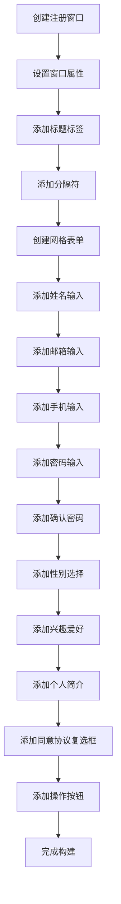

**图表来源**
- [helper_shortcuts_demo.php](file://example/helper_shortcuts_demo.php#L107-L137)

**节来源**
- [helper_shortcuts_demo.php](file://example/helper_shortcuts_demo.php#L14-L151)

## 与核心API的集成

### Builder API 集成

辅助功能与Builder API深度集成，提供了无缝的开发体验：

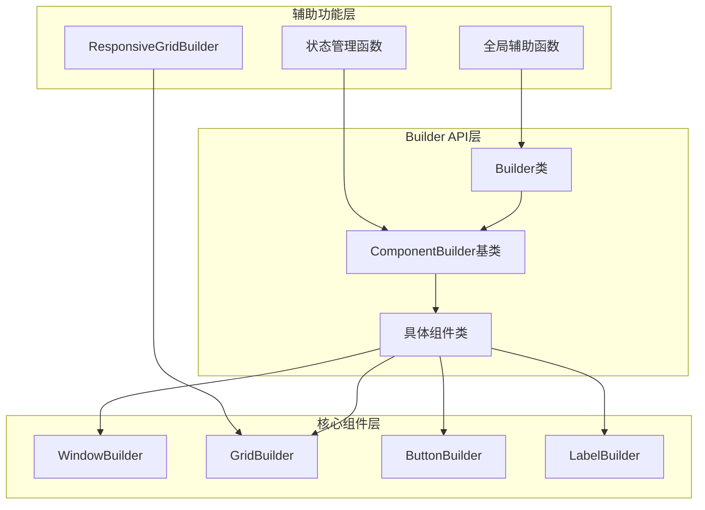

**图表来源**
- [ComponentBuilder.php](file://src/ComponentBuilder.php#L11-L234)
- [TabBuilder.php](file://src/Builder/TabBuilder.php#L10-L106)

### 状态管理系统集成

辅助功能与状态管理系统紧密配合，实现了响应式的数据绑定：

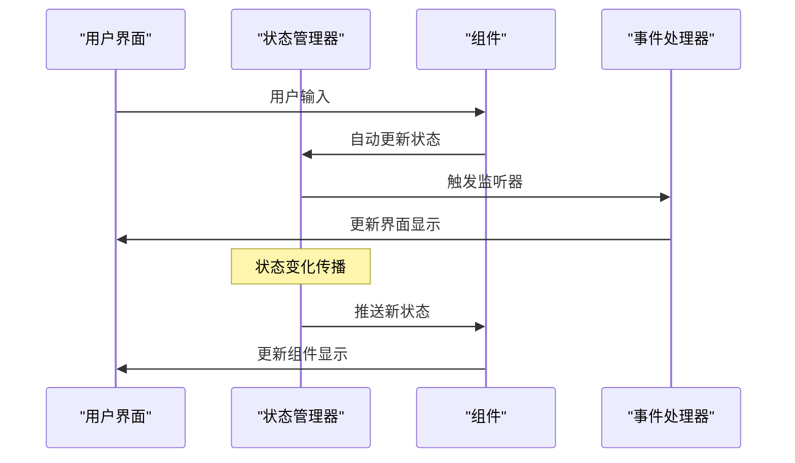

**图表来源**
- [ComponentBuilder.php](file://src/ComponentBuilder.php#L140-L146)

### 兼容性保证

所有辅助功能都保持与现有代码的完全兼容性：

- **向后兼容**: 现有的Builder::调用方式继续支持
- **渐进迁移**: 开发者可以逐步采用新的辅助函数
- **功能增强**: 辅助功能不改变原有行为，只是提供更多便利

**节来源**
- [ComponentBuilder.php](file://src/ComponentBuilder.php#L11-L234)
- [builder_helpers_demo.php](file://example/builder_helpers_demo.php#L128-L139)

## 性能考虑

### 函数调用开销

辅助函数的设计充分考虑了性能因素：

- **延迟初始化**: 状态管理器采用单例模式，按需创建
- **缓存机制**: 组件引用和状态值进行适当缓存
- **最小化反射**: 避免不必要的反射调用

### 内存使用优化

- **对象池**: 重用常用的组件实例
- **及时清理**: 在适当时候释放不再需要的资源
- **弱引用**: 对于大型数据结构使用弱引用避免内存泄漏

### 并发安全

辅助功能在多线程环境下保持安全性：

- **原子操作**: 关键状态更新使用原子操作
- **锁机制**: 在必要时使用适当的锁保护共享资源
- **不可变性**: 尽可能使用不可变对象减少同步开销

## 故障排除

### 常见问题及解决方案

#### 1. 辅助函数未定义错误

**问题**: 调用辅助函数时报"function not found"错误

**解决方案**: 
- 确保正确引入helper.php文件
- 检查命名空间冲突
- 验证函数定义顺序

#### 2. 状态绑定失效

**问题**: 组件状态绑定不生效

**解决方案**:
- 确认组件已正确设置ID
- 检查状态键名是否匹配
- 验证状态管理器实例

#### 3. 响应式布局异常

**问题**: ResponsiveGridBuilder布局显示异常

**解决方案**:
- 检查列跨度总和是否超过总列数
- 验证组件尺寸设置
- 确认父容器布局正确

#### 4. 链式调用中断

**问题**: 链式调用过程中出现意外中断

**解决方案**:
- 检查中间步骤的返回值
- 验证方法调用顺序
- 确认对象实例状态

### 调试技巧

1. **启用调试模式**: 使用调试版本的辅助函数获取详细信息
2. **日志记录**: 在关键位置添加日志输出
3. **单元测试**: 利用现有的测试用例验证功能
4. **断点调试**: 在IDE中设置断点跟踪执行流程

**节来源**
- [BuilderHelperTest.php](file://tests/BuilderHelperTest.php#L8-L157)
- [HelperFunctionsTest.php](file://tests/HelperFunctionsTest.php#L13-L197)

## 结论

libuiBuilder的辅助功能体系为PHP桌面应用开发提供了强大而便捷的工具集。通过全局辅助函数、ResponsiveGridBuilder、链式调用API和状态管理系统，开发者可以显著提高开发效率，减少重复代码，同时保持代码的可读性和可维护性。

这些辅助功能不仅简化了开发过程，更重要的是提供了一致的编程模型，使得GUI应用程序的开发变得更加直观和高效。随着项目的持续发展，这些辅助功能将继续演进，为开发者提供更好的体验。