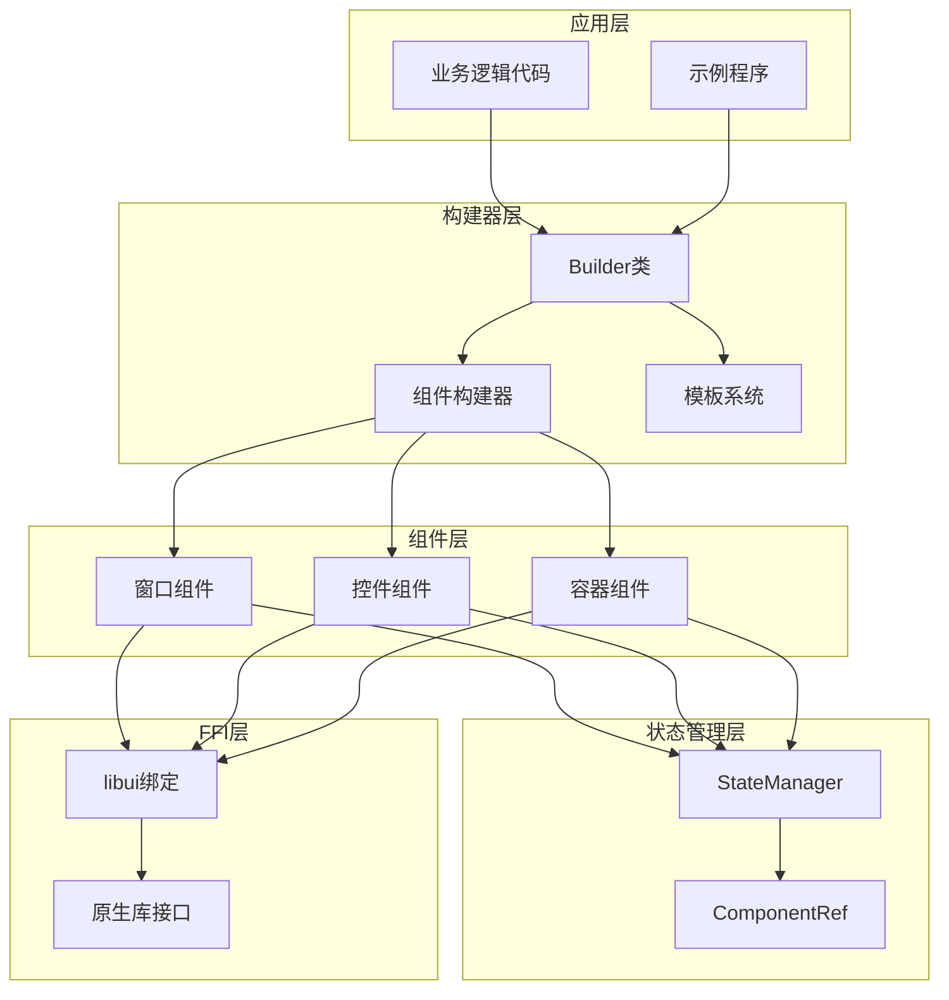
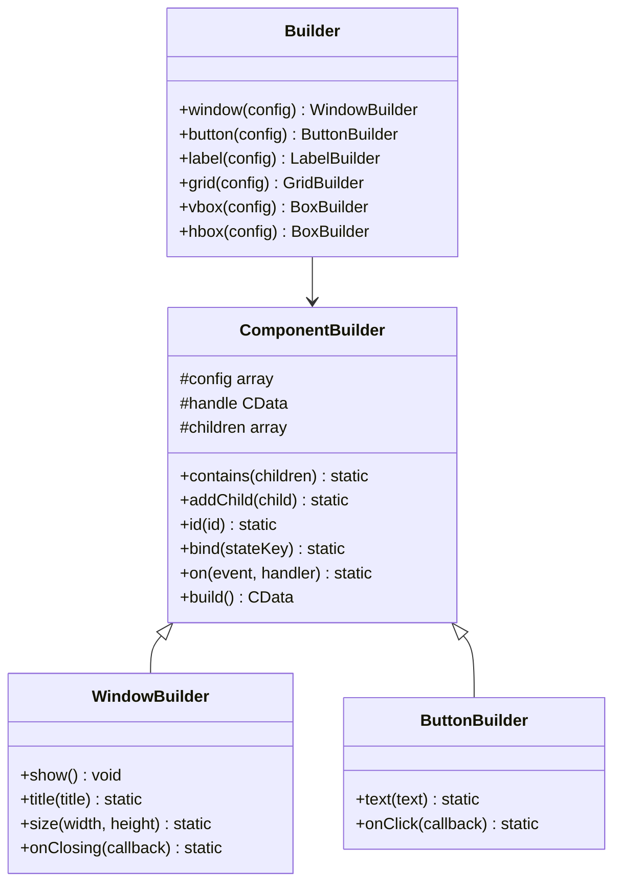
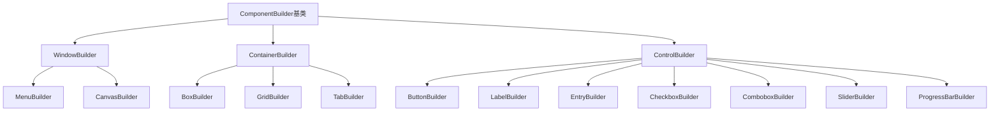
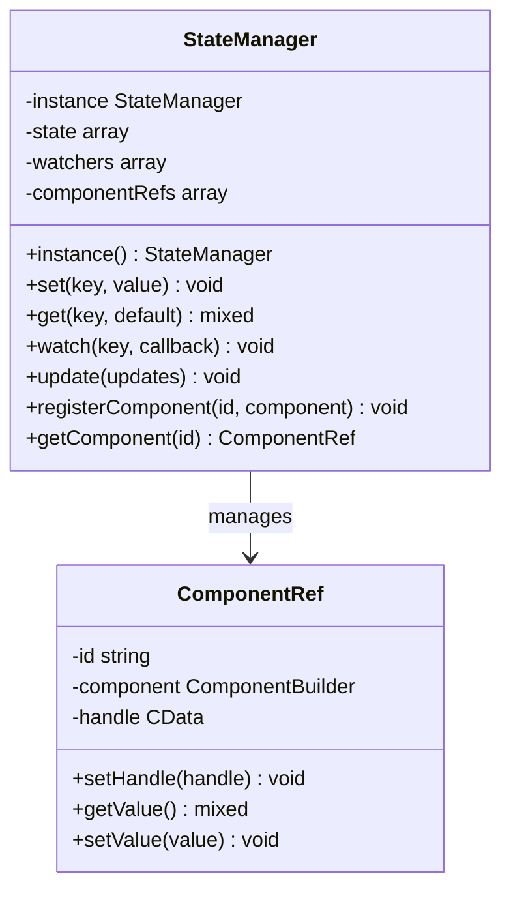
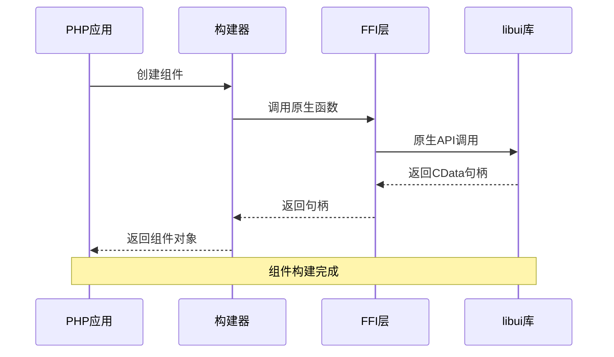

# libuiBuilder项目概述

<cite>
**本文档中引用的文件**
- [composer.json](file://composer.json)
- [src/Builder.php](file://src/Builder.php)
- [src/ComponentBuilder.php](file://src/ComponentBuilder.php)
- [src/Components/ButtonBuilder.php](file://src/Components/ButtonBuilder.php)
- [src/Components/WindowBuilder.php](file://src/Components/WindowBuilder.php)
- [src/Components/GridBuilder.php](file://src/Components/GridBuilder.php)
- [src/State/StateManager.php](file://src/State/StateManager.php)
- [src/Templates/FormTemplate.php](file://src/Templates/FormTemplate.php)
- [src/Validation/FormValidator.php](file://src/Validation/FormValidator.php)
- [src/helper.php](file://src/helper.php)
- [example/simple.php](file://example/simple.php)
- [example/full.php](file://example/full.php)
</cite>

## 目录
1. [项目简介](#项目简介)
2. [核心目标与技术定位](#核心目标与技术定位)
3. [项目架构概览](#项目架构概览)
4. [核心技术特性](#核心技术特性)
5. [组件化架构设计](#组件化架构设计)
6. [状态管理机制](#状态管理机制)
7. [与底层libui库的交互](#与底层libui库的交互)
8. [目标用户群体](#目标用户群体)
9. [技术栈依赖](#技术栈依赖)
10. [命名空间与自动加载](#命名空间与自动加载)
11. [实际应用场景](#实际应用场景)
12. [总结](#总结)

## 项目简介

libuiBuilder是一个基于PHP的GUI开发库，旨在为PHP开发者提供声明式的跨平台桌面应用程序开发体验。该项目通过构建器模式、组件化架构和状态管理机制，将复杂的原生UI库调用封装成简洁易用的API，让开发者能够以声明式的方式快速构建功能丰富的桌面应用程序。

该项目的核心价值在于：
- **简化原生UI库的复杂调用**：通过抽象层隐藏底层libui的复杂性
- **提供链式API**：支持流畅的配置和操作语法
- **组件化架构**：模块化的组件设计便于维护和扩展
- **状态管理机制**：内置的状态管理系统支持组件间的数据共享和同步

## 核心目标与技术定位

### 主要解决的问题

libuiBuilder致力于解决以下关键问题：

1. **原生UI库调用复杂性**：传统libui库需要直接调用C语言接口，对于PHP开发者来说学习成本高且容易出错
2. **缺乏声明式开发体验**：传统的GUI开发需要大量样板代码，缺乏直观的声明式语法
3. **组件间通信困难**：在复杂的GUI应用中，组件间的通信和状态同步是一大挑战
4. **跨平台兼容性**：不同操作系统上的GUI行为差异需要统一处理

### 技术定位

项目定位为：
- **PHP GUI开发的现代化解决方案**
- **基于FFI技术的原生库桥接**
- **声明式与命令式相结合的开发范式**
- **面向桌面应用开发的专用框架**

## 项目架构概览

libuiBuilder采用分层架构设计，从上到下包括：



**图表来源**
- [src/Builder.php](file://src/Builder.php#L1-L153)
- [src/ComponentBuilder.php](file://src/ComponentBuilder.php#L1-L234)
- [src/State/StateManager.php](file://src/State/StateManager.php#L1-L91)

## 核心技术特性

### 1. 构建器模式的应用

项目广泛采用构建器模式，提供流畅的API设计：



**图表来源**
- [src/Builder.php](file://src/Builder.php#L27-L153)
- [src/ComponentBuilder.php](file://src/ComponentBuilder.php#L11-L234)
- [src/Components/ButtonBuilder.php](file://src/Components/ButtonBuilder.php#L9-L48)
- [src/Components/WindowBuilder.php](file://src/Components/WindowBuilder.php#L11-L96)

### 2. 链式API设计

所有组件都支持链式调用，提供流畅的开发体验：

- **配置方法**：支持链式设置各种属性
- **事件绑定**：通过链式API绑定事件处理器
- **组件组合**：支持嵌套和组合多个组件

### 3. 组件化架构

系统采用高度模块化的组件设计：

- **基础组件**：按钮、标签、输入框等
- **容器组件**：窗口、盒子、网格等
- **复合组件**：菜单、表格等复杂组件

**章节来源**
- [src/Builder.php](file://src/Builder.php#L1-L153)
- [src/ComponentBuilder.php](file://src/ComponentBuilder.php#L1-L234)

## 组件化架构设计

### 组件层次结构



**图表来源**
- [src/ComponentBuilder.php](file://src/ComponentBuilder.php#L11-L234)
- [src/Components/ButtonBuilder.php](file://src/Components/ButtonBuilder.php#L9-L48)
- [src/Components/WindowBuilder.php](file://src/Components/WindowBuilder.php#L11-L96)

### 组件生命周期管理

每个组件都有完整的生命周期管理：

1. **初始化阶段**：创建原生控件实例
2. **配置阶段**：应用配置参数
3. **构建阶段**：递归构建子组件
4. **运行阶段**：事件处理和状态更新
5. **销毁阶段**：资源清理

**章节来源**
- [src/ComponentBuilder.php](file://src/ComponentBuilder.php#L209-L231)

## 状态管理机制

### 状态管理器架构



**图表来源**
- [src/State/StateManager.php](file://src/State/StateManager.php#L8-L91)

### 状态绑定与同步

状态管理器提供了强大的数据绑定功能：

- **单向绑定**：组件值自动跟随状态变化
- **双向绑定**：状态自动跟随组件值变化
- **事件驱动更新**：状态变化触发相应的事件处理

**章节来源**
- [src/State/StateManager.php](file://src/State/StateManager.php#L1-L91)
- [src/ComponentBuilder.php](file://src/ComponentBuilder.php#L134-L175)

## 与底层libui库的交互

### FFI技术集成

项目通过FFI（Foreign Function Interface）技术与libui库进行交互：



**图表来源**
- [src/Components/ButtonBuilder.php](file://src/Components/ButtonBuilder.php#L20-L36)
- [src/Components/WindowBuilder.php](file://src/Components/WindowBuilder.php#L26-L50)

### 原生库绑定策略

- **类型安全**：通过FFI确保类型安全
- **内存管理**：自动管理原生资源的生命周期
- **错误处理**：统一的异常处理机制

**章节来源**
- [src/Components/ButtonBuilder.php](file://src/Components/ButtonBuilder.php#L1-L48)
- [src/Components/WindowBuilder.php](file://src/Components/WindowBuilder.php#L1-L96)

## 目标用户群体

### 主要用户群体

1. **PHP开发者**：希望使用PHP构建桌面应用程序的开发者
2. **企业应用开发人员**：需要快速开发企业级桌面工具的团队
3. **原型开发工程师**：需要快速验证桌面应用概念的开发者
4. **教育工作者**：教授GUI开发课程的教师和学生

### 用户需求场景

- **快速原型开发**：快速构建应用原型进行验证
- **企业工具开发**：开发内部使用的桌面工具
- **教学演示**：用于GUI开发教学和演示
- **小型应用开发**：开发轻量级的桌面应用程序

## 技术栈依赖

### 核心依赖

根据composer.json配置，项目依赖以下核心组件：

| 依赖项 | 版本要求 | 用途 |
|--------|----------|------|
| ext/ffi | * | 提供PHP与原生库的FFI接口 |
| kingbes/libui | * | libui库的PHP绑定 |

### 开发依赖

| 依赖项 | 版本要求 | 用途 |
|--------|----------|------|
| pestphp/pest | * | 测试框架 |
| phpunit/phpunit | * | 单元测试框架 |

### 自动加载机制

项目采用PSR-4自动加载标准：

```json
{
    "psr-4": {
        "Kingbes\\Libui\\View\\": "src/",
        "Tests\\": "tests/"
    },
    "files": ["src/helper.php"]
}
```

**章节来源**
- [composer.json](file://composer.json#L1-L35)

## 命名空间与自动加载

### 命名空间结构

项目采用清晰的命名空间组织：

- **主命名空间**：`Kingbes\Libui\View\`
- **组件命名空间**：`Kingbes\Libui\View\Components\`
- **构建器命名空间**：`Kingbes\Libui\View\Builder\`
- **状态管理命名空间**：`Kingbes\Libui\View\State\`
- **模板命名空间**：`Kingbes\Libui\View\Templates\`
- **验证命名空间**：`Kingbes\Libui\View\Validation\`

### 文件组织结构

```
src/
├── Builder/          # 构建器相关类
├── Components/       # 组件类
├── State/           # 状态管理类
├── Templates/       # 模板类
├── Validation/      # 验证类
├── Builder.php      # 主构建器入口
├── ComponentBuilder.php # 组件基类
├── helper.php       # 辅助函数
└── ResponsiveGridBuilder.php # 响应式网格构建器
```

**章节来源**
- [composer.json](file://composer.json#L10-L17)
- [src/helper.php](file://src/helper.php#L1-L59)

## 实际应用场景

### 示例应用展示

项目提供了两个完整的示例应用，展示了不同的使用场景：

#### 简单应用示例

简单应用展示了基本的组件使用和状态管理：

- **表单界面**：包含输入框、复选框、下拉框等
- **实时反馈**：密码强度实时计算和显示
- **事件处理**：按钮点击、输入变化等事件处理
- **状态绑定**：组件值与状态系统的自动同步

#### 完整应用示例

完整应用展示了更复杂的功能组合：

- **多种输入控件**：单行输入、多行输入、数值控件等
- **选择控件**：复选框、单选框、下拉选择
- **进度指示**：进度条显示
- **控制按钮**：获取值、重置表单等功能
- **事件驱动**：复杂的事件处理和状态更新逻辑

### 典型应用场景

1. **数据录入工具**：表单驱动的数据录入界面
2. **配置管理器**：应用程序配置界面
3. **报表生成器**：数据可视化和报表生成
4. **开发辅助工具**：代码编辑器、调试工具等
5. **教育软件**：教学演示和练习软件

**章节来源**
- [example/simple.php](file://example/simple.php#L1-L142)
- [example/full.php](file://example/full.php#L1-L180)

## 总结

libuiBuilder作为一个创新的PHP GUI开发库，成功地将复杂的原生UI库调用封装成了简洁易用的API。通过构建器模式、组件化架构和状态管理机制，它为PHP开发者提供了一个完整的桌面应用程序开发解决方案。

### 核心优势

1. **降低学习成本**：通过抽象层隐藏底层复杂性
2. **提高开发效率**：声明式API和链式调用提升开发体验
3. **保证代码质量**：模块化设计便于维护和测试
4. **跨平台兼容**：基于libui的跨平台特性

### 发展前景

随着现代Web技术的发展和桌面应用需求的增长，libuiBuilder为PHP开发者提供了一个独特的选择，使得PHP不仅仅局限于Web开发，也能胜任桌面应用程序开发的需求。项目的模块化设计和清晰的架构为未来的功能扩展和性能优化奠定了良好的基础。