# libuiBuilder项目全面技术文档

<cite>
**本文档中引用的文件**
- [README.md](file://README.md)
- [composer.json](file://composer.json)
- [src/ComponentBuilder.php](file://src/ComponentBuilder.php)
- [src/State/StateManager.php](file://src/State/StateManager.php)
- [src/State/ComponentRef.php](file://src/State/ComponentRef.php)
- [src/Components/WindowBuilder.php](file://src/Components/WindowBuilder.php)
- [src/Components/GridBuilder.php](file://src/Components/GridBuilder.php)
- [src/Components/ButtonBuilder.php](file://src/Components/ButtonBuilder.php)
- [src/Components/EntryBuilder.php](file://src/Components/EntryBuilder.php)
- [src/helper.php](file://src/helper.php)
- [example/simple.php](file://example/simple.php)
- [example/htmlLogin.php](file://example/htmlLogin.php)
- [example/views/login.ui.html](file://example/views/login.ui.html)
- [docs/HTML_RENDERER.md](file://docs/HTML_RENDERER.md)
</cite>

## 目录
1. [项目概述](#项目概述)
2. [核心架构](#核心架构)
3. [技术栈与依赖](#技术栈与依赖)
4. [核心特性](#核心特性)
5. [架构设计](#架构设计)
6. [组件系统](#组件系统)
7. [状态管理系统](#状态管理系统)
8. [HTML模板渲染](#html模板渲染)
9. [事件系统](#事件系统)
10. [Grid布局系统](#grid布局系统)
11. [实际应用示例](#实际应用示例)
12. [性能考虑](#性能考虑)
13. [适用场景与限制](#适用场景与限制)
14. [总结](#总结)

## 项目概述

libuiBuilder是一个基于PHP的桌面GUI开发框架，专门用于简化kingbes/libui库的应用开发。该项目的核心目标是通过Builder模式和HTML模板系统，为PHP开发者提供直观、灵活的桌面应用程序开发体验。

### 核心价值主张

- **简化开发流程**：通过Builder模式提供流畅的链式调用API
- **熟悉语法**：使用HTML模板渲染，降低学习成本
- **强大布局**：提供精确的Grid布局控制系统
- **响应式状态**：内置响应式数据绑定机制
- **事件驱动**：简洁的事件处理系统
- **组件复用**：完整的模板系统支持

**章节来源**
- [README.md](file://README.md#L1-L50)

## 核心架构

libuiBuilder采用分层架构设计，主要包含以下几个层次：

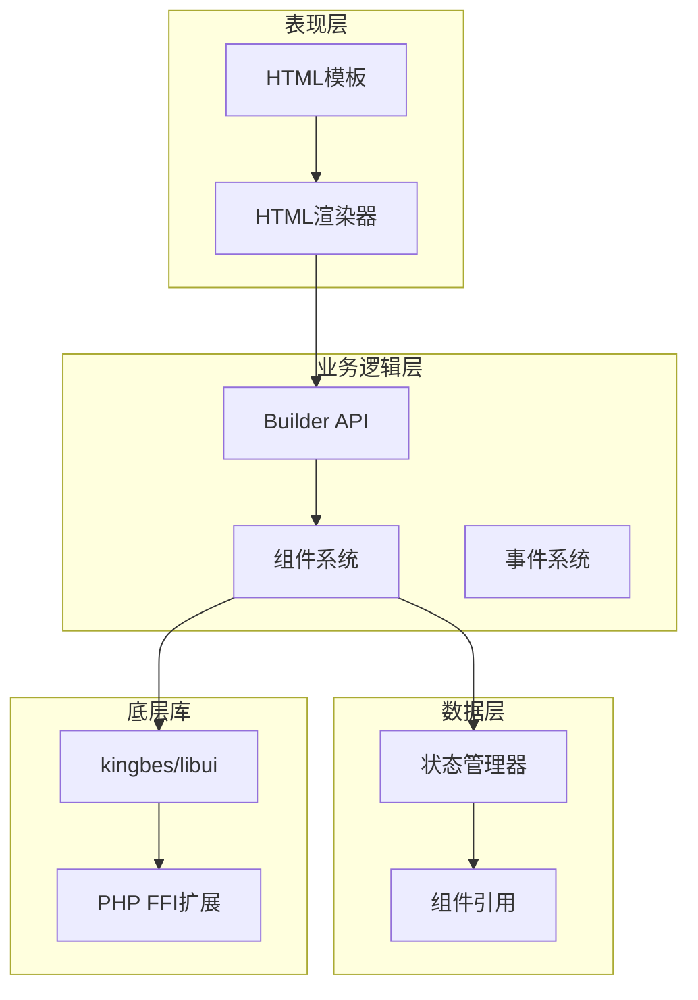

**图表来源**
- [src/ComponentBuilder.php](file://src/ComponentBuilder.php#L1-L50)
- [src/State/StateManager.php](file://src/State/StateManager.php#L1-L30)

**章节来源**
- [src/ComponentBuilder.php](file://src/ComponentBuilder.php#L1-L234)
- [src/State/StateManager.php](file://src/State/StateManager.php#L1-L91)

## 技术栈与依赖

### 核心技术栈

| 技术组件 | 版本要求 | 用途说明 |
|---------|---------|---------|
| PHP | 8.0+ | 主要开发语言 |
| ext-ffi | * | PHP FFI扩展，用于与C库交互 |
| kingbes/libui | * | 原生GUI库封装 |
| Pest | * | 测试框架 |

### 架构风格

项目采用以下架构模式：

- **Builder模式**：提供流畅的链式API
- **组件化设计**：模块化的组件系统
- **观察者模式**：状态管理和事件处理
- **工厂模式**：组件创建和管理

**章节来源**
- [composer.json](file://composer.json#L1-L37)

## 核心特性

### Builder API的链式调用机制

libuiBuilder的核心特性之一是其Builder API，提供了流畅的链式调用体验：

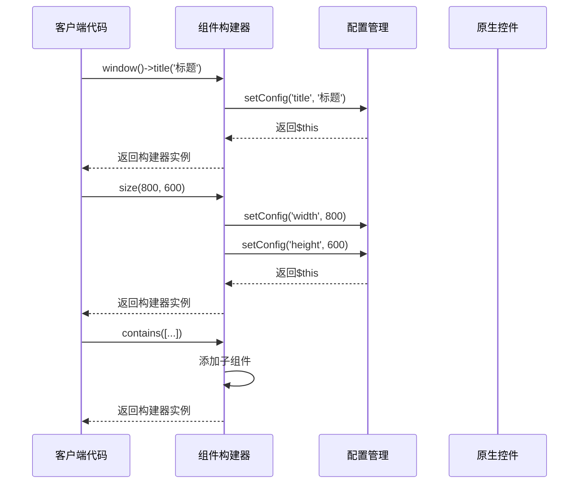

**图表来源**
- [src/ComponentBuilder.php](file://src/ComponentBuilder.php#L110-L130)

### HTML模板渲染流程

HTML模板系统是libuiBuilder的重要特色，支持使用熟悉的HTML语法定义界面：

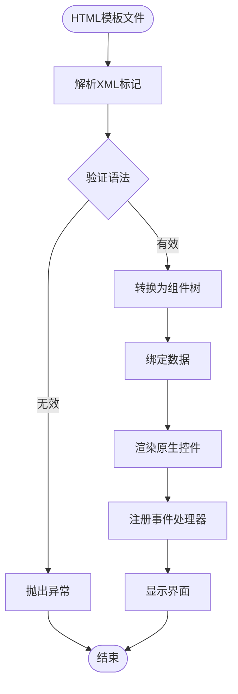

**图表来源**
- [docs/HTML_RENDERER.md](file://docs/HTML_RENDERER.md#L1-L100)

### 响应式状态管理

状态管理系统提供响应式数据绑定，支持组件间的数据同步：

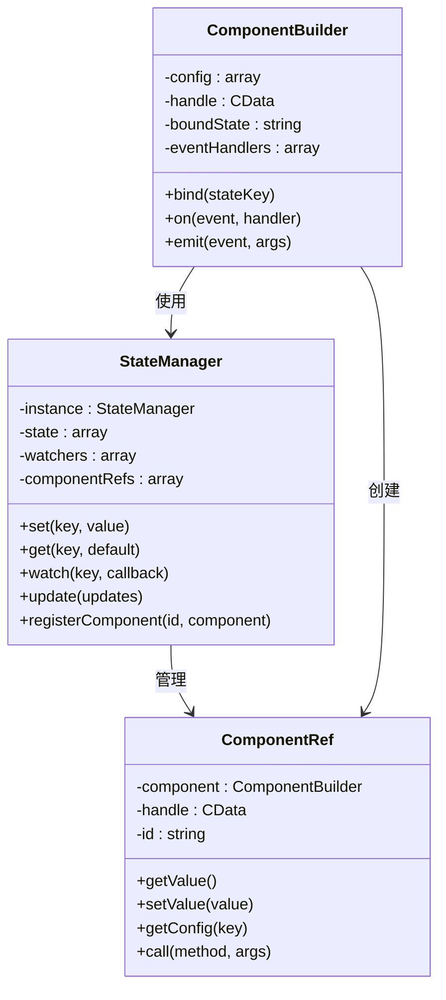

**图表来源**
- [src/State/StateManager.php](file://src/State/StateManager.php#L1-L91)
- [src/State/ComponentRef.php](file://src/State/ComponentRef.php#L1-L74)

### 事件系统

事件系统支持多种类型的事件处理：

| 事件类型 | 触发时机 | 参数 | 用途 |
|---------|---------|------|------|
| click | 按钮点击 | $button, $stateManager | 用户交互响应 |
| change | 值改变 | $newValue, $component | 数据变化监听 |
| selected | 选择变化 | $selectedIndex | 选择状态跟踪 |
| closing | 窗口关闭 | $window | 生命周期管理 |

**章节来源**
- [src/Components/ButtonBuilder.php](file://src/Components/ButtonBuilder.php#L1-L48)
- [src/Components/EntryBuilder.php](file://src/Components/EntryBuilder.php#L1-L80)

## 架构设计

### 整体架构图

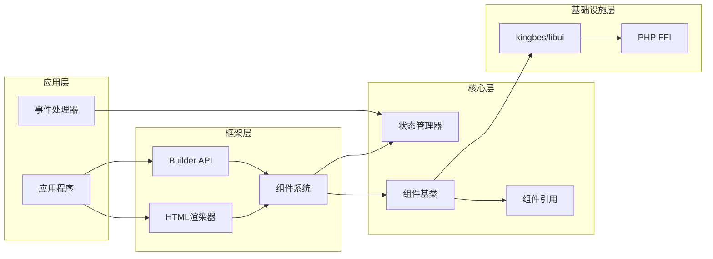

**图表来源**
- [src/ComponentBuilder.php](file://src/ComponentBuilder.php#L1-L100)
- [src/State/StateManager.php](file://src/State/StateManager.php#L1-L50)

### 核心组件关系

项目的核心组件之间存在明确的依赖关系：

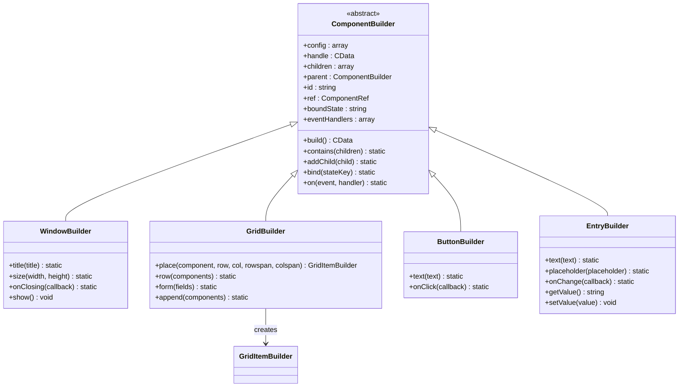

**图表来源**
- [src/Components/WindowBuilder.php](file://src/Components/WindowBuilder.php#L1-L96)
- [src/Components/GridBuilder.php](file://src/Components/GridBuilder.php#L1-L150)
- [src/Components/ButtonBuilder.php](file://src/Components/ButtonBuilder.php#L1-L48)
- [src/Components/EntryBuilder.php](file://src/Components/EntryBuilder.php#L1-L80)

**章节来源**
- [src/ComponentBuilder.php](file://src/ComponentBuilder.php#L1-L234)
- [src/Components/WindowBuilder.php](file://src/Components/WindowBuilder.php#L1-L96)

## 组件系统

### 组件分类体系

libuiBuilder提供了丰富的组件类型，按功能分为以下几类：

#### 容器组件
- **WindowBuilder**：主窗口容器
- **BoxBuilder**：水平/垂直盒子布局
- **GridBuilder**：网格布局系统
- **TabBuilder**：标签页容器

#### 基础控件
- **LabelBuilder**：文本标签显示
- **ButtonBuilder**：交互按钮
- **EntryBuilder**：单行文本输入
- **MultilineEntryBuilder**：多行文本输入
- **CheckboxBuilder**：复选框
- **RadioBuilder**：单选框组

#### 选择控件
- **ComboboxBuilder**：下拉选择框
- **SpinboxBuilder**：数值输入框
- **SliderBuilder**：滑动条
- **ProgressBarBuilder**：进度条

#### 其他控件
- **SeparatorBuilder**：分隔符
- **TableBuilder**：表格控件
- **CanvasBuilder**：绘图画布
- **MenuBuilder**：菜单系统

### 组件生命周期

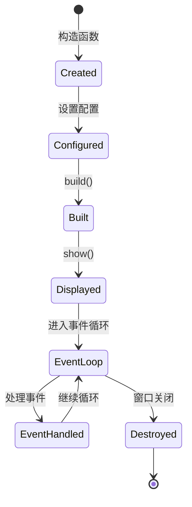

**图表来源**
- [src/ComponentBuilder.php](file://src/ComponentBuilder.php#L209-L231)

**章节来源**
- [src/Components/WindowBuilder.php](file://src/Components/WindowBuilder.php#L1-L96)
- [src/Components/GridBuilder.php](file://src/Components/GridBuilder.php#L1-L150)

## 状态管理系统

### 状态管理器架构

状态管理系统采用单例模式设计，提供全局状态共享和响应式更新：

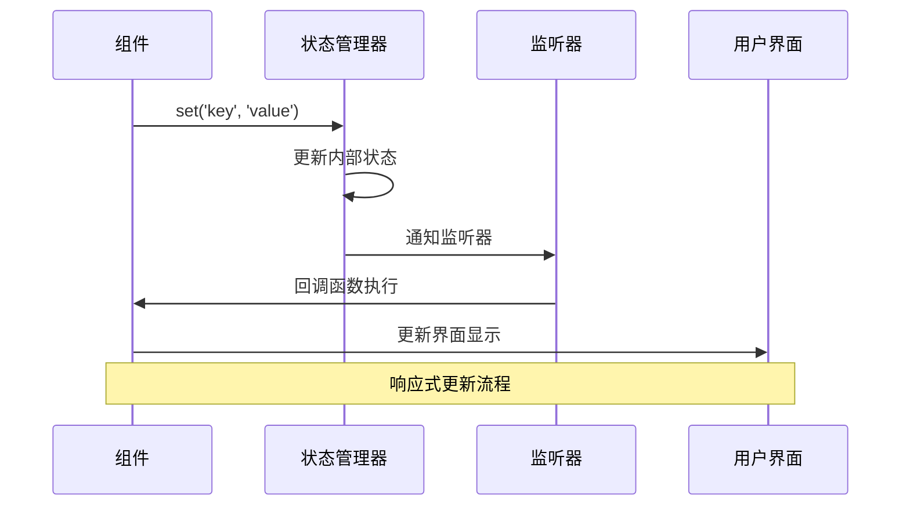

**图表来源**
- [src/State/StateManager.php](file://src/State/StateManager.php#L24-L40)

### 组件引用机制

ComponentRef类提供了对其他组件的引用和操作能力：

| 方法 | 功能 | 参数 | 返回值 |
|------|------|------|--------|
| getValue() | 获取组件值 | 无 | mixed |
| setValue(value) | 设置组件值 | value: mixed | void |
| getConfig(key) | 获取配置 | key?: string | mixed |
| call(method, args) | 调用组件方法 | method: string, args: array | mixed |

**章节来源**
- [src/State/StateManager.php](file://src/State/StateManager.php#L1-L91)
- [src/State/ComponentRef.php](file://src/State/ComponentRef.php#L1-L74)

## HTML模板渲染

### 模板语法规范

HTML模板系统使用自定义的XML语法来定义GUI界面：

#### 基本语法结构
```html
<!DOCTYPE html>
<ui version="1.0">
  <window title="应用标题" size="800,600">
    <grid padded="true">
      <!-- 组件定义 -->
    </grid>
  </window>
</ui>
```

#### 支持的标签体系

| 标签类别 | 支持的标签 | 主要用途 |
|---------|-----------|---------|
| 窗口容器 | `<window>` | 主窗口定义 |
| 布局容器 | `<vbox>`, `<hbox>`, `<grid>`, `<tab>` | 布局管理 |
| 基础控件 | `<label>`, `<button>`, `<input>` | 用户交互 |
| 选择控件 | `<combobox>`, `<radio>`, `<checkbox>` | 数据选择 |
| 其他控件 | `<separator>`, `<table>`, `<canvas>` | 特殊功能 |

### 布局系统

Grid布局是最强大的布局系统，支持精确的二维定位：

```mermaid
graph TD
Grid[Grid容器] --> Cell1[单元格(row:0,col:0)]
Grid --> Cell2[单元格(row:0,col:1)]
Grid --> Cell3[单元格(row:1,col:0)]
Grid --> Cell4[单元格(row:1,col:1)]
Cell1 --> Span1[跨列span(colspan:2)]
Cell2 --> Span2[跨行span(rowspan:2)]
Cell3 --> Align[对齐方式]
Cell4 --> Expand[扩展属性]
```

**图表来源**
- [src/Components/GridBuilder.php](file://src/Components/GridBuilder.php#L37-L65)

**章节来源**
- [docs/HTML_RENDERER.md](file://docs/HTML_RENDERER.md#L1-L781)

## 事件系统

### 事件处理机制

libuiBuilder提供了完整的事件处理系统，支持多种事件类型：

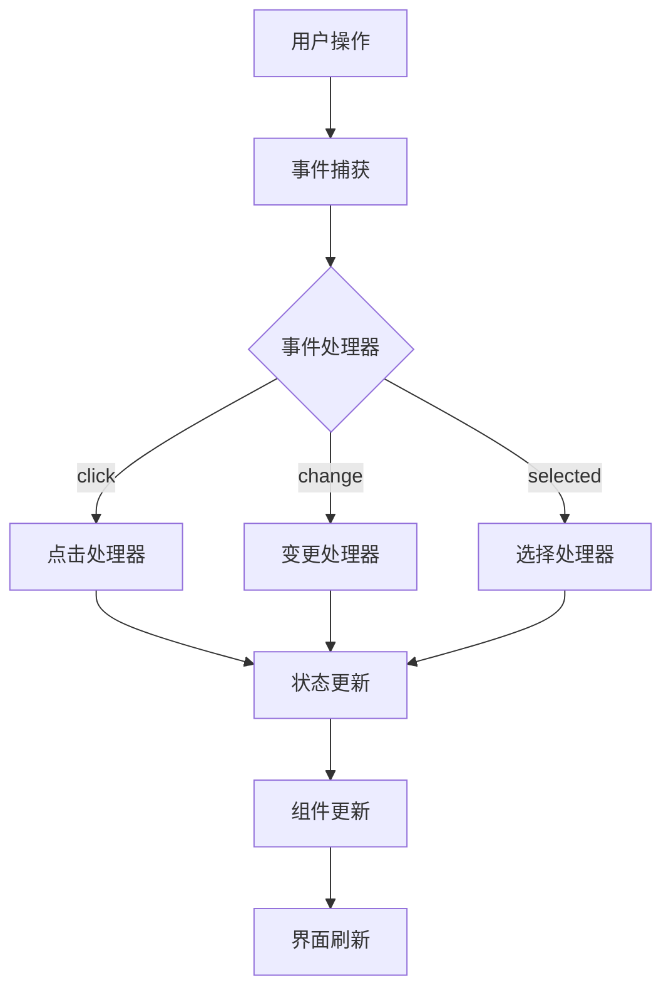

**图表来源**
- [src/Components/ButtonBuilder.php](file://src/Components/ButtonBuilder.php#L27-L40)

### 事件处理器注册

事件处理器可以通过HTML属性或PHP代码进行注册：

#### HTML事件绑定
```html
<button onclick="handleClick">点击我</button>
<input onchange="handleChange"/>
<radio onselected="handleSelect">
```

#### PHP事件处理器
```php
$handlers = [
    'handleClick' => function($button, $stateManager) {
        // 处理点击事件
    },
    'handleChange' => function($value, $component) {
        // 处理值变更
    }
];
```

**章节来源**
- [src/Components/ButtonBuilder.php](file://src/Components/ButtonBuilder.php#L1-L48)
- [src/Components/EntryBuilder.php](file://src/Components/EntryBuilder.php#L1-L80)

## Grid布局系统

### Grid布局特性

Grid布局系统提供了精确的二维布局控制能力：

#### 布局属性详解

| 属性 | 类型 | 说明 | 示例 |
|------|------|------|------|
| row | integer | 行位置（从0开始） | `row="0"` |
| col | integer | 列位置（从0开始） | `col="1"` |
| rowspan | integer | 跨越的行数 | `rowspan="2"` |
| colspan | integer | 跨越的列数 | `colspan="3"` |
| align | string | 对齐方式 | `align="center,end"` |
| expand | string | 扩展方式 | `expand="horizontal"` |

#### 布局方法

GridBuilder提供了多种布局方法：

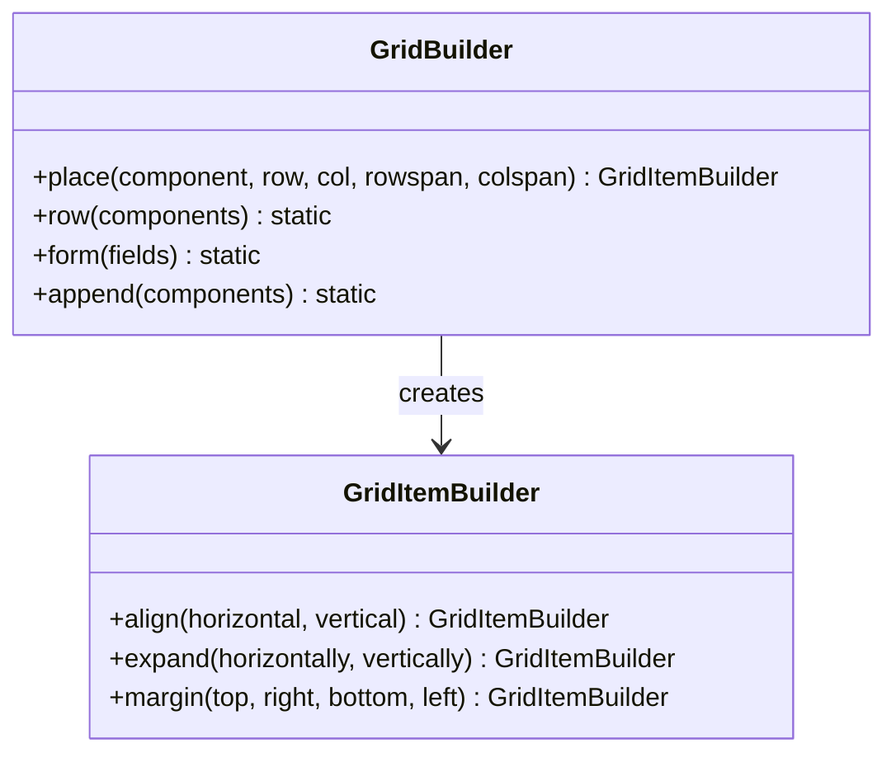

**图表来源**
- [src/Components/GridBuilder.php](file://src/Components/GridBuilder.php#L59-L149)

**章节来源**
- [src/Components/GridBuilder.php](file://src/Components/GridBuilder.php#L1-L150)

## 实际应用示例

### 基本窗口创建

以下是使用libuiBuilder创建简单窗口的基本示例：

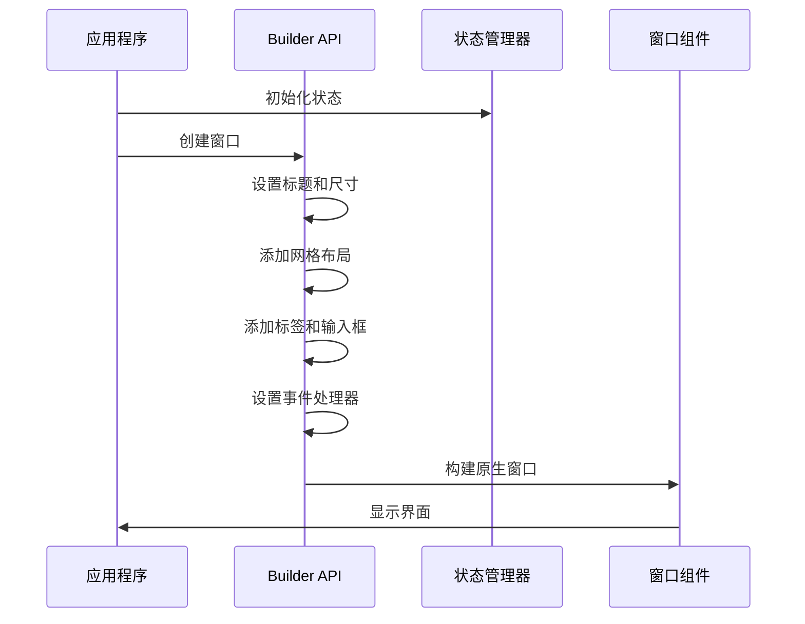

**图表来源**
- [example/simple.php](file://example/simple.php#L1-L50)

### HTML模板登录表单

HTML模板方式提供了更直观的界面定义：

```html
<!DOCTYPE html>
<ui version="1.0">
  <window title="登录窗口" size="400,300" centered="true">
    <grid padded="true">
      <label row="0" col="0" align="end,center">用户名:</label>
      <input id="usernameInput" row="0" col="1" bind="username" placeholder="请输入用户名" expand="horizontal"/>
      
      <label row="1" col="0" align="end,center">密码:</label>
      <input id="passwordInput" row="1" col="1" type="password" bind="password" placeholder="请输入密码" expand="horizontal"/>
      
      <hbox row="2" col="0" colspan="2" align="center">
        <button id="loginBtn" onclick="handleLogin">登录</button>
        <button onclick="handleReset">清空</button>
      </hbox>
      
      <label id="statusLabel" row="3" col="0" colspan="2" align="center">请输入登录信息</label>
    </grid>
  </window>
</ui>
```

**章节来源**
- [example/simple.php](file://example/simple.php#L1-L142)
- [example/htmlLogin.php](file://example/htmlLogin.php#L1-L96)
- [example/views/login.ui.html](file://example/views/login.ui.html#L1-L49)

## 性能考虑

### 优化策略

#### 1. 组件树优化
- 避免过深的嵌套结构
- 合理使用Grid布局替代嵌套容器
- 及时释放不需要的组件引用

#### 2. 状态管理优化
- 批量更新状态而非频繁单个更新
- 合理使用状态监听器，避免过度监听
- 避免在事件处理器中执行耗时操作

#### 3. 渲染性能
- 避免频繁的界面重建
- 合理使用组件缓存机制
- 优化事件处理逻辑

### 内存管理

libuiBuilder通过以下机制管理内存：

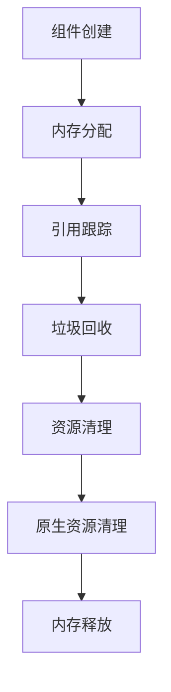

**图表来源**
- [src/ComponentBuilder.php](file://src/ComponentBuilder.php#L209-L231)

## 适用场景与限制

### 适用场景

#### 优势领域
- **桌面应用开发**：适合需要原生桌面体验的应用
- **快速原型开发**：HTML模板系统支持快速界面迭代
- **企业级应用**：复杂表单和数据展示需求
- **跨平台部署**：基于libui的跨平台兼容性

#### 推荐使用方式
- **HTML模板方式**：推荐用于大多数应用场景
- **Builder API方式**：适用于动态构建和复杂逻辑
- **混合使用**：根据具体需求灵活组合

### 项目限制

#### 技术限制
- **PHP环境依赖**：需要PHP 8.0+和FFI扩展
- **原生库依赖**：依赖kingbes/libui库
- **平台限制**：主要支持Windows、macOS、Linux

#### 功能限制
- **Web功能缺失**：非Web应用框架
- **网络功能**：不包含网络通信功能
- **数据库集成**：需要额外集成数据库层

#### 性能限制
- **大型界面**：复杂界面可能影响性能
- **高频率更新**：频繁的状态更新可能产生性能问题
- **内存消耗**：大量组件可能导致内存占用过高

### 与其他GUI框架对比

| 框架 | 语言 | 性能 | 学习曲线 | 生态系统 | 适用场景 |
|------|------|------|----------|----------|----------|
| libuiBuilder | PHP | 中等 | 低 | 小 | 桌面应用 |
| Tkinter | Python | 中等 | 低 | 中等 | 跨平台脚本 |
| PyQt | Python | 高 | 中等 | 大 | 复杂应用 |
| Electron | JavaScript | 低 | 低 | 大 | Web应用 |

## 总结

libuiBuilder作为一个基于PHP的桌面GUI开发框架，通过巧妙的设计解决了传统桌面应用开发的痛点：

### 核心优势

1. **开发效率**：Builder模式和HTML模板系统显著提升开发效率
2. **学习成本**：熟悉的HTML语法降低了学习门槛
3. **组件丰富**：完整的组件库满足各种界面需求
4. **状态管理**：响应式状态管理简化了数据绑定
5. **事件系统**：灵活的事件处理机制支持复杂交互

### 技术创新

- **混合开发模式**：HTML模板和Builder API的双重支持
- **响应式架构**：基于观察者模式的状态管理系统
- **组件化设计**：模块化的组件架构便于维护和扩展
- **跨平台兼容**：基于libui的原生跨平台支持

### 发展前景

libuiBuilder为PHP开发者提供了一个全新的桌面应用开发选择，特别适合需要快速开发、原型验证和小型桌面应用的场景。随着PHP生态系统的不断发展，该框架有望在桌面应用开发领域发挥更大的作用。

对于希望使用PHP开发桌面应用的开发者来说，libuiBuilder提供了一个既熟悉又高效的解决方案，让PHP开发者能够充分发挥自己的技术优势，创造出优秀的桌面应用程序。