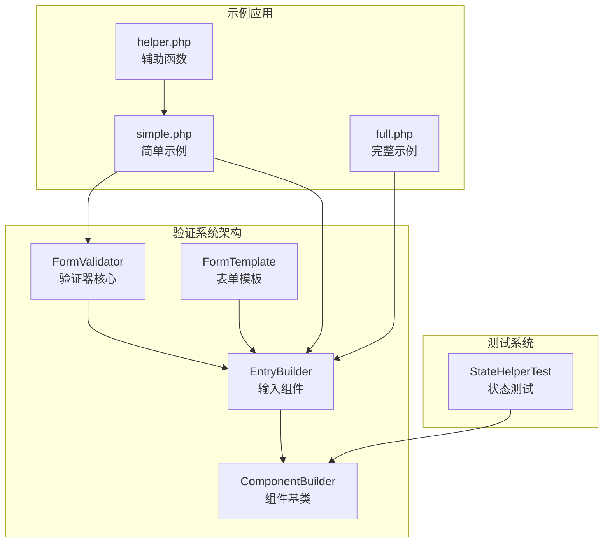
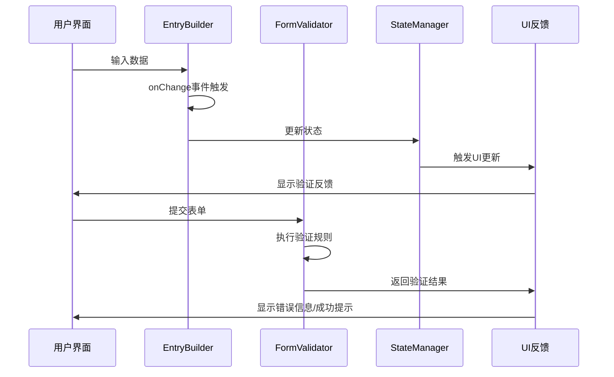
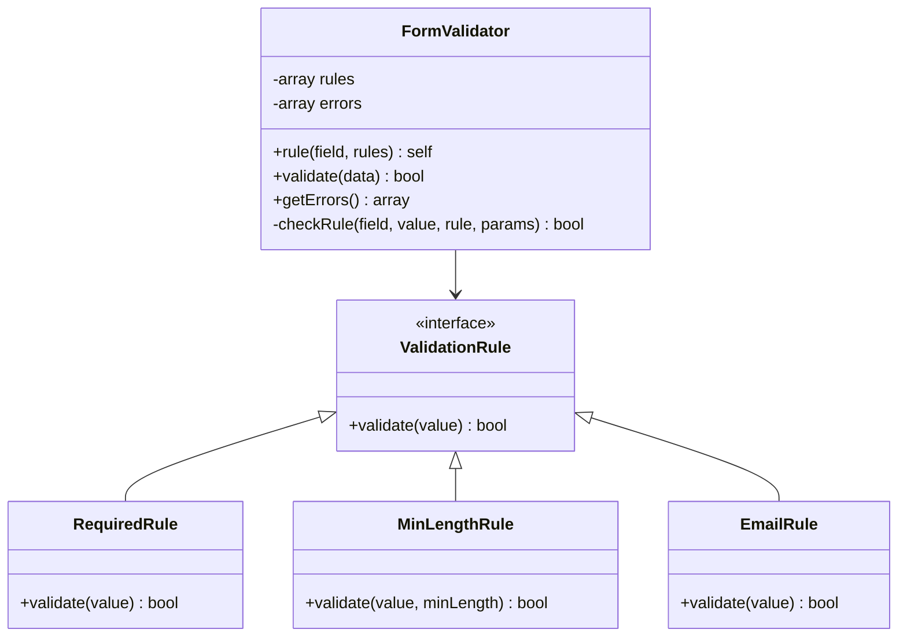
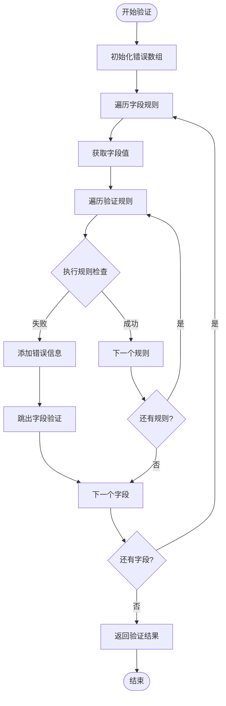
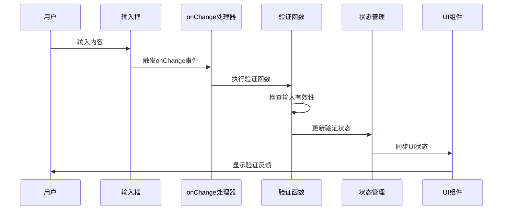
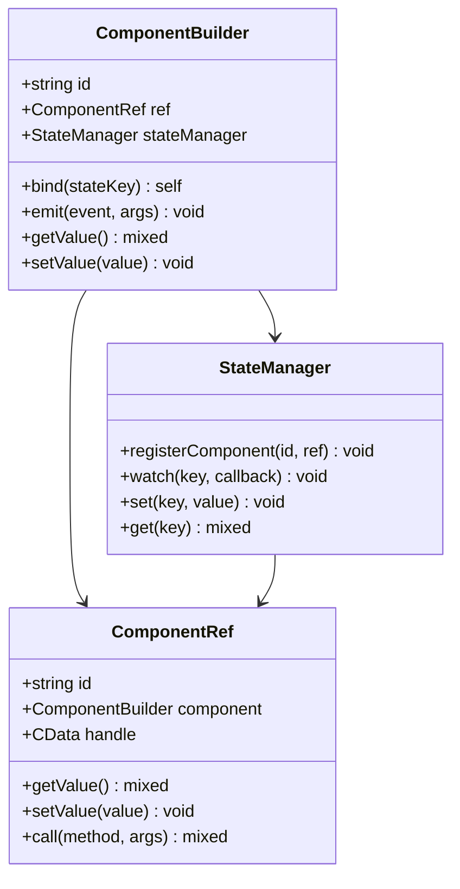
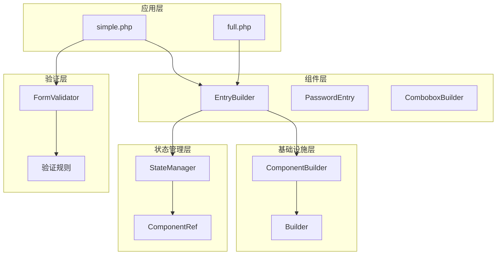

# 验证系统

<cite>
**本文档中引用的文件**
- [FormValidator.php](file://src/Validation/FormValidator.php)
- [EntryBuilder.php](file://src/Components/EntryBuilder.php)
- [ComponentBuilder.php](file://src/ComponentBuilder.php)
- [FormTemplate.php](file://src/Templates/FormTemplate.php)
- [simple.php](file://example/simple.php)
- [full.php](file://example/full.php)
- [helper.php](file://src/helper.php)
- [StateHelperTest.php](file://tests/StateHelperTest.php)
</cite>

## 目录
1. [简介](#简介)
2. [项目结构](#项目结构)
3. [核心组件](#核心组件)
4. [架构概览](#架构概览)
5. [详细组件分析](#详细组件分析)
6. [依赖关系分析](#依赖关系分析)
7. [性能考虑](#性能考虑)
8. [故障排除指南](#故障排除指南)
9. [结论](#结论)

## 简介

LibUI Builder框架提供了一套完整的表单验证系统，支持多种验证规则和实时验证功能。该系统通过FormValidator类提供强大的后端验证能力，同时通过EntryBuilder等组件支持前端实时验证和用户体验优化。

验证系统的核心特性包括：
- 多种内置验证规则（required、minLength、maxLength、email等）
- 实时验证与提交时验证相结合
- 响应式UI反馈机制
- 灵活的验证规则配置
- 错误信息本地化支持

## 项目结构

验证系统在项目中的组织结构如下：

**图表来源**
- [FormValidator.php](file://src/Validation/FormValidator.php#L1-L78)
- [EntryBuilder.php](file://src/Components/EntryBuilder.php#L1-L80)
- [ComponentBuilder.php](file://src/ComponentBuilder.php#L1-L234)

**章节来源**
- [FormValidator.php](file://src/Validation/FormValidator.php#L1-L78)
- [EntryBuilder.php](file://src/Components/EntryBuilder.php#L1-L80)

## 核心组件

### FormValidator 类

FormValidator是验证系统的核心组件，提供了完整的验证规则管理和验证执行功能。

#### 主要功能
- **规则定义**：通过`rule()`方法定义字段验证规则
- **验证执行**：通过`validate()`方法执行验证逻辑
- **错误处理**：通过`getErrors()`方法获取验证错误信息
- **链式调用**：支持流畅的API设计模式

#### 验证规则类型

| 规则名称 | 参数类型 | 描述 | 示例 |
|---------|---------|------|------|
| required | bool | 必填验证 | `['required' => true]` |
| min_length | int | 最小长度验证 | `['min_length' => 6]` |
| email | bool | 邮箱格式验证 | `['email' => true]` |

### EntryBuilder 组件

EntryBuilder是输入组件的基础实现，支持验证功能和实时反馈。

#### 核心特性
- **实时验证**：通过onChange事件触发验证
- **状态管理**：与StateManager集成实现响应式更新
- **事件处理**：支持自定义回调函数
- **配置管理**：灵活的组件配置系统

**章节来源**
- [FormValidator.php](file://src/Validation/FormValidator.php#L1-L78)
- [EntryBuilder.php](file://src/Components/EntryBuilder.php#L1-L80)

## 架构概览

验证系统的整体架构采用分层设计，确保了良好的可扩展性和维护性：

**图表来源**
- [EntryBuilder.php](file://src/Components/EntryBuilder.php#L38-L50)
- [ComponentBuilder.php](file://src/ComponentBuilder.php#L160-L175)
- [FormValidator.php](file://src/Validation/FormValidator.php#L14-L28)

## 详细组件分析

### FormValidator 验证器实现

FormValidator采用策略模式实现验证规则的动态配置和执行：

**图表来源**
- [FormValidator.php](file://src/Validation/FormValidator.php#L3-L62)

#### 验证流程

验证过程遵循以下步骤：

**图表来源**
- [FormValidator.php](file://src/Validation/FormValidator.php#L14-L28)

### EntryBuilder 实时验证机制

EntryBuilder通过事件驱动的方式实现实时验证：

**图表来源**
- [EntryBuilder.php](file://src/Components/EntryBuilder.php#L38-L50)
- [ComponentBuilder.php](file://src/ComponentBuilder.php#L160-L175)

**章节来源**
- [FormValidator.php](file://src/Validation/FormValidator.php#L14-L62)
- [EntryBuilder.php](file://src/Components/EntryBuilder.php#L38-L50)

### 组件状态管理系统

验证系统与状态管理器紧密集成，实现响应式验证：

**图表来源**
- [ComponentBuilder.php](file://src/ComponentBuilder.php#L122-L234)
- [StateHelperTest.php](file://tests/StateHelperTest.php#L152-L183)

**章节来源**
- [ComponentBuilder.php](file://src/ComponentBuilder.php#L122-L234)

## 依赖关系分析

验证系统的依赖关系体现了清晰的分层架构：

**图表来源**
- [FormValidator.php](file://src/Validation/FormValidator.php#L1-L78)
- [EntryBuilder.php](file://src/Components/EntryBuilder.php#L1-L80)
- [ComponentBuilder.php](file://src/ComponentBuilder.php#L1-L234)

**章节来源**
- [FormValidator.php](file://src/Validation/FormValidator.php#L1-L78)
- [EntryBuilder.php](file://src/Components/EntryBuilder.php#L1-L80)
- [ComponentBuilder.php](file://src/ComponentBuilder.php#L1-L234)

## 性能考虑

验证系统在设计时充分考虑了性能优化：

### 验证性能优化策略
- **短路验证**：一旦字段验证失败立即停止该字段的后续验证
- **延迟加载**：验证规则按需加载和执行
- **内存管理**：及时清理验证状态和错误信息
- **事件节流**：防止频繁的验证触发影响性能

### 最佳实践建议
1. **合理使用验证规则**：避免过度复杂的验证逻辑
2. **异步验证**：对于耗时验证可考虑异步处理
3. **缓存验证结果**：对重复验证的数据进行缓存
4. **渐进式验证**：优先验证关键字段

## 故障排除指南

### 常见问题及解决方案

#### 验证规则不生效
**问题描述**：设置的验证规则没有被触发
**解决方案**：
1. 检查是否正确调用了`validation()`方法
2. 确认验证函数的返回值为布尔值
3. 验证组件是否正确绑定到状态管理器

#### 实时验证延迟
**问题描述**：输入后验证反馈延迟明显
**解决方案**：
1. 优化验证函数的复杂度
2. 使用防抖技术减少验证频率
3. 检查事件处理程序的性能

#### 错误信息显示异常
**问题描述**：验证错误信息没有正确显示
**解决方案**：
1. 确认错误信息的绑定状态
2. 检查UI组件的状态更新机制
3. 验证错误信息的本地化配置

**章节来源**
- [FormValidator.php](file://src/Validation/FormValidator.php#L36-L62)
- [EntryBuilder.php](file://src/Components/EntryBuilder.php#L38-L50)

## 结论

LibUI Builder的验证系统提供了一个完整、灵活且高性能的表单验证解决方案。通过FormValidator类的强大验证能力和EntryBuilder组件的实时验证功能，开发者可以构建出色的用户体验。

### 系统优势
- **模块化设计**：清晰的职责分离和可扩展的架构
- **实时反馈**：即时的验证反馈提升用户体验
- **灵活配置**：支持多种验证规则和自定义验证逻辑
- **响应式集成**：与状态管理系统无缝集成

### 发展方向
- 支持更多验证规则类型
- 增强异步验证能力
- 提供更丰富的UI反馈选项
- 优化大型表单的验证性能

该验证系统为现代桌面应用程序的表单处理提供了坚实的技术基础，能够满足各种复杂的业务需求。