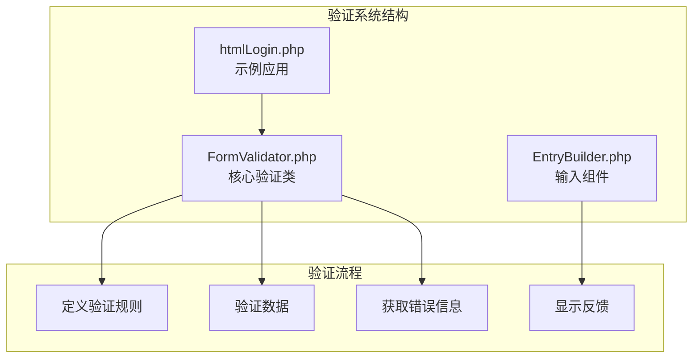
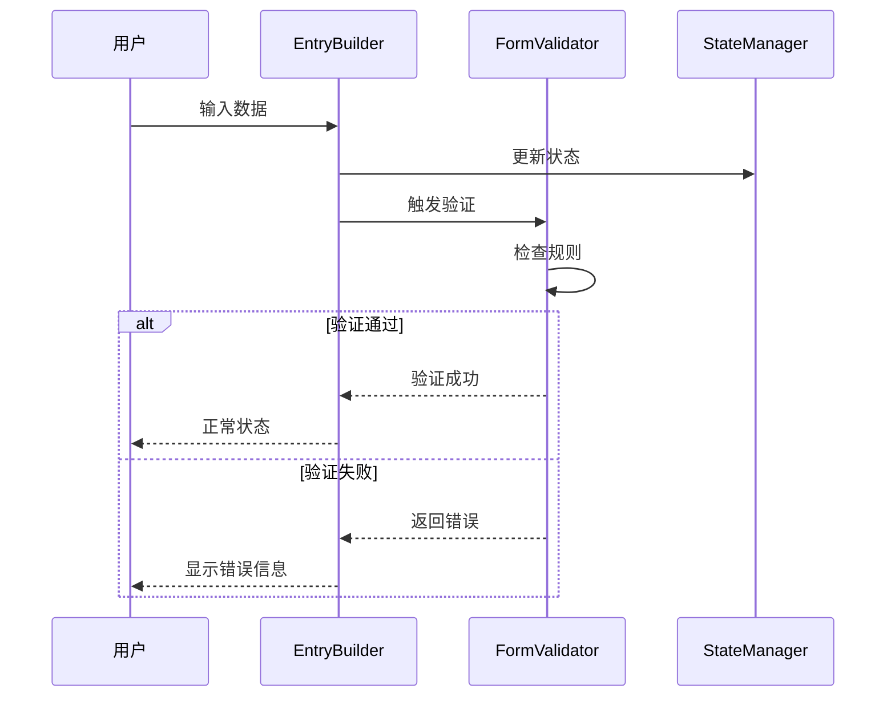
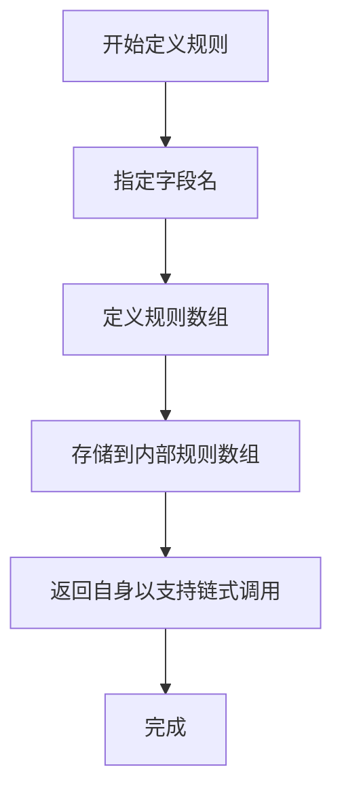
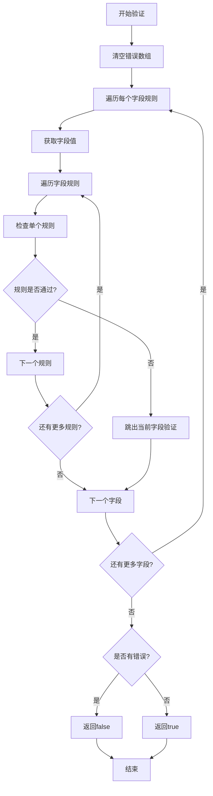
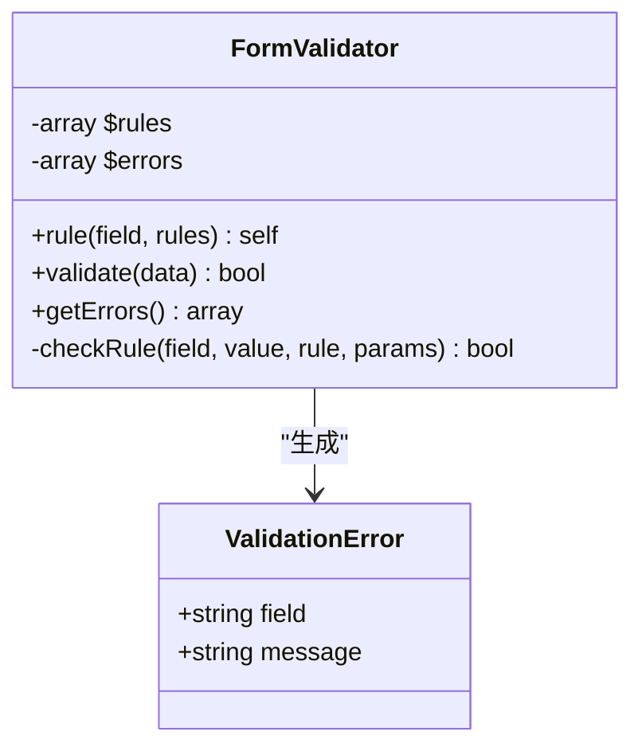
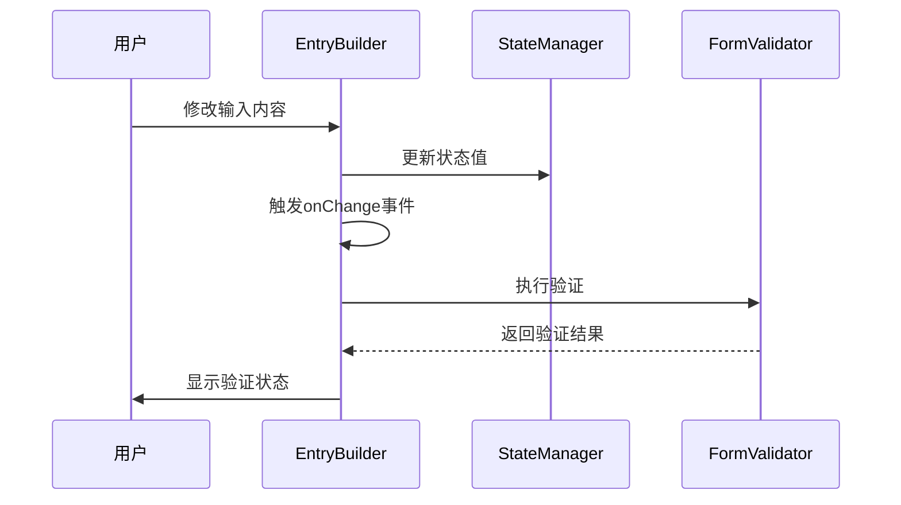
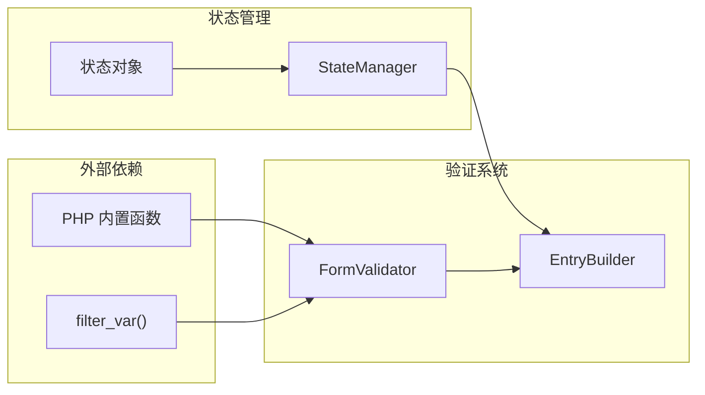

# 验证系统

<cite>
**本文档中引用的文件**
- [FormValidator.php](file://src/Validation/FormValidator.php)
- [EntryBuilder.php](file://src/Components/EntryBuilder.php)
- [htmlLogin.php](file://example/htmlLogin.php)
- [simple.php](file://example/simple.php)
- [README.md](file://README.md)
</cite>

## 目录
1. [简介](#简介)
2. [项目结构](#项目结构)
3. [核心组件](#核心组件)
4. [架构概览](#架构概览)
5. [详细组件分析](#详细组件分析)
6. [依赖关系分析](#依赖关系分析)
7. [性能考虑](#性能考虑)
8. [故障排除指南](#故障排除指南)
9. [结论](#结论)

## 简介

libuiBuilder 的验证系统提供了一个简单而强大的表单验证解决方案。该系统的核心是 `FormValidator` 类，它采用流畅的链式调用 API 来定义和执行验证规则。验证系统与前端组件（如 `EntryBuilder`）无缝集成，支持实时验证和错误反馈。

验证系统的主要特点包括：
- 流畅的链式调用 API
- 内置多种验证规则
- 详细的错误信息反馈
- 与前端组件的深度集成
- 易于扩展的架构设计

## 项目结构

验证系统位于项目的 `src/Validation/` 目录下，包含以下关键文件：

**图表来源**
- [FormValidator.php](file://src/Validation/FormValidator.php#L1-L78)
- [EntryBuilder.php](file://src/Components/EntryBuilder.php#L1-L80)

**章节来源**
- [FormValidator.php](file://src/Validation/FormValidator.php#L1-L78)
- [EntryBuilder.php](file://src/Components/EntryBuilder.php#L1-L80)

## 核心组件

### FormValidator 类

`FormValidator` 是验证系统的核心类，提供了完整的验证功能。它采用流畅的接口设计，支持链式调用。

#### 主要特性

- **规则定义**：通过 `rule()` 方法为字段定义验证规则
- **数据验证**：通过 `validate()` 方法执行验证
- **错误收集**：通过 `getErrors()` 方法获取验证错误
- **内置规则**：支持 `required`、`min_length`、`email` 等内置规则

#### 核心方法

| 方法 | 参数 | 返回值 | 描述 |
|------|------|--------|------|
| `rule()` | `$field, $rules` | `self` | 为指定字段添加验证规则 |
| `validate()` | `$data` | `bool` | 执行验证并返回结果 |
| `getErrors()` | 无 | `array` | 获取验证错误信息 |

**章节来源**
- [FormValidator.php](file://src/Validation/FormValidator.php#L8-L34)

## 架构概览

验证系统采用模块化架构，将验证逻辑与前端组件分离，实现了良好的关注点分离：

**图表来源**
- [FormValidator.php](file://src/Validation/FormValidator.php#L14-L29)
- [EntryBuilder.php](file://src/Components/EntryBuilder.php#L38-L50)

## 详细组件分析

### FormValidator 类详细分析

#### rule() 方法

`rule()` 方法用于为特定字段定义验证规则，支持链式调用：

**图表来源**
- [FormValidator.php](file://src/Validation/FormValidator.php#L8-L12)

#### validate() 方法

`validate()` 方法执行实际的验证过程：

**图表来源**
- [FormValidator.php](file://src/Validation/FormValidator.php#L14-L29)

#### 内置验证规则

系统提供了三种内置验证规则：

| 规则名称 | 参数类型 | 描述 | 错误消息模板 |
|----------|----------|------|--------------|
| `required` | 无 | 检查字段是否为空 | `{field}不能为空` |
| `min_length` | 整数 | 检查字符串最小长度 | `{field}长度不能少于{params}位` |
| `email` | 无 | 验证电子邮件格式 | `{field}格式不正确` |

#### getErrors() 方法

`getErrors()` 方法返回所有验证失败的字段及其对应的错误消息：

**图表来源**
- [FormValidator.php](file://src/Validation/FormValidator.php#L31-L34)

**章节来源**
- [FormValidator.php](file://src/Validation/FormValidator.php#L8-L62)

### EntryBuilder 类分析

`EntryBuilder` 类是验证系统与前端交互的桥梁，它提供了与验证器集成的能力：

#### 事件处理机制

**图表来源**
- [EntryBuilder.php](file://src/Components/EntryBuilder.php#L38-L50)

#### 与验证系统的集成

验证系统与 `EntryBuilder` 的集成体现在以下几个方面：

1. **状态绑定**：通过 `bind()` 方法将输入值与状态管理器关联
2. **实时验证**：在 `onChange` 事件中触发验证
3. **错误反馈**：通过状态变化向用户显示验证结果

**章节来源**
- [EntryBuilder.php](file://src/Components/EntryBuilder.php#L38-L50)

## 依赖关系分析

验证系统的依赖关系相对简单，主要涉及以下组件：

**图表来源**
- [FormValidator.php](file://src/Validation/FormValidator.php#L54-L56)
- [EntryBuilder.php](file://src/Components/EntryBuilder.php#L1-L80)

**章节来源**
- [FormValidator.php](file://src/Validation/FormValidator.php#L1-L78)
- [EntryBuilder.php](file://src/Components/EntryBuilder.php#L1-L80)

## 性能考虑

验证系统在设计时考虑了以下性能因素：

1. **短路验证**：一旦某个字段验证失败，立即停止对该字段的进一步验证
2. **内存效率**：使用简单的数组结构存储规则和错误信息
3. **延迟计算**：只在需要时才执行验证逻辑
4. **最小依赖**：仅依赖 PHP 内置函数，减少外部依赖开销

## 故障排除指南

### 常见问题及解决方案

#### 验证规则未生效

**问题描述**：定义的验证规则没有被正确执行

**可能原因**：
- 字段名不匹配
- 规则参数格式错误
- 验证时机不正确

**解决方案**：
1. 确保字段名与数据中的键名完全匹配
2. 检查规则参数的类型和格式
3. 确认在正确的时机调用 `validate()` 方法

#### 错误消息显示异常

**问题描述**：错误消息格式不正确或缺失

**可能原因**：
- 自定义错误消息未设置
- 字段名包含特殊字符
- 编码问题

**解决方案**：
1. 使用默认的错误消息模板
2. 确保字段名使用标准字符
3. 检查字符编码设置

**章节来源**
- [FormValidator.php](file://src/Validation/FormValidator.php#L40-L56)

## 结论

libuiBuilder 的验证系统提供了一个简洁而强大的表单验证解决方案。通过 `FormValidator` 类的流畅 API 设计，开发者可以轻松地为表单字段定义复杂的验证规则。系统与前端组件的深度集成确保了良好的用户体验，而内置的多种验证规则满足了常见的验证需求。

该验证系统的主要优势包括：
- **易用性**：流畅的链式调用 API
- **可扩展性**：支持自定义验证规则
- **集成性**：与状态管理系统无缝集成
- **可靠性**：内置多种验证规则，保证数据质量

对于需要构建高质量桌面应用程序的开发者来说，这个验证系统提供了一个可靠且易于使用的解决方案。