# 全局函数扩展机制详解

<cite>
**本文档中引用的文件**
- [helper.php](file://src/helper.php)
- [composer.json](file://composer.json)
- [Builder.php](file://src/Builder.php)
- [FormValidator.php](file://src/Validation/FormValidator.php)
- [StateHelperTest.php](file://tests/StateHelperTest.php)
- [simple.php](file://example/simple.php)
- [full.php](file://example/full.php)
</cite>

## 目录
1. [简介](#简介)
2. [项目结构概览](#项目结构概览)
3. [全局函数扩展机制](#全局函数扩展机制)
4. [Composer自动加载支持](#composer自动加载支持)
5. [calculateStrength函数深度解析](#calculateStrength函数深度解析)
6. [函数设计原则与最佳实践](#函数设计原则与最佳实践)
7. [扩展示例与应用场景](#扩展示例与应用场景)
8. [命名冲突避免策略](#命名冲突避免策略)
9. [性能考虑与优化建议](#性能考虑与优化建议)
10. [故障排除指南](#故障排除指南)
11. [总结](#总结)

## 简介

本文档详细阐述了libuiBuilder项目中全局辅助函数的扩展机制，重点分析了helper.php文件中的函数设计原理，并提供了完整的扩展指南。该项目采用Composer自动加载机制，通过PSR-4标准和文件级自动加载支持全局函数的无缝集成。

## 项目结构概览

libuiBuilder是一个基于PHP的GUI应用程序构建框架，其核心架构围绕全局辅助函数展开，这些函数通过Composer的文件级自动加载机制直接可用。

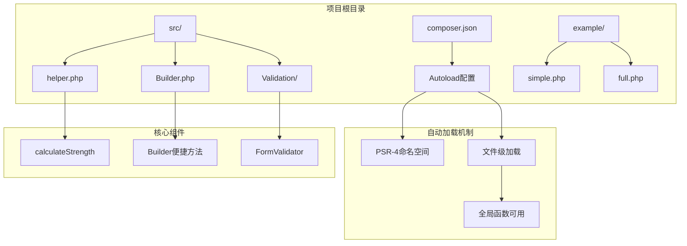

**图表来源**
- [composer.json](file://composer.json#L10-L17)
- [helper.php](file://src/helper.php#L1-L59)

**章节来源**
- [composer.json](file://composer.json#L1-L35)
- [helper.php](file://src/helper.php#L1-L59)

## 全局函数扩展机制

### 核心扩展原理

libuiBuilder采用独特的全局函数扩展机制，通过Composer的文件级自动加载功能实现：

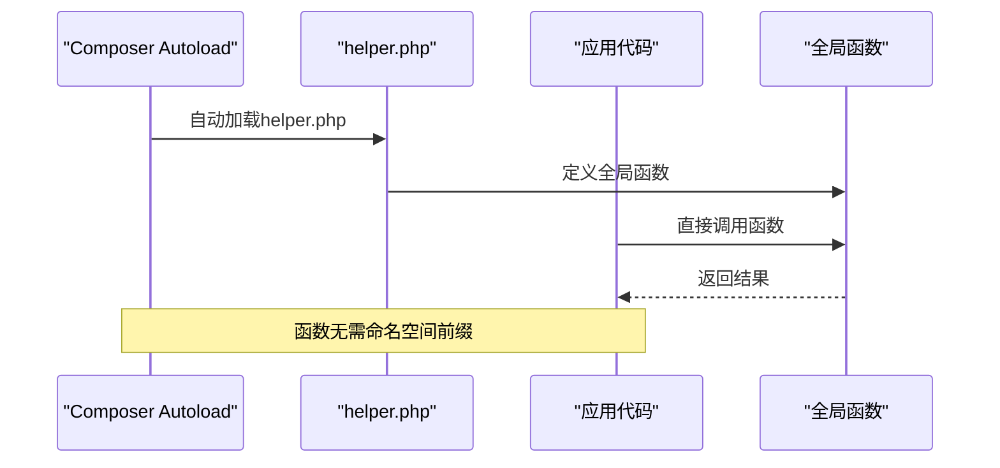

**图表来源**
- [composer.json](file://composer.json#L15-L17)
- [helper.php](file://src/helper.php#L1-L59)

### 扩展架构设计

全局函数扩展遵循以下架构原则：

1. **单一职责原则**: 每个函数专注于特定功能领域
2. **纯函数设计**: 函数不依赖外部状态，确保可预测性
3. **类型安全**: 明确的参数类型和返回类型声明
4. **无副作用**: 函数执行不会产生意外的外部影响

**章节来源**
- [helper.php](file://src/helper.php#L4-L59)
- [composer.json](file://composer.json#L15-L17)

## Composer自动加载支持

### PSR-4命名空间映射

项目使用PSR-4标准进行命名空间映射，但通过文件级加载绕过命名空间限制：

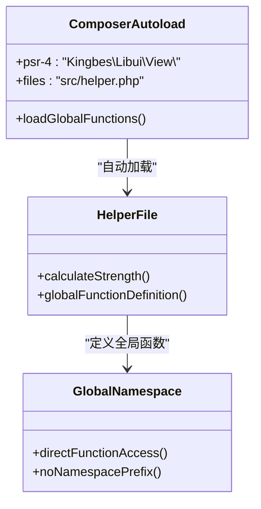

**图表来源**
- [composer.json](file://composer.json#L10-L17)
- [helper.php](file://src/helper.php#L1-L59)

### 作用域问题解决方案

通过Composer的文件级加载机制，项目解决了PHP全局函数的作用域问题：

| 特性 | 传统方法 | libuiBuilder方法 |
|------|----------|------------------|
| 函数定义位置 | 类内部或命名空间内 | 文件顶部直接定义 |
| 调用方式 | 需要命名空间前缀 | 直接函数名调用 |
| 加载机制 | 手动require/include | Composer自动加载 |
| 作用域控制 | 受命名空间限制 | 全局可用 |

**章节来源**
- [composer.json](file://composer.json#L15-L17)

## calculateStrength函数深度解析

### 函数架构分析

`calculateStrength`函数是项目中最具代表性的全局辅助函数，展示了密码强度评估的完整逻辑：

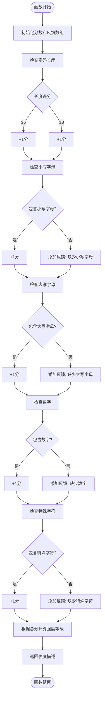

**图表来源**
- [helper.php](file://src/helper.php#L4-L59)

### 评分算法详解

函数采用多维度评分机制：

| 维度 | 条件 | 分值 | 反馈信息 |
|------|------|------|----------|
| 长度 | ≥6字符 | +1 | 长度至少6位 |
| 长度 | ≥8字符 | +1 | - |
| 小写字母 | 存在 | +1 | 缺少小写字母 |
| 大写字母 | 存在 | +1 | 缺少大写字母 |
| 数字 | 存在 | +1 | 缺少数字 |
| 特殊字符 | 存在 | +1 | 缺少特殊字符 |

### 强度等级划分

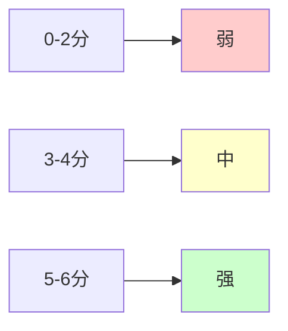

**图表来源**
- [helper.php](file://src/helper.php#L45-L58)

**章节来源**
- [helper.php](file://src/helper.php#L4-L59)

## 函数设计原则与最佳实践

### 无副作用原则

全局函数必须保持无副作用特性：

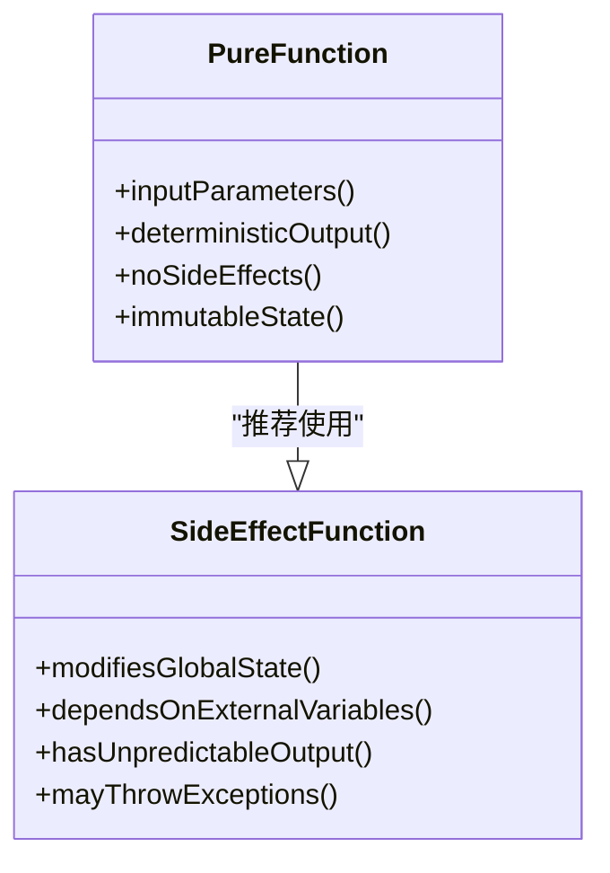

### 纯函数优先策略

纯函数具有以下特征：
- 相同输入始终产生相同输出
- 不依赖外部状态
- 不修改传入参数
- 不产生意外的外部影响

### 类型安全保证

函数应明确指定参数类型和返回类型：

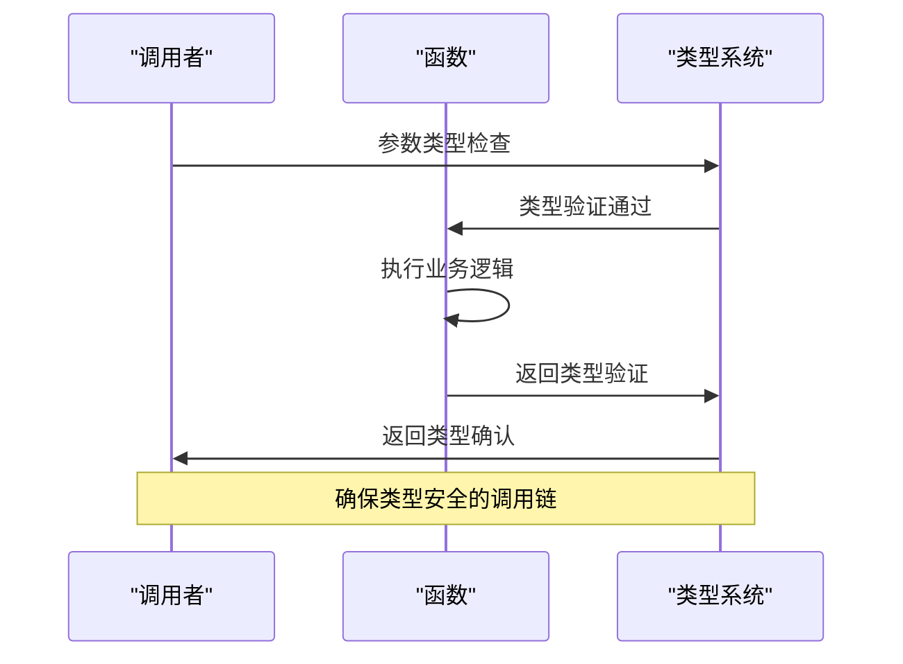

**章节来源**
- [helper.php](file://src/helper.php#L4-L59)

## 扩展示例与应用场景

### 密码强度检测扩展

基于现有的`calculateStrength`函数，可以扩展更多密码安全相关的功能：

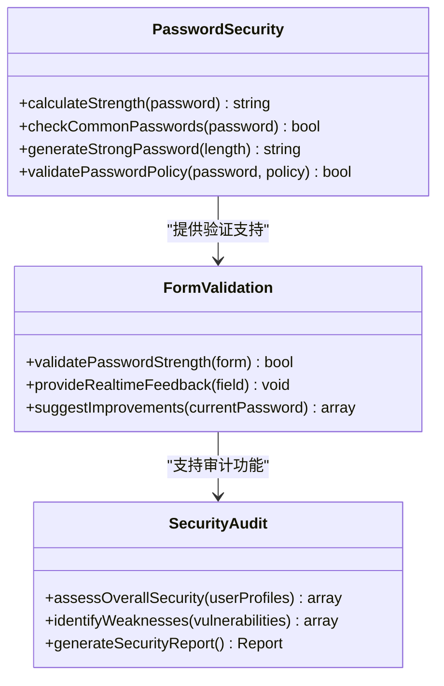

### 输入格式化示例

扩展输入格式化功能：

| 功能 | 描述 | 应用场景 |
|------|------|----------|
| `formatPhoneNumber(number)` | 格式化电话号码 | 用户注册表单 |
| `formatCurrency(amount, currency)` | 格式化货币显示 | 电商应用 |
| `sanitizeInput(input)` | 清理用户输入 | 表单处理 |
| `maskSensitiveData(data)` | 敏感数据脱敏 | 数据展示 |

### 数值计算扩展

提供数学计算辅助函数：

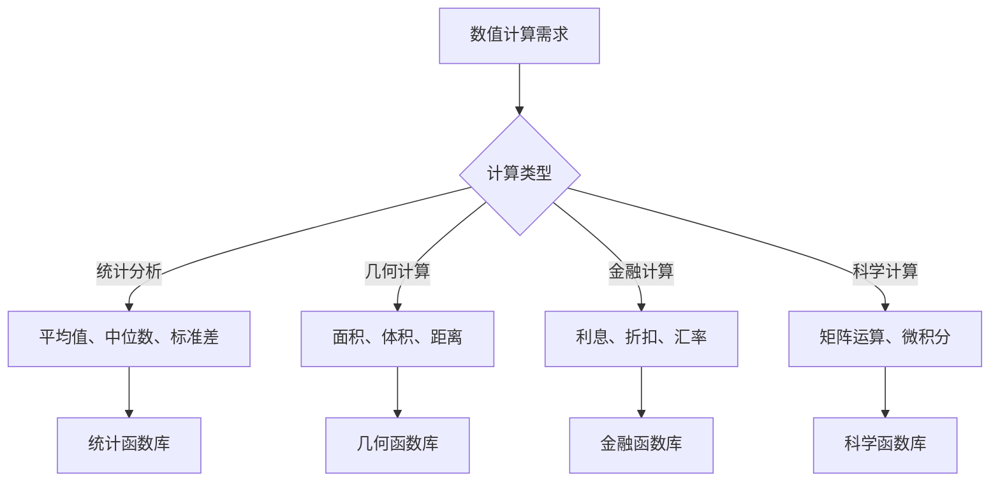

**章节来源**
- [simple.php](file://example/simple.php#L40-L49)
- [FormValidator.php](file://src/Validation/FormValidator.php#L53-L58)

## 命名冲突避免策略

### 命名空间隔离

虽然项目采用全局函数设计，但仍需注意命名冲突：

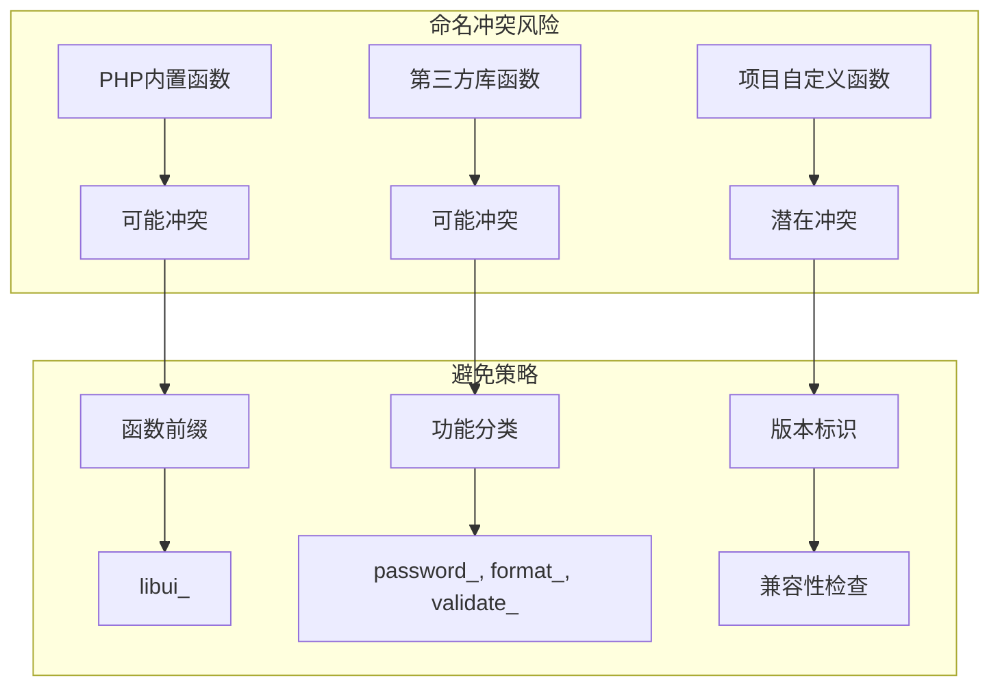

### 冲突检测机制

建立函数冲突检测流程：

1. **预检查阶段**: 在添加新函数前检查现有函数列表
2. **命名规范**: 采用项目特定的命名前缀
3. **版本控制**: 记录函数变更历史
4. **向后兼容**: 确保新版本不破坏现有功能

### 最佳命名实践

| 前缀类别 | 示例函数 | 用途说明 |
|----------|----------|----------|
| `libui_` | `libui_calculateStrength()` | 项目专用函数 |
| `format_` | `format_phoneNumber()` | 数据格式化 |
| `validate_` | `validate_email()` | 数据验证 |
| `security_` | `security_hashPassword()` | 安全相关 |
| `math_` | `math_calculateAverage()` | 数学计算 |

**章节来源**
- [composer.json](file://composer.json#L10-L17)

## 性能考虑与优化建议

### 函数调用开销

全局函数调用的性能特点：

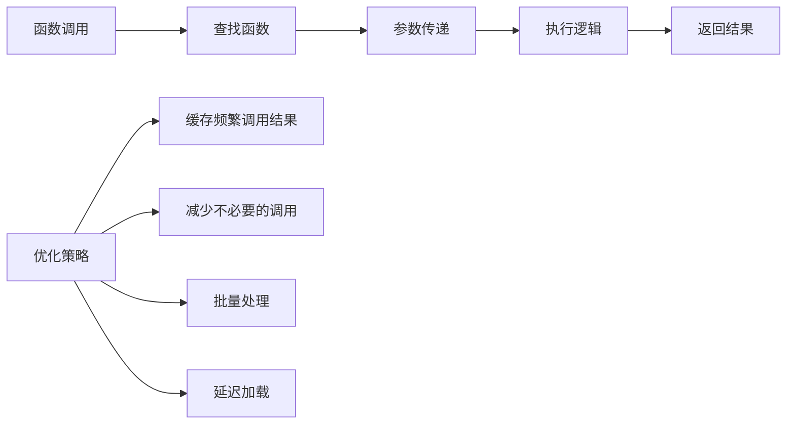

### 性能优化技巧

1. **结果缓存**: 对重复计算的结果进行缓存
2. **条件优化**: 使用早期返回减少不必要的计算
3. **内存管理**: 及时释放不需要的变量
4. **批量处理**: 合并多个相关操作

### 内存使用监控

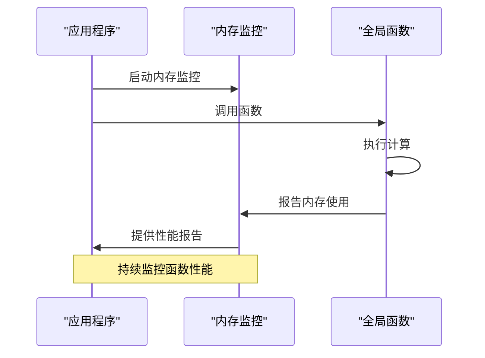

## 故障排除指南

### 常见问题诊断

| 问题类型 | 症状 | 解决方案 |
|----------|------|----------|
| 函数未定义 | Fatal error: Call to undefined function | 检查helper.php是否正确加载 |
| 类型错误 | TypeError: Argument must be of type | 验证参数类型声明 |
| 性能问题 | 函数执行缓慢 | 优化算法或添加缓存 |
| 内存泄漏 | 内存使用持续增长 | 检查循环引用和资源释放 |

### 调试工具与技术

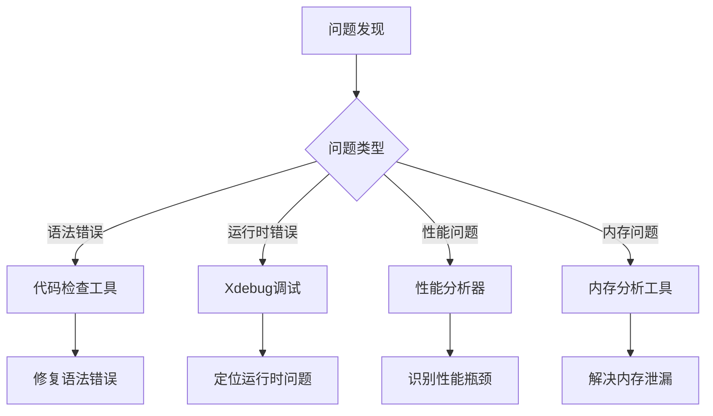

### 测试策略

建立全面的测试覆盖：

1. **单元测试**: 针对每个函数编写独立测试
2. **集成测试**: 测试函数间的协作
3. **性能测试**: 验证函数性能指标
4. **压力测试**: 测试高负载下的表现

**章节来源**
- [StateHelperTest.php](file://tests/StateHelperTest.php#L1-L184)

## 总结

libuiBuilder项目的全局函数扩展机制展现了现代PHP开发的最佳实践。通过Composer的文件级自动加载，项目实现了既方便使用又安全可靠的全局函数系统。`calculateStrength`函数作为核心示例，展示了密码强度评估的完整实现，体现了函数设计的完整性原则。

关键要点包括：

1. **架构优势**: 通过Composer自动加载实现全局函数的无缝集成
2. **设计原则**: 无副作用、纯函数优先、类型安全的核心理念
3. **扩展能力**: 提供了丰富的扩展示例和应用场景
4. **安全性**: 完善的命名冲突避免和性能优化策略
5. **可维护性**: 清晰的函数分类和完善的测试覆盖

这种设计不仅提高了开发效率，也为项目提供了强大的可扩展性和良好的代码质量保证。开发者可以在此基础上继续扩展更多实用的全局函数，构建更加完善的应用程序功能体系。