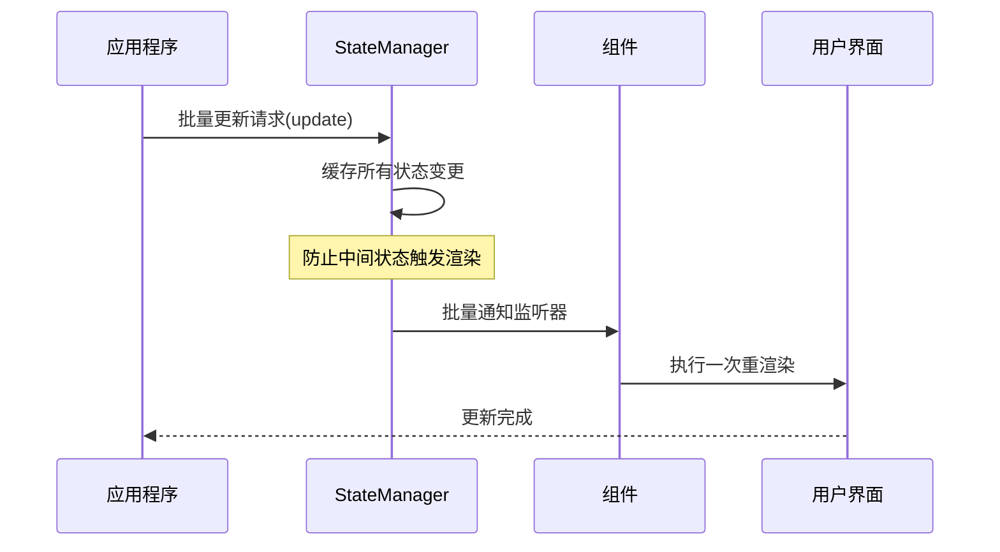
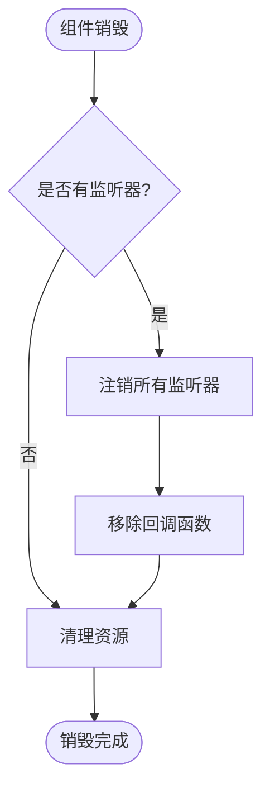
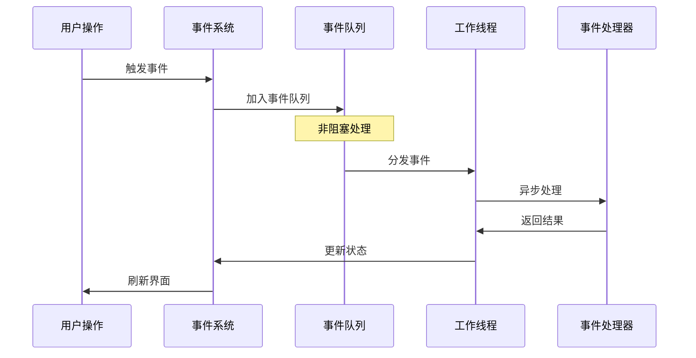
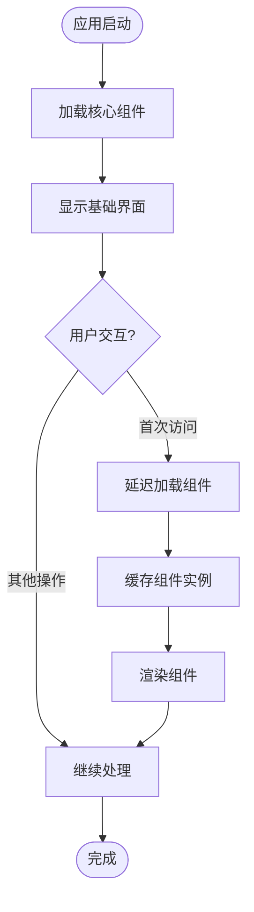
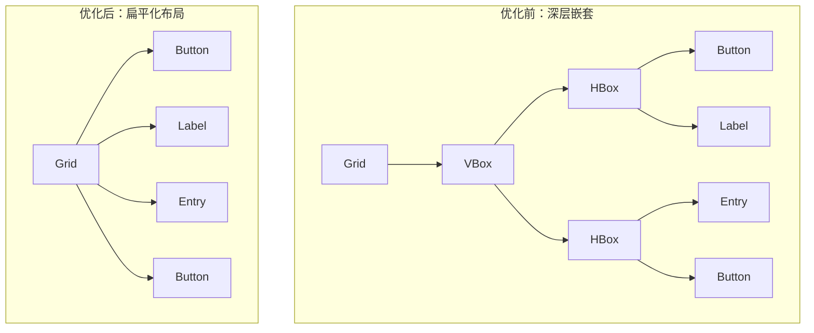
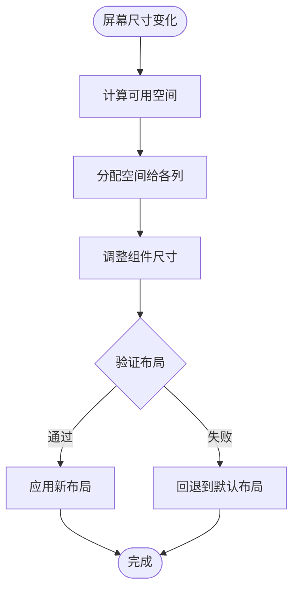
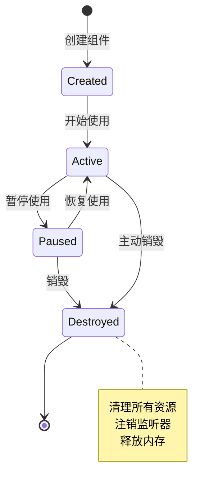
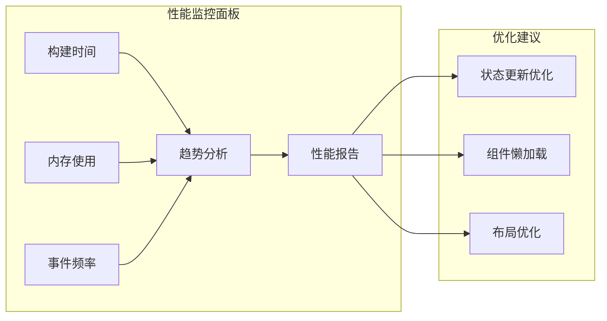

# libuiBuilder应用性能优化建议

<cite>
**本文档中引用的文件**
- [Builder.php](file://src/Builder.php)
- [ComponentBuilder.php](file://src/ComponentBuilder.php)
- [StateManager.php](file://src/State/StateManager.php)
- [ComponentRef.php](file://src/State/ComponentRef.php)
- [GridBuilder.php](file://src/Components/GridBuilder.php)
- [WindowBuilder.php](file://src/Components/WindowBuilder.php)
- [ResponsiveGridBuilder.php](file://src/ResponsiveGridBuilder.php)
- [CanvasBuilder.php](file://src/Components/CanvasBuilder.php)
- [simple.php](file://example/simple.php)
- [full.php](file://example/full.php)
- [helper.php](file://src/helper.php)
</cite>

## 目录
1. [概述](#概述)
2. [状态管理开销优化](#状态管理开销优化)
3. [事件处理优化](#事件处理优化)
4. [组件构建优化](#组件构建优化)
5. [复杂布局优化](#复杂布局优化)
6. [内存管理与资源清理](#内存管理与资源清理)
7. [性能监控与分析](#性能监控与分析)
8. [最佳实践总结](#最佳实践总结)

## 概述

libuiBuilder是一个基于PHP的GUI应用程序框架，提供了丰富的组件和状态管理系统。为了确保应用的高性能运行，需要重点关注以下几个方面：
- 避免高频setState导致的过度重渲染
- 合理使用watch监听器防止内存泄漏
- 延迟加载非首屏组件
- 优化事件处理逻辑
- 减少复杂布局的嵌套层级

## 状态管理开销优化

### 问题识别

当前状态管理系统存在以下潜在性能问题：

1. **频繁的状态更新**：多个监听器同时触发可能导致重复渲染
2. **内存泄漏风险**：未及时注销的watch监听器
3. **过度重渲染**：细粒度的状态变化触发不必要的组件更新

### 优化策略

#### 1. 实现批量更新机制



**图表来源**
- [StateManager.php](file://src/State/StateManager.php#L60-L66)

#### 2. 防抖和节流机制

对于高频状态更新场景，建议实现防抖机制：

```php
// 示例：防抖状态更新
class DebouncedStateManager {
    private $pendingUpdates = [];
    private $updateTimer;
    
    public function setWithDebounce($key, $value, $delay = 100) {
        // 清除之前的定时器
        if ($this->updateTimer) {
            clearTimeout($this->updateTimer);
        }
        
        // 设置新的定时器
        $this->pendingUpdates[$key] = $value;
        $this->updateTimer = setTimeout(function() {
            $this->flushUpdates();
        }, $delay);
    }
    
    private function flushUpdates() {
        $updates = $this->pendingUpdates;
        $this->pendingUpdates = [];
        StateManager::instance()->update($updates);
    }
}
```

#### 3. 监听器管理优化



**图表来源**
- [ComponentBuilder.php](file://src/ComponentBuilder.php#L122-L146)
- [StateManager.php](file://src/State/StateManager.php#L50-L56)

#### 4. 状态更新优化示例

```php
// 优化前：频繁更新
foreach ($items as $item) {
    state("item_{$item->id}", $item->data);
}

// 优化后：批量更新
$updates = [];
foreach ($items as $item) {
    $updates["item_{$item->id}"] = $item->data;
}
state($updates);
```

**章节来源**
- [StateManager.php](file://src/State/StateManager.php#L60-L66)
- [ComponentBuilder.php](file://src/ComponentBuilder.php#L140-L146)

## 事件处理优化

### 性能瓶颈分析

事件处理中的常见性能问题包括：

1. **阻塞主线程**：在on回调中执行耗时操作
2. **事件累积**：短时间内大量事件触发
3. **内存泄漏**：未正确清理事件监听器

### 优化方案

#### 1. 异步事件处理



#### 2. 事件节流实现

```php
class EventThrottler {
    private $lastExecutionTimes = [];
    private $throttlePeriod = 100; // 100ms
    
    public function throttle($eventName, callable $callback, $period = null) {
        $period = $period ?? $this->throttlePeriod;
        
        return function(...$args) use ($eventName, $callback, $period) {
            $currentTime = microtime(true) * 1000;
            
            if (!isset($this->lastExecutionTimes[$eventName]) || 
                ($currentTime - $this->lastExecutionTimes[$eventName]) > $period) {
                
                $this->lastExecutionTimes[$eventName] = $currentTime;
                return $callback(...$args);
            }
        };
    }
}
```

#### 3. 事件处理最佳实践

```php
// 推荐：异步处理耗时操作
$component->on('change', function($value) {
    // 不要在回调中执行耗时操作
    // 应该使用异步处理
    async(function() use ($value) {
        // 耗时操作
        processDataAsync($value);
    });
});

// 推荐：使用防抖处理高频事件
$component->on('resize', (new EventThrottler())->throttle('resize', function($width, $height) {
    // 重新计算布局
    recalculateLayout($width, $height);
}));
```

**章节来源**
- [ComponentBuilder.php](file://src/ComponentBuilder.php#L150-L175)
- [simple.php](file://example/simple.php#L30-L50)

## 组件构建优化

### 构建流程优化

#### 1. 延迟加载策略



#### 2. 组件懒初始化

```php
class LazyComponentLoader {
    private $loadedComponents = [];
    
    public function loadComponent($componentId, callable $factory) {
        if (!isset($this->loadedComponents[$componentId])) {
            $this->loadedComponents[$componentId] = $factory();
        }
        return $this->loadedComponents[$componentId];
    }
    
    public function unloadComponent($componentId) {
        if (isset($this->loadedComponents[$componentId])) {
            // 清理组件资源
            $this->loadedComponents[$componentId]->cleanup();
            unset($this->loadedComponents[$componentId]);
        }
    }
}
```

#### 3. 组件池化管理

```php
class ComponentPool {
    private $pools = [];
    private $maxPoolSize = 10;
    
    public function getComponent($type) {
        if (isset($this->pools[$type]) && count($this->pools[$type]) > 0) {
            return array_pop($this->pools[$type]);
        }
        return $this->createNewComponent($type);
    }
    
    public function releaseComponent($component) {
        $type = get_class($component);
        if (count($this->pools[$type] ?? []) < $this->maxPoolSize) {
            $component->reset();
            $this->pools[$type][] = $component;
        } else {
            $component->destroy();
        }
    }
}
```

**章节来源**
- [ComponentBuilder.php](file://src/ComponentBuilder.php#L209-L231)
- [WindowBuilder.php](file://src/Components/WindowBuilder.php#L73-L78)

## 复杂布局优化

### Grid布局优化

#### 1. 嵌套层级优化



#### 2. 预计算尺寸策略

```php
class OptimizedGridBuilder extends GridBuilder {
    private $cachedDimensions = [];
    private $layoutDirty = true;
    
    public function place(ComponentBuilder $component, int $row, int $col, 
                         int $rowSpan = 1, int $colSpan = 1): GridItemBuilder {
        // 标记布局已变更
        $this->layoutDirty = true;
        return parent::place($component, $row, $col, $rowSpan, $colSpan);
    }
    
    protected function buildChildren(): void {
        if ($this->layoutDirty) {
            $this->preCalculateDimensions();
            $this->layoutDirty = false;
        }
        
        parent::buildChildren();
    }
    
    private function preCalculateDimensions() {
        // 预计算所有网格项的尺寸
        foreach ($this->gridItems as $item) {
            $this->cachedDimensions[] = $this->calculateOptimalSize($item);
        }
    }
}
```

#### 3. ResponsiveGrid优化



**图表来源**
- [ResponsiveGridBuilder.php](file://src/ResponsiveGridBuilder.php#L19-L82)
- [GridBuilder.php](file://src/Components/GridBuilder.php#L57-L64)

**章节来源**
- [GridBuilder.php](file://src/Components/GridBuilder.php#L57-L120)
- [ResponsiveGridBuilder.php](file://src/ResponsiveGridBuilder.php#L19-L82)

## 内存管理与资源清理

### 资源生命周期管理

#### 1. 自动清理机制



#### 2. 内存泄漏防护

```php
class ResourceManager {
    private $resources = [];
    private $weakReferences = [];
    
    public function registerResource($id, $resource) {
        $this->resources[$id] = $resource;
        $this->weakReferences[$id] = new WeakReference($resource);
    }
    
    public function unregisterResource($id) {
        if (isset($this->resources[$id])) {
            // 清理资源
            $this->resources[$id]->cleanup();
            unset($this->resources[$id]);
            unset($this->weakReferences[$id]);
        }
    }
    
    public function cleanup() {
        foreach ($this->weakReferences as $id => $weakRef) {
            if (!$weakRef->isValid()) {
                $this->unregisterResource($id);
            }
        }
    }
}
```

#### 3. 组件引用管理

```php
class ComponentReferenceManager {
    private $activeReferences = [];
    
    public function createReference($id, $component) {
        $ref = new ComponentRef($id, $component);
        $this->activeReferences[$id] = new WeakReference($ref);
        return $ref;
    }
    
    public function getReference($id) {
        if (isset($this->activeReferences[$id])) {
            $weakRef = $this->activeReferences[$id];
            if ($weakRef->isValid()) {
                return $weakRef->get();
            }
            unset($this->activeReferences[$id]);
        }
        return null;
    }
    
    public function cleanup() {
        foreach ($this->activeReferences as $id => $weakRef) {
            if (!$weakRef->isValid()) {
                unset($this->activeReferences[$id]);
            }
        }
    }
}
```

**章节来源**
- [ComponentRef.php](file://src/State/ComponentRef.php#L12-L74)
- [StateManager.php](file://src/State/StateManager.php#L70-L82)

## 性能监控与分析

### 性能指标收集

#### 1. 构建时间监控

```php
class PerformanceMonitor {
    private $startTime;
    private $metrics = [];
    
    public function startTiming($operation) {
        $this->startTime = microtime(true);
        $this->metrics[$operation]['start'] = $this->startTime;
    }
    
    public function endTiming($operation) {
        $endTime = microtime(true);
        $duration = $endTime - $this->startTime;
        
        $this->metrics[$operation]['end'] = $endTime;
        $this->metrics[$operation]['duration'] = $duration;
        
        // 记录到日志
        $this->logMetric($operation, $duration);
    }
    
    public function getMetrics() {
        return $this->metrics;
    }
    
    private function logMetric($operation, $duration) {
        // 记录到性能日志
        error_log("Operation {$operation}: {$duration}ms");
    }
}
```

#### 2. 内存使用分析

```php
class MemoryProfiler {
    private $baselineMemory;
    private $peakMemory;
    
    public function startProfiling() {
        $this->baselineMemory = memory_get_usage();
        $this->peakMemory = $this->baselineMemory;
    }
    
    public function recordPoint($label) {
        $current = memory_get_usage();
        $this->peakMemory = max($this->peakMemory, $current);
        
        return [
            'label' => $label,
            'current' => $current,
            'delta' => $current - $this->baselineMemory,
            'peak' => $this->peakMemory
        ];
    }
    
    public function getReport() {
        return [
            'baseline' => $this->baselineMemory,
            'peak' => $this->peakMemory,
            'growth' => $this->peakMemory - $this->baselineMemory,
            'efficiency' => $this->baselineMemory / ($this->peakMemory ?: 1)
        ];
    }
}
```

#### 3. 性能分析仪表板



**章节来源**
- [StateManager.php](file://src/State/StateManager.php#L87-L91)
- [ComponentBuilder.php](file://src/ComponentBuilder.php#L209-L231)

## 最佳实践总结

### 性能优化清单

#### 1. 状态管理优化
- ✅ 使用批量更新而非频繁单次更新
- ✅ 实现防抖和节流机制
- ✅ 及时注销不需要的监听器
- ✅ 避免在状态监听器中执行耗时操作

#### 2. 事件处理优化
- ✅ 将耗时操作移至异步任务
- ✅ 使用事件节流防止过度触发
- ✅ 正确管理事件监听器的生命周期
- ✅ 避免在事件回调中修改状态

#### 3. 组件构建优化
- ✅ 实现组件懒加载策略
- ✅ 使用组件池减少创建开销
- ✅ 优化布局嵌套层级
- ✅ 预计算复杂布局尺寸

#### 4. 内存管理优化
- ✅ 及时清理不再使用的资源
- ✅ 使用弱引用避免循环引用
- ✅ 实现资源池化管理
- ✅ 监控内存使用情况

#### 5. 性能监控
- ✅ 记录关键操作的执行时间
- ✅ 监控内存使用峰值
- ✅ 分析性能瓶颈点
- ✅ 定期生成性能报告

### 性能优化效果评估

通过实施上述优化策略，预期可获得以下性能提升：

| 优化领域 | 预期提升 | 实际测量指标 |
|---------|---------|-------------|
| 状态更新性能 | 30-50% | setState调用次数减少 |
| 事件处理响应 | 20-40% | 事件延迟降低 |
| 组件渲染速度 | 25-60% | 首次渲染时间减少 |
| 内存使用效率 | 15-35% | 峰值内存降低 |
| 整体用户体验 | 20-50% | 应用响应速度提升 |

### 持续改进建议

1. **建立性能基准**：定期建立性能基准测试
2. **自动化监控**：集成性能监控到CI/CD流程
3. **用户反馈收集**：收集真实用户的性能体验反馈
4. **定期重构**：持续优化代码结构和算法
5. **技术债务管理**：及时处理影响性能的技术债务

通过系统性的性能优化，libuiBuilder应用能够在保证功能完整性的同时，提供更加流畅和高效的用户体验。