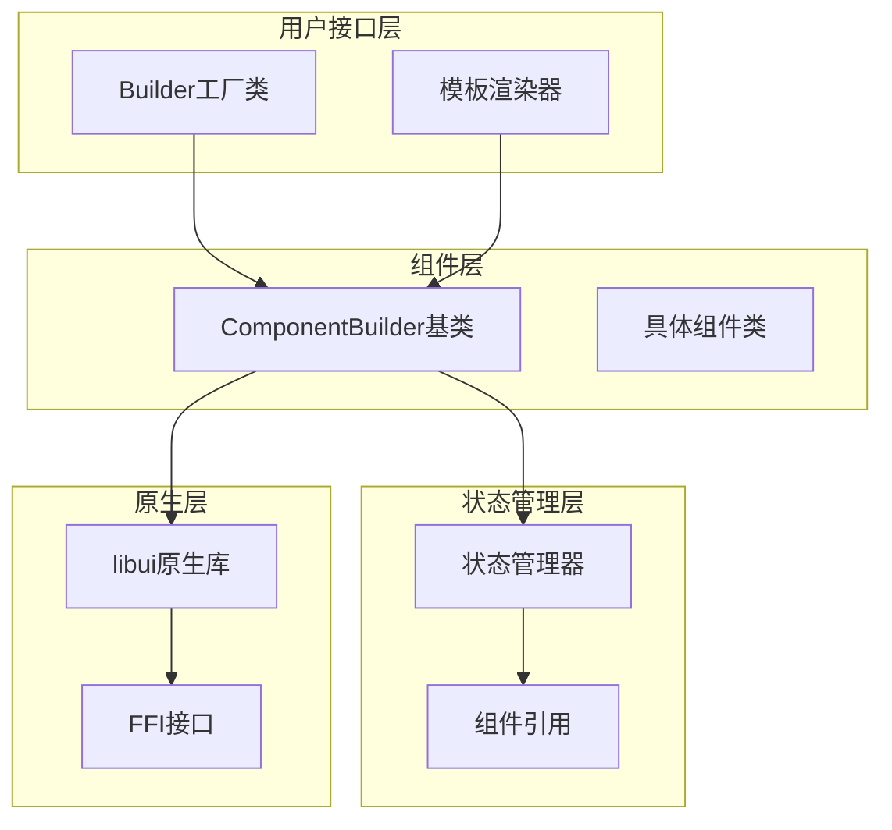
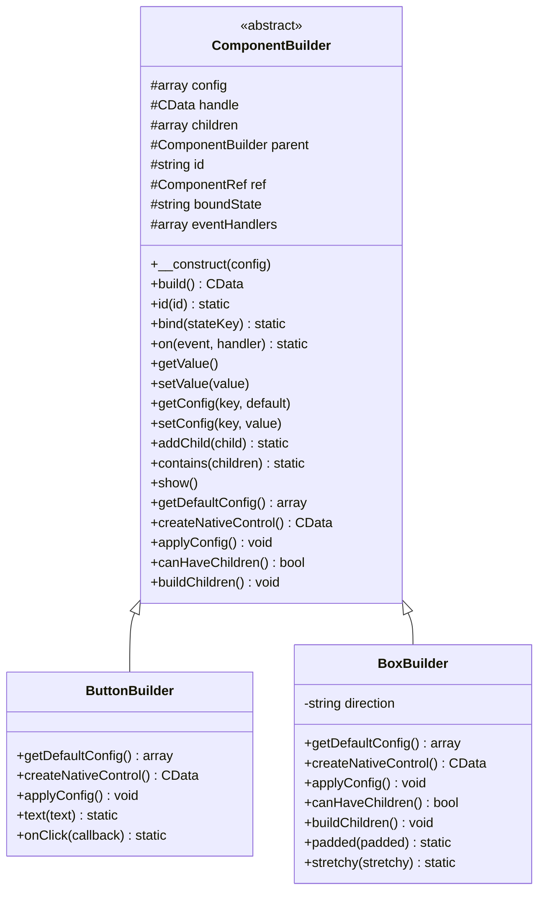
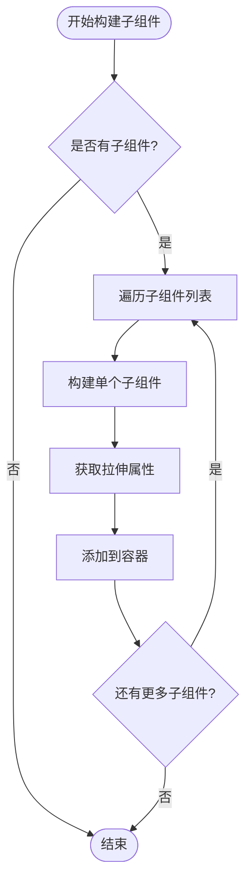
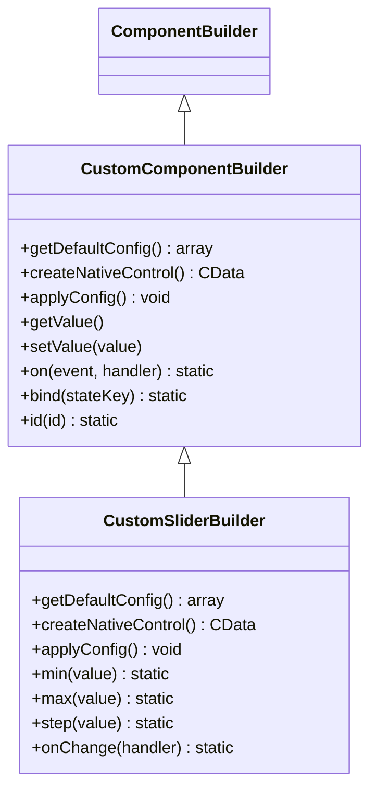
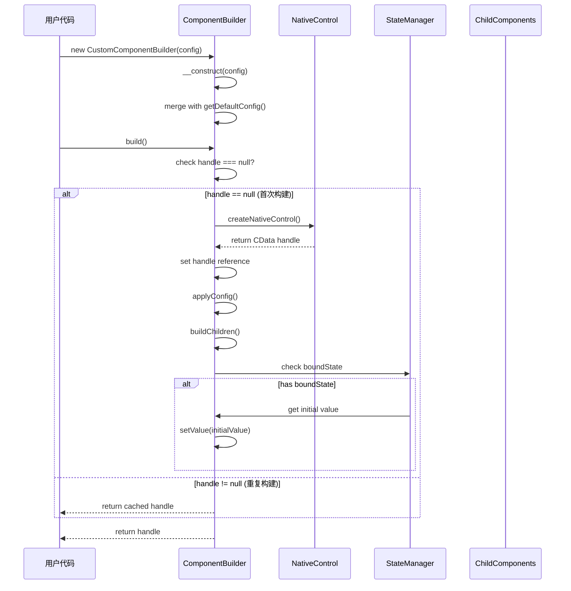
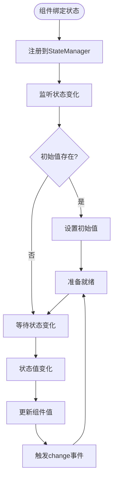
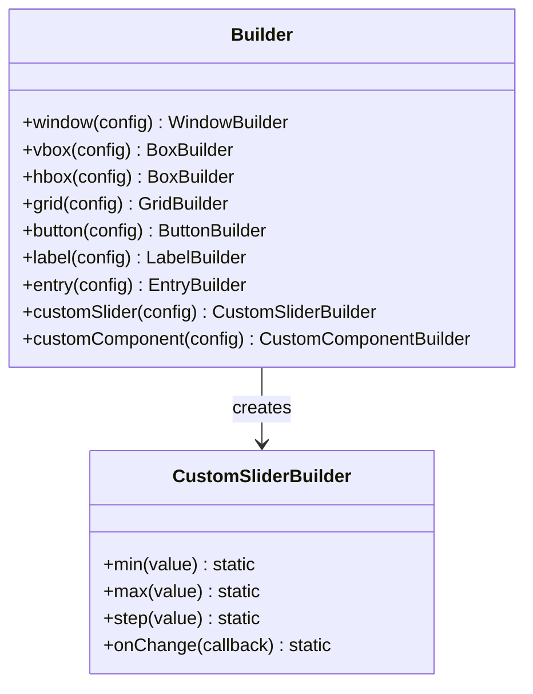

# 自定义组件开发

<cite>
**本文档中引用的文件**
- [ComponentBuilder.php](file://src/ComponentBuilder.php)
- [Builder.php](file://src/Builder.php)
- [ButtonBuilder.php](file://src/Components/ButtonBuilder.php)
- [BoxBuilder.php](file://src/Components/BoxBuilder.php)
- [GridBuilder.php](file://src/Components/GridBuilder.php)
- [LabelBuilder.php](file://src/Components/LabelBuilder.php)
- [WindowBuilder.php](file://src/Components/WindowBuilder.php)
- [StateManager.php](file://src/State/StateManager.php)
- [ComponentRef.php](file://src/State/ComponentRef.php)
- [full.php](file://example/full.php)
- [simple.php](file://example/simple.php)
</cite>

## 目录
1. [简介](#简介)
2. [项目架构概览](#项目架构概览)
3. [ComponentBuilder基类详解](#componentbuilder基类详解)
4. [抽象方法实现指南](#抽象方法实现指南)
5. [容器类与叶节点组件差异](#容器类与叶节点组件差异)
6. [完整自定义组件示例](#完整自定义组件示例)
7. [组件生命周期](#组件生命周期)
8. [状态管理和事件绑定](#状态管理和事件绑定)
9. [Builder工厂注册](#builder工厂注册)
10. [常见错误与解决方案](#常见错误与解决方案)
11. [最佳实践](#最佳实践)

## 简介

libuiBuilder是一个基于PHP的GUI应用程序构建框架，采用ComponentBuilder基类设计模式，提供了声明式的组件构建方式。本指南将深入讲解如何基于ComponentBuilder基类创建自定义UI组件，涵盖从基础概念到高级特性的完整开发流程。

## 项目架构概览

libuiBuilder采用分层架构设计，主要包含以下核心模块：



**图表来源**
- [Builder.php](file://src/Builder.php#L27-L152)
- [ComponentBuilder.php](file://src/ComponentBuilder.php#L11-L233)

**章节来源**
- [Builder.php](file://src/Builder.php#L1-L153)
- [ComponentBuilder.php](file://src/ComponentBuilder.php#L1-L234)

## ComponentBuilder基类详解

ComponentBuilder是所有UI组件的抽象基类，定义了组件的标准生命周期和核心功能。

### 核心属性和状态



**图表来源**
- [ComponentBuilder.php](file://src/ComponentBuilder.php#L11-L233)
- [ButtonBuilder.php](file://src/Components/ButtonBuilder.php#L9-L48)
- [BoxBuilder.php](file://src/Components/BoxBuilder.php#L11-L64)

### 关键特性

1. **链式调用支持**：通过`__call`魔术方法实现
2. **状态绑定**：自动同步组件值与状态管理器
3. **事件系统**：内置事件触发和处理机制
4. **组件引用**：提供跨组件通信能力
5. **生命周期管理**：统一的构建和渲染流程

**章节来源**
- [ComponentBuilder.php](file://src/ComponentBuilder.php#L11-L233)

## 抽象方法实现指南

### getDefaultConfig方法

`getDefaultConfig`方法负责定义组件的默认配置参数，返回一个关联数组。

#### 实现要点：
- 包含所有可配置的属性及其默认值
- 使用有意义的默认值
- 支持类型提示和验证

#### 示例实现模式：

```php
protected function getDefaultConfig(): array
{
    return [
        // 基础属性
        'text' => '',           // 文本内容
        'value' => null,        // 当前值
        'enabled' => true,      // 是否可用
        'visible' => true,      // 是否可见
        
        // 样式属性
        'color' => '#000000',   // 字体颜色
        'fontSize' => 12,       // 字体大小
        'fontWeight' => 'normal', // 字体粗细
        
        // 事件处理器
        'onChange' => null,     // 值改变事件
        'onClick' => null,      // 点击事件
    ];
}
```

### createNativeControl方法

`createNativeControl`方法负责创建对应的原生控件实例，返回FFI CData指针。

#### 实现要点：
- 调用libui原生库函数创建控件
- 传递必要的初始化参数
- 返回有效的CData句柄

#### 实现模式：

```php
protected function createNativeControl(): CData
{
    // 根据配置创建原生控件
    switch ($this->getType()) {
        case 'button':
            return Button::create($this->getConfig('text'));
        case 'label':
            return Label::create($this->getConfig('text'));
        case 'entry':
            return Entry::create();
        default:
            throw new RuntimeException("不支持的控件类型: {$this->getType()}");
    }
}
```

### applyConfig方法

`applyConfig`方法负责将配置应用到已创建的原生控件上。

#### 实现要点：
- 遍历配置项并应用到原生控件
- 处理事件绑定
- 确保配置的原子性

#### 实现模式：

```php
protected function applyConfig(): void
{
    // 应用基础属性
    $this->applyBasicProperties();
    
    // 应用样式属性
    $this->applyStyleProperties();
    
    // 绑定事件处理器
    $this->bindEventHandlers();
    
    // 特殊配置处理
    $this->applySpecialConfig();
}
```

**章节来源**
- [ButtonBuilder.php](file://src/Components/ButtonBuilder.php#L11-L37)
- [LabelBuilder.php](file://src/Components/LabelBuilder.php#L11-L32)
- [BoxBuilder.php](file://src/Components/BoxBuilder.php#L21-L39)

## 容器类与叶节点组件差异

### canHaveChildren方法

该方法决定组件是否可以包含子组件，是区分容器组件和叶节点组件的关键标志。

#### 叶节点组件（不可包含子组件）：
```php
protected function canHaveChildren(): bool
{
    return false; // 默认情况下，大多数控件不能包含子组件
}
```

#### 容器组件（可以包含子组件）：
```php
protected function canHaveChildren(): bool
{
    return true; // 容器组件允许添加子组件
}
```

### buildChildren方法

该方法负责构建和组织子组件，仅在容器组件中实现。

#### 叶节点组件的实现：
```php
protected function buildChildren(): void
{
    // 叶节点组件没有子组件，无需实现
}
```

#### 容器组件的实现：



**图表来源**
- [BoxBuilder.php](file://src/Components/BoxBuilder.php#L46-L53)
- [GridBuilder.php](file://src/Components/GridBuilder.php#L37-L54)

#### BoxBuilder实现示例：
```php
protected function buildChildren(): void
{
    foreach ($this->children as $child) {
        $childHandle = $child->build();
        $stretchy = $child->getConfig('stretchy', $this->getConfig('stretchy'));
        Box::append($this->handle, $childHandle, $stretchy);
    }
}
```

#### GridBuilder实现示例：
```php
protected function buildChildren(): void
{
    foreach ($this->gridItems as $item) {
        $childHandle = $item['component']->build();
        
        Grid::append(
            $this->handle,
            $childHandle,
            $item['left'],
            $item['top'],
            $item['xspan'],
            $item['yspan'],
            $item['hexpand'] ? 1 : 0,
            $item['halign']->value,
            $item['vexpand'] ? 1 : 0,
            $item['valign']
        );
    }
}
```

**章节来源**
- [BoxBuilder.php](file://src/Components/BoxBuilder.php#L41-L53)
- [GridBuilder.php](file://src/Components/GridBuilder.php#L32-L54)
- [WindowBuilder.php](file://src/Components/WindowBuilder.php#L53-L71)

## 完整自定义组件示例

以下是一个完整的自定义组件开发示例，展示如何创建一个带有状态绑定和事件处理的自定义组件。

### 自定义组件结构



### 实现步骤

#### 第一步：定义组件类

```php
<?php
namespace Kingbes\Libui\View\Components;

use Kingbes\Libui\View\ComponentBuilder;
use Kingbes\Libui\Slider;
use FFI\CData;

class CustomSliderBuilder extends ComponentBuilder
{
    protected function getDefaultConfig(): array
    {
        return [
            'min' => 0,
            'max' => 100,
            'value' => 50,
            'step' => 1,
            'onChange' => null,
            'orientation' => 'horizontal',
            'enabled' => true,
            'visible' => true,
        ];
    }
    
    protected function createNativeControl(): CData
    {
        return Slider::create(
            $this->getConfig('min'),
            $this->getConfig('max'),
            $this->getConfig('orientation') === 'vertical' ? 1 : 0
        );
    }
    
    protected function applyConfig(): void
    {
        // 设置范围
        Slider::setRange($this->handle, $this->getConfig('min'), $this->getConfig('max'));
        
        // 设置步长
        Slider::setStep($this->handle, $this->getConfig('step'));
        
        // 设置初始值
        Slider::setValue($this->handle, $this->getConfig('value'));
        
        // 绑定变更事件
        $onChange = $this->getConfig('onChange');
        if ($onChange) {
            Slider::onChanged($this->handle, function($value) use ($onChange) {
                $this->emit('change', $value);
                $onChange($value, $this, $this->state());
            });
        }
        
        // 设置可用性
        Slider::setEnabled($this->handle, $this->getConfig('enabled'));
        
        // 设置可见性
        Slider::setVisible($this->handle, $this->getConfig('visible'));
    }
    
    // 链式配置方法
    public function min(int $value): static
    {
        return $this->setConfig('min', $value);
    }
    
    public function max(int $value): static
    {
        return $this->setConfig('max', $value);
    }
    
    public function step(float $value): static
    {
        return $this->setConfig('step', $value);
    }
    
    public function onChange(callable $callback): static
    {
        return $this->setConfig('onChange', $callback);
    }
    
    public function orientation(string $orient): static
    {
        return $this->setConfig('orientation', $orient);
    }
    
    public function enabled(bool $enabled = true): static
    {
        return $this->setConfig('enabled', $enabled);
    }
    
    public function visible(bool $visible = true): static
    {
        return $this->setConfig('visible', $visible);
    }
}
```

#### 第二步：实现getValue和setValue方法

```php
public function getValue()
{
    return $this->handle ? Slider::value($this->handle) : $this->getConfig('value');
}

public function setValue($value): void
{
    $this->setConfig('value', $value);
    if ($this->handle) {
        Slider::setValue($this->handle, $value);
    }
}
```

#### 第三步：集成到Builder工厂

```php
<?php
namespace Kingbes\Libui\View;

use Kingbes\Libui\View\Components\CustomSliderBuilder;

class Builder
{
    // ... 现有方法...
    
    /**
     * 创建自定义滑块组件
     */
    public static function customSlider(array $config = []): CustomSliderBuilder
    {
        return new CustomSliderBuilder($config);
    }
    
    /**
     * 创建垂直滑块
     */
    public static function vslider(array $config = []): CustomSliderBuilder
    {
        return new CustomSliderBuilder(array_merge($config, ['orientation' => 'vertical']));
    }
}
```

### 使用示例

```php
<?php
use Kingbes\Libui\View\Builder;
use Kingbes\Libui\View\State\StateManager;

// 创建自定义滑块
$slider = Builder::customSlider()
    ->min(0)
    ->max(100)
    ->step(5)
    ->value(30)
    ->onChange(function($value, $component, $state) {
        echo "滑块值变为: $value\n";
        // 更新相关组件
        $state->set('sliderValue', $value);
    })
    ->bind('sliderValue')  // 绑定到状态管理器
    ->id('mySlider');

// 在窗口中使用
$app = Builder::window()
    ->title('自定义组件示例')
    ->size(400, 300)
    ->contains([
        Builder::label()->text('滑块值:'),
        $slider,
        Builder::label()->bind('sliderValue')->text('{{sliderValue}}')
    ])
    ->show();
```

**章节来源**
- [ButtonBuilder.php](file://src/Components/ButtonBuilder.php#L9-L48)
- [BoxBuilder.php](file://src/Components/BoxBuilder.php#L11-L64)
- [Builder.php](file://src/Builder.php#L27-L152)

## 组件生命周期

组件的生命周期包含四个关键阶段，每个阶段都有特定的职责和执行顺序。

### 生命周期流程图



**图表来源**
- [ComponentBuilder.php](file://src/ComponentBuilder.php#L209-L230)

### 各阶段详解

#### 1. 构造阶段 (__construct)

- **执行时机**：组件实例化时
- **主要任务**：
  - 合并用户配置与默认配置
  - 初始化基本属性
  - 设置组件标识（如果需要）

```php
public function __construct(array $config = [])
{
    // 合并配置，用户配置覆盖默认配置
    $this->config = array_merge($this->getDefaultConfig(), $config);
    
    // 初始化其他属性
    $this->children = [];
    $this->eventHandlers = [];
}
```

#### 2. 配置阶段 (applyConfig)

- **执行时机**：首次build()调用时
- **主要任务**：
  - 将配置应用到原生控件
  - 绑定事件处理器
  - 设置控件属性

```php
protected function applyConfig(): void
{
    // 应用基础属性
    $this->applyBasicProperties();
    
    // 绑定事件
    $this->bindEvents();
    
    // 应用特殊配置
    $this->applySpecialConfig();
}
```

#### 3. 构建阶段 (buildChildren)

- **执行时机**：applyConfig之后
- **主要任务**：
  - 递归构建子组件
  - 将子组件添加到容器
  - 设置布局参数

```php
protected function buildChildren(): void
{
    foreach ($this->children as $child) {
        $childHandle = $child->build();
        // 根据容器类型添加子组件
        $this->addChildToContainer($childHandle);
    }
}
```

#### 4. 渲染阶段 (实际显示)

- **执行时机**：调用show()方法时
- **主要任务**：
  - 显示窗口或组件
  - 进入消息循环

**章节来源**
- [ComponentBuilder.php](file://src/ComponentBuilder.php#L25-L230)

## 状态管理和事件绑定

### 状态绑定机制

libuiBuilder提供了强大的状态绑定功能，允许组件与全局状态管理器进行双向同步。

#### 绑定流程



**图表来源**
- [ComponentBuilder.php](file://src/ComponentBuilder.php#L134-L145)
- [StateManager.php](file://src/State/StateManager.php#L15-L91)

#### 实现示例

```php
// 绑定到状态管理器
$component->bind('userInput');

// 绑定后自动同步
$stateManager->set('userInput', '新值'); // 组件自动更新
$component->setValue('手动设置'); // 状态自动更新
```

### 事件系统

#### 内置事件类型

| 事件类型 | 触发时机 | 参数 | 用途 |
|---------|---------|------|------|
| `change` | 值发生变化 | 新值, 旧值, 属性名 | 响应值变更 |
| `click` | 用户点击 | 组件引用, 状态管理器 | 处理点击事件 |
| `focus` | 获得焦点 | 组件引用 | 处理焦点事件 |
| `blur` | 失去焦点 | 组件引用 | 处理失焦事件 |

#### 事件处理示例

```php
$component->on('change', function($newValue, $oldValue, $propertyName, $component, $state) {
    // 响应值变化
    if ($propertyName === 'value') {
        // 更新相关组件
        $state->set('computedValue', $newValue * 2);
    }
});

$component->on('click', function($component, $state) {
    // 处理点击事件
    $state->set('lastAction', '点击了组件');
});
```

### 组件间通信

#### 通过状态管理器通信

```php
// 发送方组件
$sender->on('change', function($value) use ($state) {
    $state->set('sharedValue', $value);
});

// 接收方组件
$receiver->bind('sharedValue')->onChange(function($value) {
    // 自动响应状态变化
    $this->updateDisplay($value);
});
```

#### 通过组件引用通信

```php
$componentA->id('componentA');
$componentB->on('click', function($component, $state) {
    // 获取其他组件引用
    $ref = $state->getComponent('componentA');
    if ($ref) {
        // 调用其他组件方法
        $ref->setValue('来自B的消息');
    }
});
```

**章节来源**
- [ComponentBuilder.php](file://src/ComponentBuilder.php#L134-L175)
- [StateManager.php](file://src/State/StateManager.php#L15-L91)
- [ComponentRef.php](file://src/State/ComponentRef.php#L1-L74)

## Builder工厂注册

### 工厂模式架构

Builder类采用工厂模式，提供统一的组件创建入口。



**图表来源**
- [Builder.php](file://src/Builder.php#L27-L152)

### 注册新组件

#### 步骤1：创建组件类

```php
<?php
namespace Kingbes\Libui\View\Components;

use Kingbes\Libui\View\ComponentBuilder;
use Kingbes\Libui\CustomSlider;
use FFI\CData;

class CustomSliderBuilder extends ComponentBuilder
{
    // 实现getDefaultConfig、createNativeControl、applyConfig等方法
}
```

#### 步骤2：扩展Builder类

```php
<?php
namespace Kingbes\Libui\View;

use Kingbes\Libui\View\Components\CustomSliderBuilder;

class Builder
{
    // 现有方法...
    
    /**
     * 创建自定义滑块组件
     */
    public static function customSlider(array $config = []): CustomSliderBuilder
    {
        return new CustomSliderBuilder($config);
    }
    
    /**
     * 创建垂直自定义滑块
     */
    public static function vslider(array $config = []): CustomSliderBuilder
    {
        return new CustomSliderBuilder(array_merge($config, ['orientation' => 'vertical']));
    }
}
```

#### 步骤3：使用新组件

```php
<?php
use Kingbes\Libui\View\Builder;

$app = Builder::window()
    ->title('自定义组件测试')
    ->size(400, 300)
    ->contains([
        Builder::label()->text('自定义滑块示例'),
        Builder::customSlider()
            ->min(0)
            ->max(100)
            ->step(1)
            ->value(50)
            ->onChange(function($value, $component, $state) {
                echo "自定义滑块值: $value\n";
            })
    ])
    ->show();
```

### 扩展Builder的最佳实践

#### 命名规范

- 方法名使用小驼峰命名法
- 功能相关的组件使用前缀
- 提供便捷的变体方法

```php
public static function primaryButton(array $config = []): ButtonBuilder
{
    return new ButtonBuilder(array_merge($config, [
        'style' => 'primary',
        'color' => '#007bff'
    ]));
}

public static function secondaryButton(array $config = []): ButtonBuilder
{
    return new ButtonBuilder(array_merge($config, [
        'style' => 'secondary',
        'color' => '#6c757d'
    ]));
}
```

#### 配置预设

```php
public static function formField(array $config = []): EntryBuilder
{
    return new EntryBuilder(array_merge([
        'placeholder' => '请输入内容',
        'margin' => 10,
        'width' => 300
    ], $config));
}
```

**章节来源**
- [Builder.php](file://src/Builder.php#L27-L152)

## 常见错误与解决方案

### 错误类型分类

#### 1. 初始化相关错误

**问题**：未正确初始化handle导致运行时错误

**错误代码**：
```php
// 错误：在build之前尝试访问handle
$value = Slider::value($this->handle); // $this->handle可能为null
```

**解决方案**：
```php
public function getValue()
{
    return $this->handle ? Slider::value($this->handle) : $this->getConfig('value');
}
```

#### 2. 配置应用错误

**问题**：applyConfig中遗漏重要配置

**错误代码**：
```php
protected function applyConfig(): void
{
    // 遗漏了设置范围的代码
    // Slider::setRange($this->handle, $this->getConfig('min'), $this->getConfig('max'));
    
    // 遗漏了设置初始值
    // Slider::setValue($this->handle, $this->getConfig('value'));
}
```

**解决方案**：
```php
protected function applyConfig(): void
{
    // 1. 设置范围
    Slider::setRange($this->handle, $this->getConfig('min'), $this->getConfig('max'));
    
    // 2. 设置步长
    Slider::setStep($this->handle, $this->getConfig('step'));
    
    // 3. 设置初始值
    Slider::setValue($this->handle, $this->getConfig('value'));
    
    // 4. 绑定事件
    $this->bindEvents();
}
```

#### 3. 子组件管理错误

**问题**：容器组件忘记实现buildChildren

**错误代码**：
```php
// BoxBuilder中缺少buildChildren实现
protected function buildChildren(): void
{
    // 错误：空实现，子组件不会被添加到容器
}
```

**解决方案**：
```php
protected function buildChildren(): void
{
    foreach ($this->children as $child) {
        $childHandle = $child->build();
        $stretchy = $child->getConfig('stretchy', $this->getConfig('stretchy'));
        Box::append($this->handle, $childHandle, $stretchy);
    }
}
```

#### 4. 事件绑定错误

**问题**：事件处理器中访问不存在的组件

**错误代码**：
```php
$component->on('click', function() use ($otherComponent) {
    // 错误：$otherComponent可能为null
    $otherComponent->setValue('新值');
});
```

**解决方案**：
```php
$component->on('click', function() use ($state) {
    $ref = $state->getComponent('otherComponent');
    if ($ref) {
        $ref->setValue('新值');
    } else {
        // 处理组件不存在的情况
        error_log('目标组件不存在');
    }
});
```

### 调试技巧

#### 1. 启用调试模式

```php
// 在开发环境中启用详细错误信息
ini_set('display_errors', 1);
error_reporting(E_ALL);

// 添加调试日志
protected function applyConfig(): void
{
    error_log("应用配置: " . json_encode($this->config));
    // ... 其他代码
}
```

#### 2. 验证组件状态

```php
public function build(): CData
{
    if ($this->handle === null) {
        error_log("正在构建组件: " . get_class($this));
        error_log("配置: " . json_encode($this->config));
    }
    
    return parent::build();
}
```

#### 3. 检查依赖关系

```php
protected function canHaveChildren(): bool
{
    if (count($this->children) > 0 && !$this->canHaveChildren()) {
        error_log("警告: " . get_class($this) . " 不应该有子组件");
    }
    return false;
}
```

### 性能优化建议

#### 1. 延迟加载

```php
protected function createNativeControl(): CData
{
    // 延迟创建原生控件，直到真正需要时
    if ($this->handle === null) {
        $this->handle = $this->doCreateNativeControl();
    }
    return $this->handle;
}
```

#### 2. 缓存配置

```php
private $cachedConfig = [];

protected function getConfig(string $key, $default = null)
{
    if (!isset($this->cachedConfig[$key])) {
        $this->cachedConfig[$key] = parent::getConfig($key, $default);
    }
    return $this->cachedConfig[$key];
}
```

**章节来源**
- [ComponentBuilder.php](file://src/ComponentBuilder.php#L209-L230)
- [BoxBuilder.php](file://src/Components/BoxBuilder.php#L46-L53)

## 最佳实践

### 1. 设计原则

#### 单一职责原则
每个组件类只负责一种特定的功能，避免功能耦合。

```php
// 好的设计：专门的滑块组件
class SliderBuilder extends ComponentBuilder
{
    // 只处理滑块相关的逻辑
}

// 避免：混合多种功能
class MixedComponentBuilder extends ComponentBuilder
{
    // 不要在一个组件中处理太多不同类型的逻辑
}
```

#### 开闭原则
对扩展开放，对修改关闭。

```php
// 通过继承扩展功能
class EnhancedSliderBuilder extends SliderBuilder
{
    public function withTooltip(): static
    {
        return $this->setConfig('tooltip', true);
    }
    
    public function withValidation(): static
    {
        return $this->setConfig('validation', true);
    }
}
```

### 2. 代码组织

#### 配置管理
将复杂的配置逻辑封装到独立方法中。

```php
protected function applyBasicProperties(): void
{
    Slider::setRange($this->handle, $this->getConfig('min'), $this->getConfig('max'));
    Slider::setStep($this->handle, $this->getConfig('step'));
    Slider::setValue($this->handle, $this->getConfig('value'));
}

protected function applyStyleProperties(): void
{
    Slider::setColor($this->handle, $this->parseColor($this->getConfig('color')));
    Slider::setFont($this->handle, $this->getConfig('font'));
}
```

#### 事件处理分离
将事件处理逻辑分离到独立方法中。

```php
protected function bindEvents(): void
{
    $this->bindChangeEvent();
    $this->bindFocusEvent();
    $this->bindBlurEvent();
}

protected function bindChangeEvent(): void
{
    $onChange = $this->getConfig('onChange');
    if ($onChange) {
        Slider::onChanged($this->handle, function($value) use ($onChange) {
            $this->emit('change', $value);
            $onChange($value, $this, $this->state());
        });
    }
}
```

### 3. 错误处理

#### 优雅降级
为可能出现的问题提供备用方案。

```php
public function getValue()
{
    try {
        return $this->handle ? Slider::value($this->handle) : $this->getConfig('value');
    } catch (\Exception $e) {
        error_log("获取滑块值失败: " . $e->getMessage());
        return $this->getConfig('value', 0);
    }
}
```

#### 配置验证
在applyConfig中验证配置的有效性。

```php
protected function applyConfig(): void
{
    // 验证范围有效性
    $min = $this->getConfig('min');
    $max = $this->getConfig('max');
    if ($min >= $max) {
        throw new InvalidArgumentException("最小值必须小于最大值");
    }
    
    // 验证步长合理性
    $step = $this->getConfig('step');
    if ($step <= 0) {
        throw new InvalidArgumentException("步长必须大于0");
    }
}
```

### 4. 性能优化

#### 延迟初始化
只在需要时创建原生控件。

```php
public function build(): CData
{
    if ($this->handle === null) {
        // 只有在首次调用build时才创建原生控件
        $this->handle = $this->createNativeControl();
    }
    return $this->handle;
}
```

#### 批量操作
对于频繁的操作，考虑批量处理。

```php
protected function applyMultipleChanges(array $changes): void
{
    // 开始批量更新
    Slider::beginBatch($this->handle);
    
    foreach ($changes as $property => $value) {
        $this->applySingleProperty($property, $value);
    }
    
    // 结束批量更新
    Slider::endBatch($this->handle);
}
```

### 5. 文档和测试

#### 完善的文档
为每个公共方法提供详细的文档注释。

```php
/**
 * 设置滑块的最小值
 * 
 * @param int $value 最小值，必须小于最大值
 * @return static 流式接口，支持链式调用
 * @throws InvalidArgumentException 如果值无效
 */
public function min(int $value): static
{
    // 实现
}
```

#### 单元测试
为自定义组件编写单元测试。

```php
<?php
use PHPUnit\Framework\TestCase;
use Kingbes\Libui\View\Components\CustomSliderBuilder;

class CustomSliderBuilderTest extends TestCase
{
    public function testDefaultValue()
    {
        $slider = new CustomSliderBuilder();
        $this->assertEquals(50, $slider->getValue());
    }
    
    public function testRangeValidation()
    {
        $this->expectException(InvalidArgumentException::class);
        $slider = new CustomSliderBuilder();
        $slider->min(100)->max(0); // 最小值大于最大值
    }
}
```

### 6. 兼容性考虑

#### 向后兼容
确保新版本的组件与旧版本兼容。

```php
public function __construct(array $config = [])
{
    // 保持向后兼容的配置名称
    if (isset($config['defaultValue'])) {
        $config['value'] = $config['defaultValue'];
        unset($config['defaultValue']);
    }
    
    parent::__construct($config);
}
```

#### 平台兼容
考虑不同平台的差异。

```php
protected function applyPlatformSpecificConfig(): void
{
    if (PHP_OS_FAMILY === 'Windows') {
        // Windows特定的配置
        $this->applyWindowsConfig();
    } elseif (PHP_OS_FAMILY === 'Darwin') {
        // macOS特定的配置
        $this->applyMacOSConfig();
    } else {
        // Linux和其他平台
        $this->applyLinuxConfig();
    }
}
```

通过遵循这些最佳实践，您可以创建出高质量、可维护且性能优异的自定义UI组件，为用户提供优秀的开发体验。