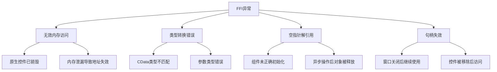
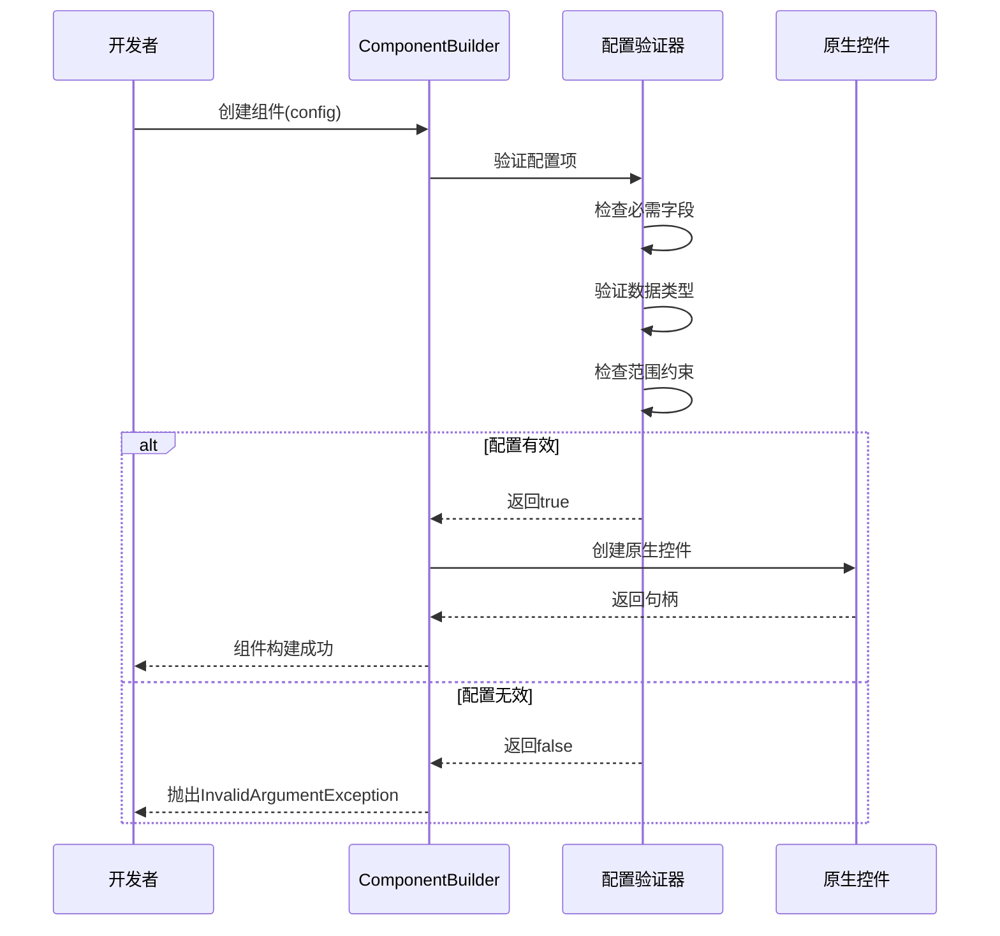
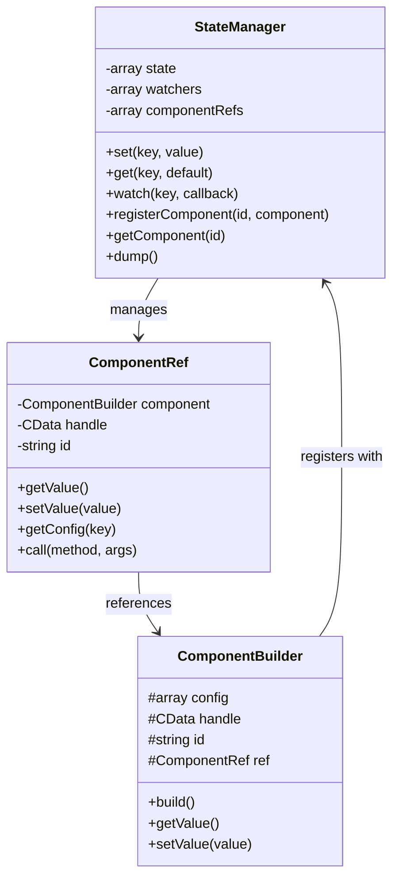
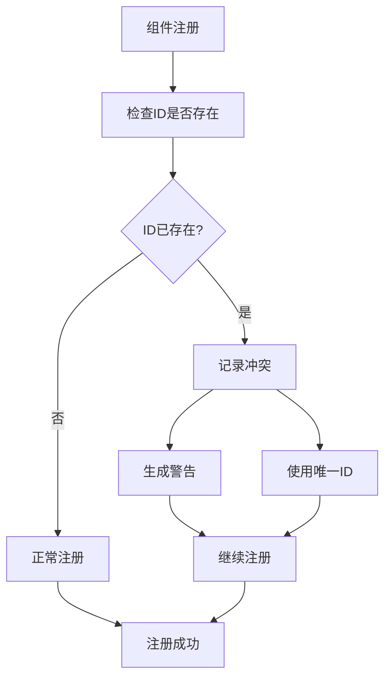
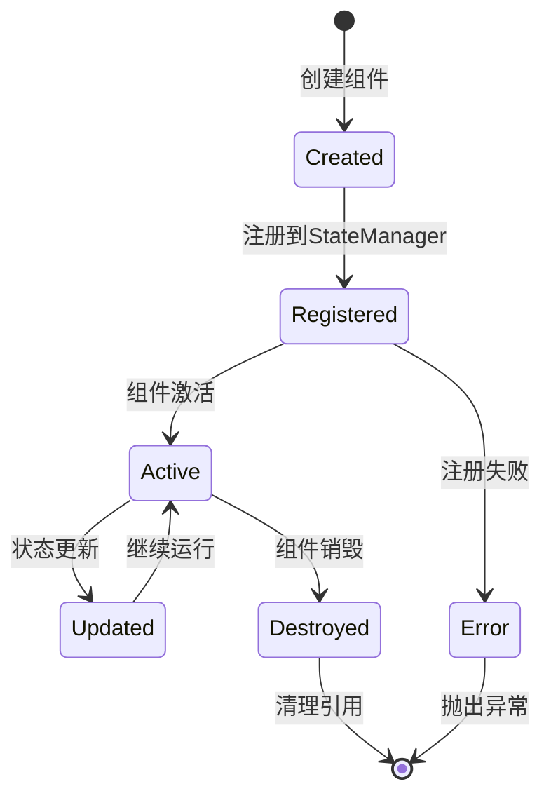

# 调试技巧

<cite>
**本文档中引用的文件**
- [Builder.php](file://src/Builder.php)
- [ComponentBuilder.php](file://src/ComponentBuilder.php)
- [StateManager.php](file://src/State/StateManager.php)
- [ComponentRef.php](file://src/State/ComponentRef.php)
- [FormValidator.php](file://src/Validation/FormValidator.php)
- [FormTemplate.php](file://src/Templates/FormTemplate.php)
- [ResponsiveGridBuilder.php](file://src/ResponsiveGridBuilder.php)
- [helper.php](file://src/helper.php)
- [ButtonBuilder.php](file://src/Components/ButtonBuilder.php)
- [EntryBuilder.php](file://src/Components/EntryBuilder.php)
- [ComboboxBuilder.php](file://src/Components/ComboboxBuilder.php)
- [WindowBuilder.php](file://src/Components/WindowBuilder.php)
- [GridBuilder.php](file://src/Components/GridBuilder.php)
- [DrawContext.php](file://src/Components/DrawContext.php)
- [StateHelperTest.php](file://tests/StateHelperTest.php)
- [composer.json](file://composer.json)
</cite>

## 目录
1. [概述](#概述)
2. [FFI异常捕获与诊断](#ffi异常捕获与诊断)
3. [组件构建失败调试](#组件构建失败调试)
4. [状态管理器调试](#状态管理器调试)
5. [组件间通信故障排查](#组件间通信故障排查)
6. [常见错误代码模式](#常见错误代码模式)
7. [调试工具与技术](#调试工具与技术)
8. [最佳实践](#最佳实践)

## 概述

libuiBuilder是一个基于PHP的GUI应用程序构建框架，使用FFI（Foreign Function Interface）与原生libui库交互。在开发过程中，开发者可能遇到各种调试挑战，包括FFI异常、组件构建失败、状态管理问题和组件间通信故障。本指南提供了系统性的调试方法论，帮助开发者快速定位和解决问题。

## FFI异常捕获与诊断

### 内存访问异常处理

FFI操作是libuiBuilder中最容易出现异常的地方，主要表现为无效内存访问。

#### 常见FFI异常类型



#### 诊断步骤

1. **启用详细错误报告**
   ```php
   // 在开发环境中启用错误报告
   error_reporting(E_ALL);
   ini_set('display_errors', 1);
   ```

2. **FFI异常捕获机制**
   ```php
   try {
       // FFI操作代码
       $result = libui_function($cdata_handle);
   } catch (\FFI\Exception $e) {
       // 记录详细的错误信息
       error_log("FFI Exception: " . $e->getMessage());
       error_log("File: " . $e->getFile() . " Line: " . $e->getLine());
   }
   ```

3. **内存访问验证**
   ```php
   // 检查CData句柄是否有效
   function isValidHandle($handle): bool {
       if ($handle === null) {
           return false;
       }
       
       // 尝试安全访问
       try {
           // 简单的安全访问测试
           $test = FFI::typeof($handle);
           return true;
       } catch (\FFI\Exception $e) {
           return false;
       }
   }
   ```

### 类型转换错误诊断

#### 常见类型转换问题

| 错误类型 | 症状 | 解决方案 |
|---------|------|----------|
| 字符串编码 | 中文字符显示乱码 | 使用UTF-8编码，确保FFI字符串正确处理 |
| 数组类型 | 参数传递失败 | 使用FFI数组类型声明，确保元素类型匹配 |
| 结构体 | 内存布局错误 | 检查C结构体定义与PHP映射的一致性 |
| 函数指针 | 回调函数无效 | 确保回调函数签名与原生函数匹配 |

#### 类型转换调试技巧

```php
// 类型检查辅助函数
function debugFFIType($value, $expectedType) {
    $actualType = FFI::typeof($value);
    if ($actualType != $expectedType) {
        error_log("类型不匹配: 实际 {$actualType}, 期望 {$expectedType}");
        return false;
    }
    return true;
}
```

## 组件构建失败调试

### 配置项合法性检查

组件构建失败通常源于配置项的非法或缺失。

#### 配置验证流程



#### 配置验证最佳实践

1. **默认配置策略**
   ```php
   protected function getDefaultConfig(): array {
       return [
           'text' => '',           // 文本内容
           'enabled' => true,      // 启用状态
           'visible' => true,      // 可见性
           'width' => 0,          // 宽度（0表示自适应）
           'height' => 0,         // 高度（0表示自适应）
           'margin' => 0,         // 边距
           'padding' => 0,        // 内边距
       ];
   }
   ```

2. **配置项验证**
   ```php
   protected function validateConfig(array $config): void {
       // 检查必需字段
       if (empty($config['text'])) {
           throw new InvalidArgumentException("text字段不能为空");
       }
       
       // 验证数值范围
       if (isset($config['width']) && $config['width'] < 0) {
           throw new InvalidArgumentException("width不能为负数");
       }
       
       // 验证布尔值
       if (isset($config['enabled']) && !is_bool($config['enabled'])) {
           throw new InvalidArgumentException("enabled必须是布尔值");
       }
   }
   ```

### 原生控件创建上下文检查

#### 上下文验证清单

| 检查项目 | 验证方法 | 常见问题 |
|---------|----------|----------|
| 主线程执行 | 检查是否在GUI主线程 | 异步操作导致的上下文错误 |
| 窗口句柄 | 验证父窗口存在且有效 | 窗口未正确创建或已被销毁 |
| 初始化状态 | 检查libui库是否已初始化 | 库加载失败或重复初始化 |
| 内存分配 | 验证是否有足够的可用内存 | 内存泄漏或过度使用 |

#### 上下文调试代码

```php
// 上下文检查函数
function checkBuildContext(): bool {
    global $libui_initialized;
    
    // 检查libui是否已初始化
    if (!$libui_initialized) {
        error_log("libui库未初始化");
        return false;
    }
    
    // 检查主线程
    if (!isMainThread()) {
        error_log("组件创建必须在主线程执行");
        return false;
    }
    
    // 检查窗口上下文
    if (!hasValidWindowContext()) {
        error_log("缺少有效的窗口上下文");
        return false;
    }
    
    return true;
}
```

## 状态管理器调试

### 数据流监控

StateManager是libuiBuilder的数据核心，监控其数据流对于调试至关重要。

#### 状态管理器架构



**图表来源**
- [StateManager.php](file://src/State/StateManager.php#L8-L91)
- [ComponentRef.php](file://src/State/ComponentRef.php#L11-L74)
- [ComponentBuilder.php](file://src/ComponentBuilder.php#L11-L234)

#### 状态变更追踪

```php
// 状态变更追踪装饰器
function traceStateChanges(StateManager $manager): StateManager {
    $originalSet = \Closure::fromCallable([$manager, 'set']);
    
    return new class($manager, $originalSet) extends StateManager {
        private $originalSet;
        
        public function set($key, $value) {
            $oldValue = $this->state[$key] ?? null;
            error_log("状态变更: {$key} 从 {$oldValue} 到 {$value}");
            
            // 调用原始方法
            return ($this->originalSet)($key, $value);
        }
    };
}
```

### 状态一致性检查

#### 状态同步验证

```php
// 状态一致性检查工具
function validateStateConsistency(): array {
    $manager = StateManager::instance();
    $errors = [];
    
    // 检查组件引用与状态的一致性
    foreach ($manager->getComponentRefs() as $id => $componentRef) {
        try {
            $stateValue = $manager->get($id);
            $componentValue = $componentRef->getValue();
            
            if ($stateValue !== $componentValue) {
                $errors[] = "状态不一致: {$id} - 状态: {$stateValue}, 组件: {$componentValue}";
            }
        } catch (\Exception $e) {
            $errors[] = "组件引用错误: {$id} - " . $e->getMessage();
        }
    }
    
    return $errors;
}
```

## 组件间通信故障排查

### ID重复问题定位

ID重复是组件间通信中最常见的问题之一。

#### ID冲突检测机制



#### ID冲突预防策略

```php
// ID冲突检测与解决
class IdConflictDetector {
    private $registeredIds = [];
    
    public function registerId(string $id, string $componentName): bool {
        if (isset($this->registeredIds[$id])) {
            // 发现冲突
            $conflictingComponent = $this->registeredIds[$id];
            
            // 记录冲突信息
            error_log("ID冲突: {$id} 已被 {$conflictingComponent} 使用");
            
            // 自动解决冲突
            $uniqueId = $this->generateUniqueId($id, $componentName);
            error_log("使用唯一ID: {$uniqueId}");
            
            // 注册新的唯一ID
            $this->registeredIds[$uniqueId] = $componentName;
            return $uniqueId;
        }
        
        $this->registeredIds[$id] = $componentName;
        return true;
    }
    
    private function generateUniqueId(string $baseId, string $componentName): string {
        $counter = 1;
        $uniqueId = "{$baseId}_{$counter}";
        
        while (isset($this->registeredIds[$uniqueId])) {
            $counter++;
            $uniqueId = "{$baseId}_{$counter}";
        }
        
        return $uniqueId;
    }
}
```

### Ref未注册问题诊断

#### 组件引用生命周期



#### 引用验证工具

```php
// 组件引用验证工具
class ComponentRefValidator {
    public static function validateReference(string $id): array {
        $manager = StateManager::instance();
        $results = [];
        
        // 检查组件是否存在
        $componentRef = $manager->getComponent($id);
        if (!$componentRef) {
            $results[] = "错误: 组件ID '{$id}' 未注册";
            return $results;
        }
        
        // 检查句柄有效性
        $handle = $componentRef->getHandle();
        if (!$handle) {
            $results[] = "警告: 组件ID '{$id}' 的句柄为空";
        }
        
        // 检查组件类型
        $component = $componentRef->getComponent();
        if (!$component) {
            $results[] = "错误: 组件ID '{$id}' 的组件实例为空";
        }
        
        // 检查配置完整性
        $config = $componentRef->getConfig();
        if (!$config) {
            $results[] = "警告: 组件ID '{$id}' 的配置为空";
        }
        
        return $results;
    }
}
```

### 通信链路追踪

#### 事件传播路径

```php
// 事件传播追踪器
class EventPropagationTracer {
    private $traceLog = [];
    
    public function traceEvent(string $eventName, array $args): void {
        $backtrace = debug_backtrace(DEBUG_BACKTRACE_IGNORE_ARGS, 5);
        $caller = $backtrace[0]['class'] ?? 'unknown';
        
        $this->traceLog[] = [
            'timestamp' => microtime(true),
            'event' => $eventName,
            'caller' => $caller,
            'args' => $args,
            'stack' => array_slice($backtrace, 1),
        ];
    }
    
    public function getTraceLog(): array {
        return $this->traceLog;
    }
    
    public function printEventFlow(): void {
        foreach ($this->traceLog as $event) {
            echo sprintf(
                "[%f] 事件: %s (调用者: %s)\n",
                $event['timestamp'],
                $event['event'],
                $event['caller']
            );
            
            foreach ($event['stack'] as $frame) {
                echo sprintf(
                    "  -> %s:%d (%s)\n",
                    $frame['file'] ?? 'unknown',
                    $frame['line'] ?? 0,
                    $frame['function'] ?? 'unknown'
                );
            }
        }
    }
}
```

## 常见错误代码模式

### 错误模式识别表格

| 错误模式 | 症状描述 | 根本原因 | 修复建议 |
|---------|----------|----------|----------|
| 组件创建失败 | InvalidArgumentException | 配置项非法或缺失 | 检查配置验证逻辑 |
| 内存访问崩溃 | Fatal error: Cannot access offset | CData句柄无效 | 添加句柄有效性检查 |
| 状态更新异常 | 状态不一致 | 异步操作导致竞态条件 | 使用状态锁机制 |
| 事件回调错误 | 回调函数未执行 | 事件处理器未正确绑定 | 检查事件绑定逻辑 |
| 组件引用丢失 | getComponent()返回null | 组件未正确注册 | 验证注册流程 |

### 错误恢复策略

#### 自动错误恢复机制

```php
// 错误恢复工厂
class ErrorRecoveryFactory {
    public static function createRecoveryHandler(string $errorType): callable {
        switch ($errorType) {
            case 'memory_access':
                return function(\FFI\Exception $e) {
                    error_log("内存访问错误: " . $e->getMessage());
                    // 尝试重新初始化组件
                    return self::attemptMemoryRecovery();
                };
                
            case 'component_creation':
                return function(\InvalidArgumentException $e) {
                    error_log("组件创建失败: " . $e->getMessage());
                    // 使用默认配置重建
                    return self::attemptComponentRecovery();
                };
                
            case 'state_sync':
                return function(\Exception $e) {
                    error_log("状态同步错误: " . $e->getMessage());
                    // 重置状态管理器
                    return self::attemptStateRecovery();
                };
                
            default:
                return function(\Exception $e) {
                    error_log("未知错误: " . $e->getMessage());
                    return false;
                };
        }
    }
    
    private static function attemptMemoryRecovery(): bool {
        // 内存恢复逻辑
        return true;
    }
    
    private static function attemptComponentRecovery(): bool {
        // 组件恢复逻辑
        return true;
    }
    
    private static function attemptStateRecovery(): bool {
        // 状态恢复逻辑
        return true;
    }
}
```

### 调试辅助函数

#### 综合调试工具包

```php
// 调试辅助函数集合
class DebugUtils {
    // 组件状态快照
    public static function snapshotComponentState(): array {
        $manager = StateManager::instance();
        $snapshot = [];
        
        foreach ($manager->getComponentRefs() as $id => $ref) {
            $snapshot[$id] = [
                'type' => get_class($ref->getComponent()),
                'handle_valid' => $ref->getHandle() !== null,
                'value' => $ref->getValue(),
                'config' => $ref->getConfig(),
            ];
        }
        
        return $snapshot;
    }
    
    // 配置验证报告
    public static function validateComponentConfig(ComponentBuilder $component): array {
        $errors = [];
        $config = $component->getConfig();
        
        // 验证必需字段
        $requiredFields = $component->getRequiredFields();
        foreach ($requiredFields as $field) {
            if (!isset($config[$field])) {
                $errors[] = "缺少必需字段: {$field}";
            }
        }
        
        // 验证数据类型
        $typeConstraints = $component->getTypeConstraints();
        foreach ($typeConstraints as $field => $expectedType) {
            if (isset($config[$field]) && 
                gettype($config[$field]) !== $expectedType) {
                $errors[] = "字段 {$field} 类型错误，期望 {$expectedType}";
            }
        }
        
        return $errors;
    }
    
    // 性能监控
    public static function monitorComponentPerformance(): array {
        $startTime = microtime(true);
        $memoryStart = memory_get_usage();
        
        // 执行性能敏感操作
        // ...
        
        $endTime = microtime(true);
        $memoryEnd = memory_get_usage();
        
        return [
            'execution_time' => $endTime - $startTime,
            'memory_delta' => $memoryEnd - $memoryStart,
            'peak_memory' => memory_get_peak_usage(),
        ];
    }
}
```

## 调试工具与技术

### 日志输出系统

#### 结构化日志记录

```php
// 结构化日志系统
class StructuredLogger {
    const LEVEL_DEBUG = 'DEBUG';
    const LEVEL_INFO = 'INFO';
    const LEVEL_WARNING = 'WARNING';
    const LEVEL_ERROR = 'ERROR';
    
    private $logFile;
    private $logLevel;
    
    public function __construct(string $logFile, string $level = self::LEVEL_INFO) {
        $this->logFile = $logFile;
        $this->logLevel = $level;
    }
    
    public function log(string $level, string $message, array $context = []): void {
        if ($this->shouldLog($level)) {
            $logEntry = $this->formatLogEntry($level, $message, $context);
            file_put_contents($this->logFile, $logEntry . PHP_EOL, FILE_APPEND);
        }
    }
    
    public function debug(string $message, array $context = []): void {
        $this->log(self::LEVEL_DEBUG, $message, $context);
    }
    
    public function info(string $message, array $context = []): void {
        $this->log(self::LEVEL_INFO, $message, $context);
    }
    
    public function warning(string $message, array $context = []): void {
        $this->log(self::LEVEL_WARNING, $message, $context);
    }
    
    public function error(string $message, array $context = []): void {
        $this->log(self::LEVEL_ERROR, $message, $context);
    }
    
    private function shouldLog(string $level): bool {
        $levels = [
            self::LEVEL_DEBUG => 0,
            self::LEVEL_INFO => 1,
            self::LEVEL_WARNING => 2,
            self::LEVEL_ERROR => 3,
        ];
        
        return $levels[$level] >= $levels[$this->logLevel];
    }
    
    private function formatLogEntry(string $level, string $message, array $context): string {
        $timestamp = date('Y-m-d H:i:s');
        $formattedContext = json_encode($context, JSON_PRETTY_PRINT);
        
        return "[{$timestamp}] [{$level}] {$message} {$formattedContext}";
    }
}
```

### 断点调试技术

#### 条件断点设置

```php
// 条件断点管理器
class ConditionalBreakpointManager {
    private $breakpoints = [];
    
    public function setBreakpoint(string $condition, callable $action): void {
        $this->breakpoints[] = [
            'condition' => $condition,
            'action' => $action,
        ];
    }
    
    public function checkBreakpoints(mixed $context): void {
        foreach ($this->breakpoints as $bp) {
            if ($this->evaluateCondition($bp['condition'], $context)) {
                $bp['action']($context);
            }
        }
    }
    
    private function evaluateCondition(string $condition, mixed $context): bool {
        // 简化的条件评估（实际应用中应使用更安全的方法）
        try {
            eval('$result = ' . $condition . ';');
            return $result;
        } catch (\Throwable $e) {
            return false;
        }
    }
}
```

### 状态追踪工具

#### 实时状态监控

```php
// 实时状态监控器
class StateMonitor {
    private $monitoring = false;
    private $metrics = [];
    private $startTime;
    
    public function startMonitoring(): void {
        $this->monitoring = true;
        $this->startTime = microtime(true);
        $this->metrics = [];
    }
    
    public function stopMonitoring(): array {
        $this->monitoring = false;
        return $this->metrics;
    }
    
    public function recordMetric(string $name, mixed $value): void {
        if (!$this->monitoring) {
            return;
        }
        
        $elapsedTime = microtime(true) - $this->startTime;
        
        $this->metrics[] = [
            'timestamp' => $elapsedTime,
            'name' => $name,
            'value' => $value,
        ];
    }
    
    public function exportMetrics(): string {
        $csv = "timestamp,name,value\n";
        
        foreach ($this->metrics as $metric) {
            $csv .= sprintf(
                "%.6f,%s,%s\n",
                $metric['timestamp'],
                $metric['name'],
                json_encode($metric['value'])
            );
        }
        
        return $csv;
    }
}
```

## 最佳实践

### 调试环境配置

#### 开发环境优化

```php
// 调试环境配置
class DebugEnvironment {
    public static function configureDevelopment(): void {
        // 启用详细错误报告
        error_reporting(E_ALL);
        ini_set('display_errors', 1);
        ini_set('log_errors', 1);
        
        // 设置错误处理器
        set_error_handler([self::class, 'customErrorHandler']);
        set_exception_handler([self::class, 'customExceptionHandler']);
        
        // 启用调试工具
        self::enableDebugTools();
    }
    
    public static function customErrorHandler($errno, $errstr, $errfile, $errline) {
        error_log("错误: {$errstr} in {$errfile} on line {$errline}");
        // 自定义错误处理逻辑
    }
    
    public static function customExceptionHandler($exception) {
        error_log("未捕获异常: " . $exception->getMessage());
        error_log($exception->getTraceAsString());
        // 显示友好的错误页面
    }
    
    private static function enableDebugTools(): void {
        // 注册调试中间件
        // ...
    }
}
```

### 性能调试指南

#### 性能瓶颈识别

```php
// 性能分析器
class PerformanceProfiler {
    private $profiles = [];
    
    public function startProfile(string $name): void {
        $this->profiles[$name] = [
            'start' => microtime(true),
            'memory_start' => memory_get_usage(),
        ];
    }
    
    public function endProfile(string $name): array {
        if (!isset($this->profiles[$name])) {
            return [];
        }
        
        $profile = $this->profiles[$name];
        $profile['duration'] = microtime(true) - $profile['start'];
        $profile['memory_end'] = memory_get_usage();
        $profile['memory_delta'] = $profile['memory_end'] - $profile['memory_start'];
        
        unset($this->profiles[$name]);
        return $profile;
    }
    
    public function reportPerformance(): void {
        echo "=== 性能报告 ===\n";
        
        foreach ($this->profiles as $name => $profile) {
            printf(
                "%s: %.4f秒, 内存: %d bytes\n",
                $name,
                $profile['duration'],
                $profile['memory_delta']
            );
        }
    }
}
```

### 测试驱动调试

#### 单元测试调试支持

```php
// 调试友好的单元测试基类
abstract class DebugTestCase extends TestCase {
    protected function setUp(): void {
        parent::setUp();
        
        // 设置调试环境
        DebugEnvironment::configureDevelopment();
        
        // 清理状态管理器
        $this->resetStateManager();
    }
    
    protected function resetStateManager(): void {
        $reflection = new ReflectionClass(StateManager::class);
        $instance = $reflection->getProperty('instance');
        $instance->setAccessible(true);
        $instance->setValue(null, null);
    }
    
    protected function dumpState(): void {
        $manager = StateManager::instance();
        echo "当前状态:\n";
        print_r($manager->dump());
    }
    
    protected function assertComponentExists(string $id): void {
        $manager = StateManager::instance();
        $component = $manager->getComponent($id);
        
        $this->assertNotNull($component, "组件ID '{$id}' 不存在");
    }
    
    protected function assertValidHandle($handle): void {
        $this->assertNotNull($handle, "句柄不能为空");
        
        try {
            $type = FFI::typeof($handle);
            $this->assertNotEmpty($type, "句柄类型无效");
        } catch (\FFI\Exception $e) {
            $this->fail("句柄无效: " . $e->getMessage());
        }
    }
}
```

通过遵循这些调试技巧和最佳实践，开发者可以更有效地诊断和解决libuiBuilder开发过程中的各种问题，提高开发效率和应用程序的稳定性。