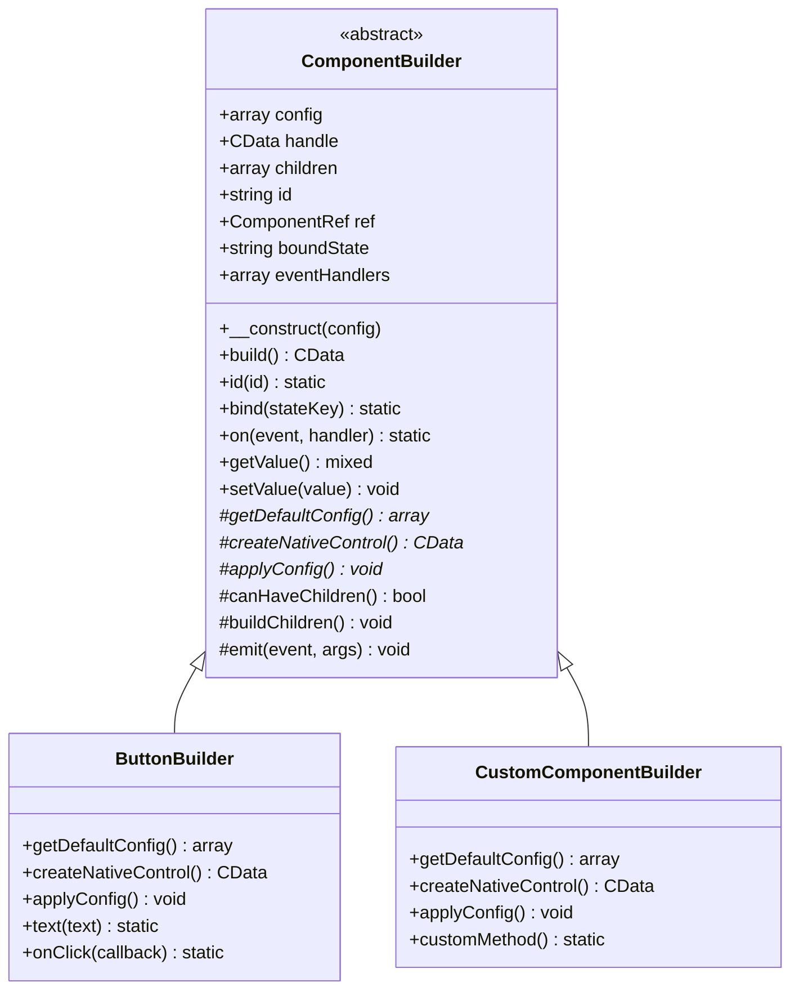
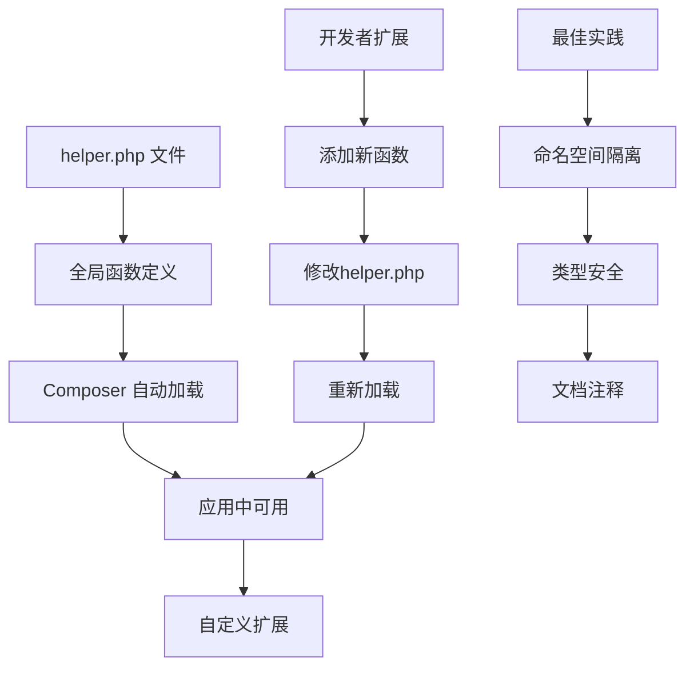
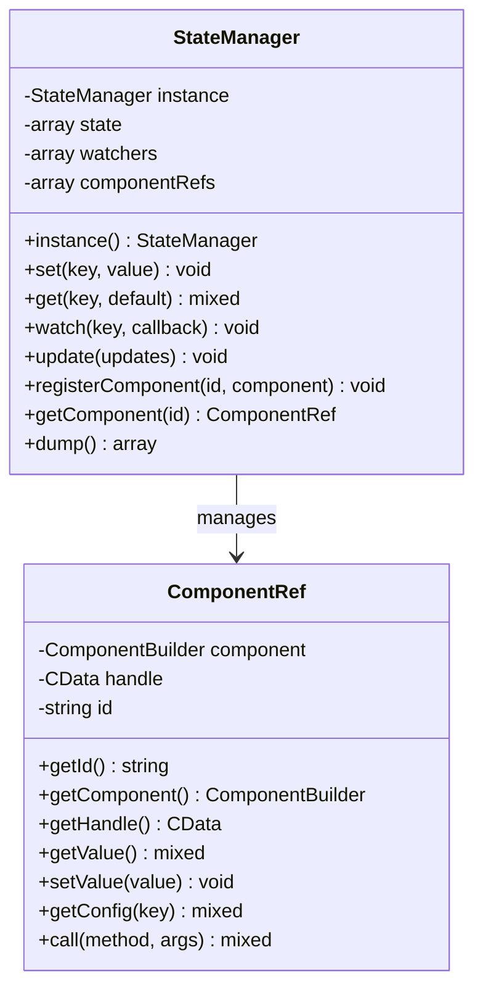
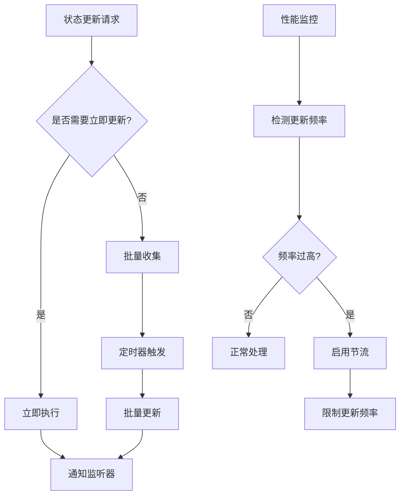
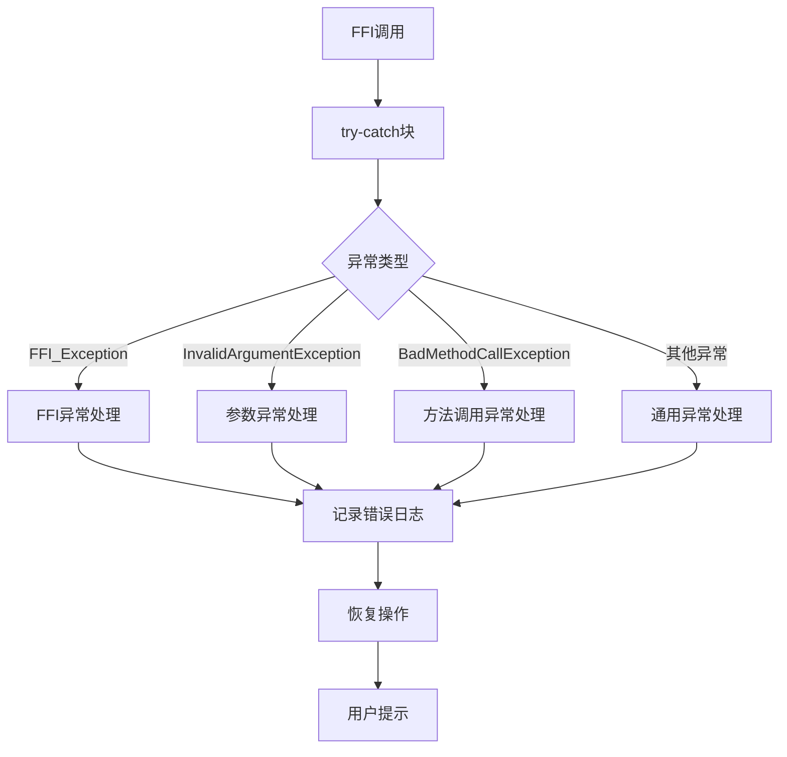
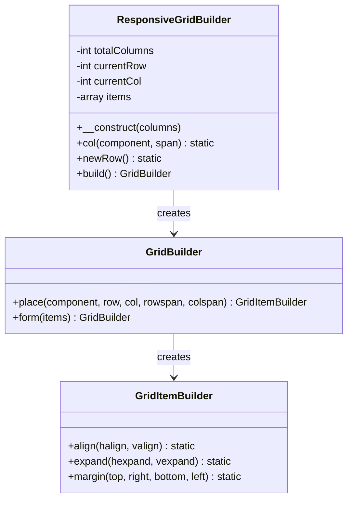
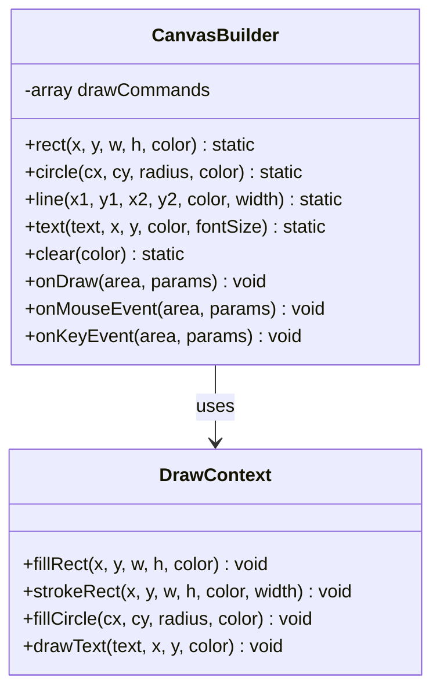
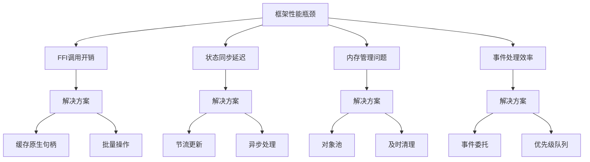

# 高级功能

<cite>
**本文档中引用的文件**
- [ComponentBuilder.php](file://src/ComponentBuilder.php)
- [helper.php](file://src/helper.php)
- [Builder.php](file://src/Builder.php)
- [ButtonBuilder.php](file://src/Components/ButtonBuilder.php)
- [WindowBuilder.php](file://src/Components/WindowBuilder.php)
- [BoxBuilder.php](file://src/Components/BoxBuilder.php)
- [StateManager.php](file://src/State/StateManager.php)
- [ComponentRef.php](file://src/State/ComponentRef.php)
- [ResponsiveGridBuilder.php](file://src/ResponsiveGridBuilder.php)
- [CanvasBuilder.php](file://src/Components/CanvasBuilder.php)
- [full.php](file://example/full.php)
- [composer.json](file://composer.json)
</cite>

## 目录
1. [简介](#简介)
2. [自定义组件构建器扩展](#自定义组件构建器扩展)
3. [全局辅助函数扩展机制](#全局辅助函数扩展机制)
4. [状态管理系统](#状态管理系统)
5. [性能优化策略](#性能优化策略)
6. [错误处理与调试技巧](#错误处理与调试技巧)
7. [响应式布局系统](#响应式布局系统)
8. [高级绘图功能](#高级绘图功能)
9. [框架局限性与改进建议](#框架局限性与改进建议)
10. [最佳实践指南](#最佳实践指南)

## 简介

libuiBuilder是一个基于FFI的PHP GUI框架，提供了强大的组件构建器模式和状态管理系统。本指南深入探讨了框架的高级功能，包括自定义组件扩展、性能优化、错误处理以及框架的局限性分析。

## 自定义组件构建器扩展

### 继承ComponentBuilder创建自定义UI组件

libuiBuilder的核心是`ComponentBuilder`抽象类，它定义了所有UI组件的基本行为和生命周期。要创建自定义组件，需要继承这个基类并实现三个抽象方法。

#### 核心抽象方法实现



**图表来源**
- [ComponentBuilder.php](file://src/ComponentBuilder.php#L11-L234)
- [ButtonBuilder.php](file://src/Components/ButtonBuilder.php#L9-L48)

#### 实现getDefaultConfig方法

每个自定义组件必须实现`getDefaultConfig`方法来定义默认配置参数：

```php
protected function getDefaultConfig(): array
{
    return [
        'text' => 'Custom Component',
        'value' => null,
        'enabled' => true,
        'customProperty' => 'default',
        'onCustomEvent' => null,
    ];
}
```

#### 实现createNativeControl方法

`createNativeControl`负责创建底层的FFI原生控件：

```php
protected function createNativeControl(): CData
{
    // 创建原生控件实例
    return CustomLibrary::createControl(
        $this->getConfig('text'),
        $this->getConfig('enabled')
    );
}
```

#### 实现applyConfig方法

`applyConfig`方法将配置应用到已创建的原生控件：

```php
protected function applyConfig(): void
{
    // 应用基本属性
    CustomLibrary::setText($this->handle, $this->getConfig('text'));
    CustomLibrary::setEnabled($this->handle, $this->getConfig('enabled'));
    
    // 设置事件处理器
    $onCustomEvent = $this->getConfig('onCustomEvent');
    if ($onCustomEvent) {
        CustomLibrary::onCustomEvent($this->handle, function() use ($onCustomEvent) {
            $this->emit('custom-event');
            $onCustomEvent($this, $this->state());
        });
    }
}
```

**章节来源**
- [ComponentBuilder.php](file://src/ComponentBuilder.php#L30-L44)
- [ButtonBuilder.php](file://src/Components/ButtonBuilder.php#L11-L36)

### 容器组件的特殊处理

对于可以包含子组件的容器类组件，需要重写`canHaveChildren`和`buildChildren`方法：

```php
protected function canHaveChildren(): bool
{
    return true;
}

protected function buildChildren(): void
{
    foreach ($this->children as $child) {
        $childHandle = $child->build();
        // 将子组件添加到容器中
        ContainerLibrary::addChild($this->handle, $childHandle);
    }
}
```

**章节来源**
- [WindowBuilder.php](file://src/Components/WindowBuilder.php#L53-L71)
- [BoxBuilder.php](file://src/Components/BoxBuilder.php#L41-L63)

## 全局辅助函数扩展机制

### helper.php中的扩展点

libuiBuilder通过`helper.php`文件提供全局辅助函数，开发者可以通过修改或扩展这个文件来添加自定义功能。

#### 当前辅助函数示例

框架已经提供了一些实用的辅助函数：

```php
// 密码强度计算函数
function calculateStrength($password): string
{
    $score = 0;
    // 强度评估逻辑...
    return match($score) {
        0, 1, 2 => '弱',
        3, 4 => '中',
        5, 6 => '强',
        default => '强',
    };
}
```

#### 扩展机制设计



**图表来源**
- [helper.php](file://src/helper.php#L1-L59)
- [composer.json](file://composer.json#L15-L17)

#### 开发者扩展示例

```php
// 在helper.php中添加自定义函数
function formatDate($timestamp, $format = 'Y-m-d H:i:s'): string
{
    return date($format, $timestamp);
}

function isValidEmail($email): bool
{
    return filter_var($email, FILTER_VALIDATE_EMAIL) !== false;
}

function generateUniqueId(): string
{
    return uniqid('custom_', true);
}

function calculateDiscount($price, $discountRate): float
{
    return $price * (1 - $discountRate / 100);
}
```

#### 扩展注册机制

为了更好地管理扩展函数，可以实现一个注册机制：

```php
// 扩展函数注册器
class HelperRegistry
{
    private static array $functions = [];
    
    public static function register(string $name, callable $function): void
    {
        self::$functions[$name] = $function;
    }
    
    public static function get(string $name): ?callable
    {
        return self::$functions[$name] ?? null;
    }
    
    public static function call(string $name, ...$args)
    {
        $function = self::get($name);
        if ($function) {
            return $function(...$args);
        }
        throw new Exception("Helper function '$name' not found");
    }
}

// 使用示例
HelperRegistry::register('formatCurrency', function($amount, $currency = 'CNY') {
    return "$currency " . number_format($amount, 2);
});
```

**章节来源**
- [helper.php](file://src/helper.php#L4-L59)

## 状态管理系统

### StateManager核心架构

libuiBuilder的状态管理系统基于观察者模式，提供了全局状态共享和响应式更新能力。



**图表来源**
- [StateManager.php](file://src/State/StateManager.php#L8-L91)
- [ComponentRef.php](file://src/State/ComponentRef.php#L11-L74)

### 状态绑定与响应式更新

组件可以通过`bind`方法绑定到状态管理器，实现自动响应式更新：

```php
// 绑定到状态
$textField = Builder::entry()
    ->id('username')
    ->bind('username');

// 状态变化会自动更新组件
StateManager::instance()->set('username', 'newUsername');

// 组件变化会自动更新状态
$textField->setValue('changedUsername');
```

### 状态监听器模式

```php
// 监听状态变化
StateManager::instance()->watch('userProfile', function($newValue, $oldValue, $key) {
    // 处理状态变化
    echo "用户资料从 {$oldValue} 变为 {$newValue}";
});

// 批量更新状态
StateManager::instance()->update([
    'firstName' => 'John',
    'lastName' => 'Doe',
    'email' => 'john@example.com'
]);
```

**章节来源**
- [StateManager.php](file://src/State/StateManager.php#L26-L66)
- [ComponentBuilder.php](file://src/ComponentBuilder.php#L136-L146)

## 性能优化策略

### 避免过度频繁的状态更新

#### 状态更新优化原则



#### 实现节流机制

```php
class ThrottledStateManager
{
    private static ?self $instance = null;
    private array $pendingUpdates = [];
    private ?Timer $timer = null;
    
    public static function instance(): self
    {
        if (!self::$instance) {
            self::$instance = new self();
        }
        return self::$instance;
    }
    
    public function setWithThrottle(string $key, $value, int $delay = 100): void
    {
        $this->pendingUpdates[$key] = $value;
        
        if (!$this->timer) {
            $this->timer = Timer::after($delay, function() {
                $updates = $this->pendingUpdates;
                $this->pendingUpdates = [];
                $this->timer = null;
                
                // 批量应用更新
                foreach ($updates as $key => $value) {
                    parent::set($key, $value);
                }
            });
        }
    }
}
```

### 合理使用事件监听器

#### 事件监听器优化策略

```php
// 优化前：频繁创建闭包
foreach ($items as $item) {
    $button = Builder::button()->on('click', function() use ($item) {
        // 处理点击事件
    });
}

// 优化后：使用事件委托
$container = Builder::vbox();
$container->on('click', function($sender, $event) {
    // 根据事件目标处理不同逻辑
    if ($event->target->id === 'specificButton') {
        // 处理特定按钮点击
    }
});
```

#### 内存泄漏防护

```php
class EventManager
{
    private array $listeners = [];
    
    public function addListener(string $event, callable $handler): void
    {
        if (!isset($this->listeners[$event])) {
            $this->listeners[$event] = [];
        }
        $this->listeners[$event][] = $handler;
    }
    
    public function removeListener(string $event, callable $handler): void
    {
        if (isset($this->listeners[$event])) {
            $this->listeners[$event] = array_filter(
                $this->listeners[$event],
                fn($h) => $h !== $handler
            );
        }
    }
    
    public function cleanup(): void
    {
        $this->listeners = [];
        gc_collect_cycles(); // 强制垃圾回收
    }
}
```

### 延迟加载复杂组件

#### 组件懒加载实现

```php
class LazyComponentLoader
{
    private array $loadedComponents = [];
    private array $componentFactories = [];
    
    public function register(string $id, callable $factory): void
    {
        $this->componentFactories[$id] = $factory;
    }
    
    public function get(string $id): ?ComponentBuilder
    {
        if (isset($this->loadedComponents[$id])) {
            return $this->loadedComponents[$id];
        }
        
        if (isset($this->componentFactories[$id])) {
            $factory = $this->componentFactories[$id];
            $component = $factory();
            $this->loadedComponents[$id] = $component;
            return $component;
        }
        
        return null;
    }
    
    public function preload(array $ids): void
    {
        foreach ($ids as $id) {
            $this->get($id);
        }
    }
}

// 使用示例
$loader = new LazyComponentLoader();
$loader->register('advancedChart', function() {
    return Builder::canvas()
        ->width(800)
        ->height(600)
        ->onDraw([$this, 'drawChart']);
});
```

**章节来源**
- [ComponentBuilder.php](file://src/ComponentBuilder.php#L160-L175)
- [StateManager.php](file://src/State/StateManager.php#L31-L36)

## 错误处理与调试技巧

### FFI异常捕获

#### FFI异常处理机制



#### 异常处理最佳实践

```php
class FFIExceptionHandler
{
    public static function wrap(callable $operation, string $context = ''): mixed
    {
        try {
            return $operation();
        } catch (\FFI\Exception $e) {
            self::handleFFIException($e, $context);
        } catch (\InvalidArgumentException $e) {
            self::handleInvalidArgumentException($e, $context);
        } catch (\BadMethodCallException $e) {
            self::handleBadMethodCallException($e, $context);
        } catch (\Exception $e) {
            self::handleGenericException($e, $context);
        }
        
        return null;
    }
    
    private static function handleFFIException(\FFI\Exception $e, string $context): void
    {
        error_log("FFI Exception in {$context}: " . $e->getMessage());
        
        // 尝试恢复
        if (self::attemptRecovery()) {
            return;
        }
        
        // 显示用户友好错误
        throw new RuntimeException("组件初始化失败，请重启应用程序");
    }
    
    private static function handleInvalidArgumentException(\InvalidArgumentException $e, string $context): void
    {
        error_log("Invalid Argument in {$context}: " . $e->getMessage());
        // 记录无效参数详情
        self::logInvalidParameters($context, $e->getMessage());
    }
    
    private static function attemptRecovery(): bool
    {
        // 尝试清理资源
        gc_collect_cycles();
        
        // 重置FFI上下文
        if (function_exists('ffi_reset')) {
            ffi_reset();
        }
        
        return true;
    }
}
```

### 调试组件构建失败

#### 组件构建调试工具

```php
class ComponentDebugger
{
    public static function debugBuild(ComponentBuilder $component): array
    {
        $debugInfo = [
            'component_type' => get_class($component),
            'config' => $component->getConfig(),
            'id' => $component->getId(),
            'has_children' => count($component->getChildren()),
            'is_built' => $component->isBuilt(),
            'native_handle' => null,
        ];
        
        try {
            $handle = $component->build();
            $debugInfo['native_handle'] = spl_object_hash($handle);
            $debugInfo['build_success'] = true;
        } catch (\Exception $e) {
            $debugInfo['build_error'] = $e->getMessage();
            $debugInfo['error_trace'] = $e->getTraceAsString();
        }
        
        return $debugInfo;
    }
    
    public static function validateComponentTree(ComponentBuilder $root): array
    {
        $issues = [];
        
        $queue = [[$root, 0]];
        while (!empty($queue)) {
            [$component, $depth] = array_shift($queue);
            
            // 深度检查
            if ($depth > 20) {
                $issues[] = "组件树过深 ({$depth}层)";
                continue;
            }
            
            // 配置验证
            $config = $component->getConfig();
            if (isset($config['value']) && !is_scalar($config['value'])) {
                $issues[] = "组件 " . $component->getId() . 
                          " 的value字段类型不正确";
            }
            
            // 子组件递归检查
            foreach ($component->getChildren() as $child) {
                $queue[] = [$child, $depth + 1];
            }
        }
        
        return $issues;
    }
}
```

### 追踪状态变化

#### 状态变更追踪器

```php
class StateChangeTracer
{
    private static ?self $instance = null;
    private array $traceLog = [];
    private bool $enabled = false;
    
    public static function instance(): self
    {
        if (!self::$instance) {
            self::$instance = new self();
        }
        return self::$instance;
    }
    
    public function enable(): void
    {
        $this->enabled = true;
        $this->traceLog = [];
        
        StateManager::instance()->watch('*', function($newValue, $oldValue, $key) {
            if ($this->enabled) {
                $this->logChange($key, $oldValue, $newValue);
            }
        });
    }
    
    public function disable(): void
    {
        $this->enabled = false;
    }
    
    public function getTrace(): array
    {
        return $this->traceLog;
    }
    
    public function exportToFile(string $filename): bool
    {
        $data = json_encode($this->traceLog, JSON_PRETTY_PRINT);
        return file_put_contents($filename, $data) !== false;
    }
    
    private function logChange(string $key, $oldValue, $newValue): void
    {
        $this->traceLog[] = [
            'timestamp' => microtime(true),
            'key' => $key,
            'old_value' => $oldValue,
            'new_value' => $newValue,
            'stack_trace' => debug_backtrace(DEBUG_BACKTRACE_IGNORE_ARGS),
        ];
    }
}
```

**章节来源**
- [ComponentBuilder.php](file://src/ComponentBuilder.php#L210-L229)
- [StateManager.php](file://src/State/StateManager.php#L31-L36)

## 响应式布局系统

### ResponsiveGridBuilder高级用法

libuiBuilder提供了灵活的响应式网格布局系统，支持复杂的布局需求。



**图表来源**
- [ResponsiveGridBuilder.php](file://src/ResponsiveGridBuilder.php#L7-L82)

### 高级布局技巧

#### 复杂网格布局示例

```php
$responsiveLayout = (new ResponsiveGridBuilder(12))
    ->col(Builder::label()->text('标题区域')->style('font-size: 20px; font-weight: bold;'), 12)
    ->newRow()
    ->col(Builder::label()->text('左侧导航'), 3)
    ->col(Builder::vbox()->contains([
        Builder::label()->text('主要内容区域'),
        Builder::separator(),
        Builder::hbox()->contains([
            Builder::button()->text('操作1'),
            Builder::button()->text('操作2'),
        ]),
    ]), 9)
    ->newRow()
    ->col(Builder::label()->text('页脚信息'), 12);

$grid = $responsiveLayout->build();
```

#### 动态布局调整

```php
class DynamicGridLayout
{
    private ResponsiveGridBuilder $builder;
    private int $screenWidth;
    
    public function __construct(int $initialWidth = 12)
    {
        $this->builder = new ResponsiveGridBuilder($initialWidth);
    }
    
    public function addHeader(array $items): self
    {
        $span = floor(12 / count($items));
        foreach ($items as $item) {
            $this->builder->col($item, $span);
        }
        return $this;
    }
    
    public function addContent(array $columns): self
    {
        foreach ($columns as $column) {
            $this->builder->col($column['content'], $column['span'] ?? 1);
        }
        return $this;
    }
    
    public function adjustForScreenSize(int $width): self
    {
        $this->screenWidth = $width;
        
        if ($width < 600) {
            // 移动端布局
            $this->builder->newRow();
        } elseif ($width < 900) {
            // 平板布局
            $this->builder->newRow();
        }
        
        return $this;
    }
    
    public function build(): GridBuilder
    {
        return $this->builder->build();
    }
}
```

**章节来源**
- [ResponsiveGridBuilder.php](file://src/ResponsiveGridBuilder.php#L19-L82)

## 高级绘图功能

### CanvasBuilder绘图系统

libuiBuilder的CanvasBuilder提供了强大的2D绘图能力，支持复杂的图形渲染。



**图表来源**
- [CanvasBuilder.php](file://src/Components/CanvasBuilder.php#L11-L126)

### 复杂图形绘制示例

```php
$canvas = Builder::canvas()
    ->width(600)
    ->height(400)
    ->onDraw(function($area, $params) {
        $context = $params->Context;
        
        // 清除背景
        $this->clearBackground($context, [1.0, 1.0, 1.0, 1.0]);
        
        // 绘制坐标轴
        $this->drawAxis($context, 50, 50, 500, 300);
        
        // 绘制数据曲线
        $dataPoints = $this->generateChartData();
        $this->drawLineChart($context, 50, 50, 500, 300, $dataPoints);
        
        // 绘制数据点
        $this->drawDataPoints($context, 50, 50, 500, 300, $dataPoints);
    });

private function drawLineChart($context, $x, $y, $width, $height, array $points): void
{
    if (count($points) < 2) return;
    
    // 设置画笔
    $pen = Draw::createPen(0.0, 0.0, 1.0, 1.0); // 蓝色线条
    Draw::setPenColor($pen, 0.0, 0.0, 1.0, 1.0);
    
    // 开始路径
    $path = Draw::createPath(DrawFillMode::Winding);
    
    // 移动到第一个点
    $firstPoint = $points[0];
    $scaledX = $x + ($firstPoint['x'] * $width);
    $scaledY = $y + ($height - ($firstPoint['y'] * $height));
    Draw::createPathFigure($path, $scaledX, $scaledY);
    
    // 连接后续点
    for ($i = 1; $i < count($points); $i++) {
        $point = $points[$i];
        $nextX = $x + ($point['x'] * $width);
        $nextY = $y + ($height - ($point['y'] * $height));
        Draw::pathLineTo($path, $nextX, $nextY);
    }
    
    Draw::pathEnd($path);
    Draw::stroke($context, $path, $pen);
    Draw::freePath($path);
    Draw::freePen($pen);
}
```

**章节来源**
- [CanvasBuilder.php](file://src/Components/CanvasBuilder.php#L50-L126)

## 框架局限性与改进建议

### 当前框架局限性

#### 性能瓶颈分析



#### 主要限制因素

1. **FFI性能开销**
   - PHP FFI调用原生库存在固有性能损失
   - 频繁的状态同步导致额外开销

2. **内存管理挑战**
   - FFI对象生命周期管理困难
   - 容易产生内存泄漏

3. **事件处理效率**
   - 事件冒泡机制可能导致性能问题
   - 大量组件时事件处理变慢

4. **跨平台兼容性**
   - 不同操作系统上的FFI行为差异
   - 原生库版本兼容性问题

### 改进方向建议

#### 性能优化建议

```php
// 1. 实现组件缓存机制
class ComponentCache
{
    private static array $cache = [];
    
    public static function get(string $id): ?ComponentBuilder
    {
        return self::$cache[$id] ?? null;
    }
    
    public static function set(string $id, ComponentBuilder $component): void
    {
        self::$cache[$id] = $component;
    }
    
    public static function clear(): void
    {
        self::$cache = [];
        gc_collect_cycles();
    }
}

// 2. 实现批量更新机制
class BatchUpdateManager
{
    private array $updates = [];
    private ?Timer $timer = null;
    
    public function scheduleUpdate(string $componentId, array $properties): void
    {
        $this->updates[$componentId] = array_merge(
            $this->updates[$componentId] ?? [],
            $properties
        );
        
        if (!$this->timer) {
            $this->timer = Timer::after(16, function() {
                $this->processBatch();
                $this->timer = null;
            });
        }
    }
    
    private function processBatch(): void
    {
        foreach ($this->updates as $componentId => $properties) {
            $component = StateManager::instance()->getComponent($componentId);
            if ($component) {
                $component->setConfig($properties);
            }
        }
        $this->updates = [];
    }
}
```

#### 架构改进建议

```php
// 3. 实现插件系统
interface PluginInterface
{
    public function getName(): string;
    public function getVersion(): string;
    public function initialize(): void;
    public function shutdown(): void;
}

class PluginManager
{
    private array $plugins = [];
    
    public function registerPlugin(PluginInterface $plugin): void
    {
        $this->plugins[] = $plugin;
        $plugin->initialize();
    }
    
    public function unregisterPlugin(string $pluginName): void
    {
        foreach ($this->plugins as $key => $plugin) {
            if ($plugin->getName() === $pluginName) {
                $plugin->shutdown();
                unset($this->plugins[$key]);
                break;
            }
        }
    }
    
    public function getPlugins(): array
    {
        return $this->plugins;
    }
}

// 4. 实现中间件模式
class MiddlewareManager
{
    private array $middlewares = [];
    
    public function addMiddleware(callable $middleware): void
    {
        $this->middlewares[] = $middleware;
    }
    
    public function process(callable $target, ...$args): mixed
    {
        return array_reduce(
            $this->middlewares,
            function($next, $middleware) {
                return function(...$args) use ($next, $middleware) {
                    return $middleware($next, ...$args);
                };
            },
            $target
        )(...$args);
    }
}
```

**章节来源**
- [ComponentBuilder.php](file://src/ComponentBuilder.php#L210-L231)
- [StateManager.php](file://src/State/StateManager.php#L31-L36)

## 最佳实践指南

### 组件设计原则

#### 单一职责原则
```php
// 好的设计：专注于单一功能
class TemperatureSensor extends ComponentBuilder
{
    protected function getDefaultConfig(): array
    {
        return [
            'unit' => 'celsius',
            'minValue' => -50,
            'maxValue' => 100,
            'onValueChanged' => null,
        ];
    }
    
    protected function createNativeControl(): CData
    {
        return SensorLibrary::createTemperatureSensor(
            $this->getConfig('minValue'),
            $this->getConfig('maxValue')
        );
    }
}

// 避免：混合多种功能
class TemperatureHumiditySensor extends ComponentBuilder
{
    // 这种设计违反单一职责原则
}
```

#### 开放封闭原则
```php
// 使用继承扩展功能
abstract class BaseChartBuilder extends ComponentBuilder
{
    protected function getDefaultConfig(): array
    {
        return [
            'data' => [],
            'theme' => 'light',
            'onRenderComplete' => null,
        ];
    }
}

class LineChartBuilder extends BaseChartBuilder
{
    protected function createNativeControl(): CData
    {
        return ChartLibrary::createLineChart($this->getConfig('data'));
    }
    
    protected function applyConfig(): void
    {
        ChartLibrary::setTheme($this->handle, $this->getConfig('theme'));
        // 特定于折线图的配置
    }
}
```

### 错误处理最佳实践

#### 分层错误处理
```php
class ErrorHandler
{
    public static function handleComponentError(ComponentBuilder $component, \Throwable $exception): void
    {
        // 记录详细错误信息
        error_log(sprintf(
            "组件 %s (%s) 发生错误: %s\nStack: %s",
            $component->getId(),
            get_class($component),
            $exception->getMessage(),
            $exception->getTraceAsString()
        ));
        
        // 显示用户友好错误
        $errorMessage = self::getUserFriendlyMessage($exception);
        
        // 创建备用组件
        $fallback = Builder::label()
            ->text("组件加载失败: {$errorMessage}")
            ->style('color: red; font-weight: bold;');
            
        // 替换原始组件
        $parent = $component->getParent();
        if ($parent) {
            $parent->replaceChild($component, $fallback);
        }
    }
    
    private static function getUserFriendlyMessage(\Throwable $exception): string
    {
        return match(true) {
            $exception instanceof \FFI\Exception => "系统资源不足，请重启应用",
            $exception instanceof \InvalidArgumentException => "配置参数错误",
            default => "未知错误，请联系技术支持",
        };
    }
}
```

### 测试策略

#### 单元测试示例
```php
// 组件单元测试
class CustomComponentTest extends TestCase
{
    public function testDefaultConfiguration(): void
    {
        $component = new CustomComponentBuilder();
        $config = $component->getConfig();
        
        $this->assertEquals('default', $config['customProperty']);
        $this->assertTrue($config['enabled']);
    }
    
    public function testStateBinding(): void
    {
        $component = (new CustomComponentBuilder())
            ->id('testComponent')
            ->bind('testState');
            
        $stateManager = StateManager::instance();
        $stateManager->set('testState', 'testValue');
        
        $this->assertEquals('testValue', $component->getValue());
    }
    
    public function testEventHandling(): void
    {
        $wasCalled = false;
        $component = (new CustomComponentBuilder())
            ->on('custom-event', function() use (&$wasCalled) {
                $wasCalled = true;
            });
            
        $component->emit('custom-event');
        $this->assertTrue($wasCalled);
    }
}
```

**章节来源**
- [ComponentBuilder.php](file://src/ComponentBuilder.php#L25-L44)
- [StateManager.php](file://src/State/StateManager.php#L26-L66)